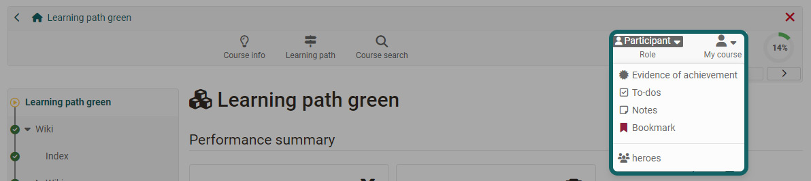

# Personal tools: Evidence of Achievements

{ class="aside-right lightbox"}

A performance record is a confirmation that a performance check has been carried out.
In OpenOlat, proof of performance can be provided for various assessment course elements, e.g. for completed tests, submitted and assessed tasks, etc. 

{ class="shadow lightbox"}

A [PDF certificate](../learningresources/Course_Settings_Assessment.md#certificate) can also be issued as confirmation that a course has been attended or that certain course-related activities have been completed. A certificate can also be issued without the use of a transcript of records

## Who awards certificates of achievement?

The course authors determine in their courses whether OpenOlat should create performance records.

Activation takes place in Administration -> Settings in the [Assessment tab](../learningresources/Course_Settings_Assessment.md). 

## Where can I see the the evidence of achievements?

Users can find their certificates of achievement, and if activated also their received [certificates](../learningresources/Course_Settings_Assessment.md#certificate), both in the respective course in which the certificate of achievement or certificate was issued and also collected in the personal tool menu. 

### Evidence of achievement in the personal tools

Die Anzeige im Persönlichen Menü eignet sich um einen schnellen Überblick über alle bereits in OpenOlat erhaltenen, persönlichen Leistungsnachweise und Zertifikate zu erhalten. So kann man schnell zu den einzelnen Leistungsnachweisen und Zertifikaten  navigieren und weitere Informationen erhalten. Aktivieren Sie in der Übersicht alle für Sie relevanten Spalten z.B. Punkte, Bestanden, Zertifikat. 

Aktivieren Sie "ePortfolio" um einen Leistungsnachweis auch in Ihr [Portfolio](../personal_menu/Portfolio.de.md) zu übernehmen. Dabei wird der Leistungsnachweis in einem ersten Schritt in ihr persönliches ["Medien Center"](../personal_menu/Media_Center.de.md) eingefügt und kann von dort aus als Inhaltselement in ein Portfolio eingefügt werden. So können Zusammenstellungen von Leistungsnachweisen für unterschiedliche Zwecke kombiniert und auch bestimmten Personen zugänglich gemacht werden. 

!!! info  "Info"

    Bitte beachten: Leistungsnachweise und Zertifikate werden erst angezeigt, wenn bereits Leistungen erbracht wurden und wenn diese auch bewertet und die Sichtbarkeit für den User freigegeben wurde. Ausgestellte Zertifikate können auch heruntergeladen werden.

**External certificates**

OpenOlat users can also upload externally acquired certificates to OpenOlat to complete their profile. The "Upload certificate" button is located in the personal menu under the "Evidence of achievement" tab (if activated by the administrator).

{ class="shadow lightbox"}

## View evidence of achievement in the course

Wurde in einem Kurs der Leistungsnachweis aktiviert finden Teilnehmende in der Toolbar unter "Mein Kurs" den Link zu ihrem Leistungsnachweis. Klickt man auf den Link erhält man einen Überblick über die bewertbaren Kursbausteine des Kurses mit ihrem jeweiligen aktuellen Bewertungsstatus.

!!! info "Note"

    The link to the evidence of achievement only appears in the course if at least one assessable course element exists in the course and the course participant has already received at least one assessment. This can be, for example, the attempted solution to a test or the assessment of an assignment.

## Further confirmation

[Certificates of achievements](../learningresources/Course_Settings_Assessment.md#evidence_of_achievement) 
[Certificates](../learningresources/Course_Settings_Assessment.md#certificate) 
[Bewertungssysteme in OpenOlat: Noten](../../manual_admin/administration/Assessment_translate_points_in_grades_admin.md) 
[Badges in den persönlichen Werkzeugen](OpenBadges.md) 
[Badges im Bewertungswerkzeug](../learningresources/OpenBadges.md) 
[Badges in der eAssessment-Administration](../../manual_admin/administration/e-Assessment_openBadges.md) 
[Testquittung erstellen](../learningresources/Test_settings.md#tab-options) 
[Testquittung validieren](../learningresources/Assessing_tests.md#grading-tool) 
[Rezertifizierung](../learningresources/Course_Settings_Assessment.md#recertification)
