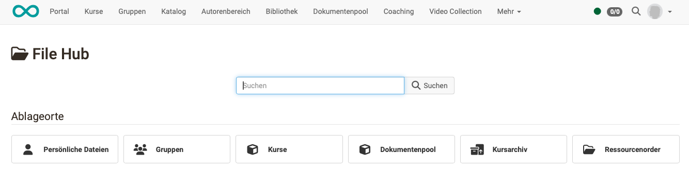
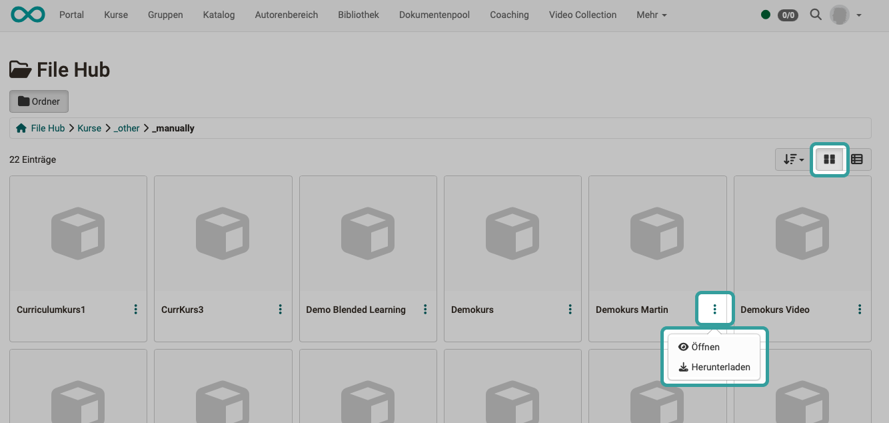

# Persönliche Werkzeuge: File Hub {: #file_hub}

{ class="aside-right lightbox"}

Ab Release 19 steht in OpenOlat ein File Hub als **globaler Dateibrowser** zur Verfügung, in dem **alle in OpenOlat vorhandenen Ordner** aufgelistet sind. (Kursordner, Gruppenordner, Archivordner, usw.) 

Es werden im File Hub aber nur Ordner angezeigt, auf die die eingeloggte Person auch Zugriffsberechtigung hat.

{ class="shadow lightbox"}

## Merkmale des File Hubs {: #features}

* **Multi-File-Upload** per drag & drop
* Werden im File Hub Dateien an einen anderen Ort übernommen, werden sie jeweils **kopiert**.  
(Im Unterschied zum [Media Center](../personal_menu/Media_Center.de.md), dort sollen z.B. Logos, AGBs u.ä. zentral verwaltet, upgedated und allen Autor:innen zur Verfügung gestellt werden. Deshalb werden dort die Dateien verlinkt.)
* Es werden nur Ordner im File Hub angezeigt, auf die die aktuell eingeloggte Person **Zugriffsberechtigungen** hat.

Siehe auch [File Hub (Basiskonzept)](../basic_concepts/File_Hub_Concept.de.md)

## Wo wird der File Hub verwendet? {: #where_used}

Die Ordner und Dateien werden im File Hub entsprechend individuellen, persönlichen Berechtigungen angezeigt, deshalb gehört der File Hub auch zu den **persönlichen Werkzeugen** und ist im **persönlichen Menü** zu finden.

Der File Hub wird aber auch an vielen weiteren Stellen immer dann angezeigt, wenn **aus Dateien ausgewählt** werden soll.

Zur **Anzeige eines Ordnerinhalts** finden Sie den File Hub zum Beispiel in der Kursadministration unter **Administration > Dateien**. (Ab Release 19)

## Umschaltung Kachelansicht - Listenansicht {: #views}

Die Ansicht des File Hubs können Sie zwischen Kachel- und Listenansicht umschalten. In beiden Ansichten finden Sie die weiteren Optionen (Datei öffnen / Datei herunterladen) unter den 3 Punkten.

{ class=" shadow lightbox" }

{ class=" shadow lightbox" }

## Allgemeines zum Ordner {: #general_info}

Ordner dienen dazu Dokumente abzulegen, Dateien zum Download bereitzustellen oder Dateien mit Anderen Usern auszutauschen. 

Wenn Sie über Lese-  **und**  Schreibrechte verfügen, die Ihnen in Kursen oder Gruppen vom entsprechenden Betreuer erst zugewiesen werden müssen, können Sie in diesen Ordnern Dateien hochladen, erstellen, kopieren, verschieben und löschen. In den persönlichen Ordner haben Sie automatisch Schreib-und Leserechte.

Dateien die Sie in OpenOlat hochladen wollen sollten nur folgende Bestandteile
im Dateinamen enthalten:

a-z, A-Z, 0-9, sowie "-", ".", "_" oder Leerschläge

Zudem können Sie Dateien zippen und entzippen. Alle Aktionen lassen sich auf
einzelne oder mehrere ausgewählte Dateien und Ordner anwenden. Wenn Sie viele
Dateien auf einmal hochladen wollen, gibt es zwei Wege.

Zum einen können Sie Ihre Dateien auf Ihrem Rechner zippen, die ZIP-Datei hochladen und im OpenOlat-Ordner entzippen. Zum anderen können Sie mehrere Dateien per WebDAV übertragen und organisieren. Alle Ordner sind WebDAV-fähig, d.h. Ordner in OpenOlat stehen Ihnen als gewöhnliches Netzlaufwerk zur Verfügung, über welches Sie sehr einfach Dateien kopieren, verschieben und löschen können. Weitere Infos finden Sie im Kapitel "[Einsatz von WebDAV](../basic_concepts/Using_WebDAV.de.md)".

!!! info "Hinweis"

    Damit der Zugriff via WebDAV auf OpenOlat funktioniert muss WebDAV von Ihrem OpenOlat Administrator werden.

## Quota {: #quota}

Der Speicherplatz pro Ordner ist begrenzt. Der Administrator legt den zur Verfügung stehenden Speicherplatz fest. Die Grundeinstellung für den privaten und öffentlichen Ordner liegt bei 100 MB. Für die Erhöhung dieser Quota ist Ihre jeweilige OpenOlat-Supportstelle zuständig. Wenden Sie sich gegebenenfalls an die zuständigen Ansprechpartner.

## Persönliche Dateien {: #personal_files}

Im File Hub finden User auch ihre "Persönlichen Dateien". Diese unterteilen sich in "private" und "public" Ordner.

 _Private_

Hier kann jeder User jegliche unterstützten Dateien hochladen. Dieser Ordner dient als Zwischenspeicher und ermöglich das Zugreifen auf Dokumente von verschiedenen Rechnern. OpenOlat funktioniert hier wie eine Cloud.

Zudem werden im privaten Ordner einige Dateien abgelegt, welche über die Datenarchivierung gespeichert wurden.

 _Public_

In diesem Ordner können Dateien abgelegt werden, welche für andere OpenOlat Nutzer zur Verfügung stehen sollen. Der public Ordner ist in der Visitenkarte des Users sichtbar. In den persönlichen Werkzeugen kann unter "Andere
Benutzer" nach dem Benutzer gesucht werden, der ein Dokument dort hochgeladen hat. Dies vereinfacht den Datenaustausch zwischen OpenOlat Nutzern.

## Weitere Informationen {: #further_information}

[File Hub (Basiskonzept) >](../basic_concepts/File_Hub_Concept.de.md) 
[Media Center >](../personal_menu/Media_Center.de.md) 

In OpenOlat gibt es mehrere unterschiedliche Varianten von Ordnern. Neben den beiden Ordnern im persönlichen Menü existieren in OpenOlat noch folgende Ordner Varianten mit unterschiedlicher Ausrichtung:

  * [Ablageordner >](../learningresources/Storage_folder.de.md) (in Kursen)   
  * [Kursbaustein Ordner >](../learningresources/Course_Element_Folder.de.md) (in Kursen) 
  * [Teilnehmer:innen Ordner >](../learningresources/Course_Element_Participant_Folder.de.md) (in Kursen)
  * [Ressourcenordner >](../learningresources/index.de.md#ressourcenordner)(Lernressource) 
  * [Werkzeug: Ordner >](../groups/Using_Group_Tools.de.md) (in Gruppen, ähnlich dem Kursbaustein Ordner in Kursen)

