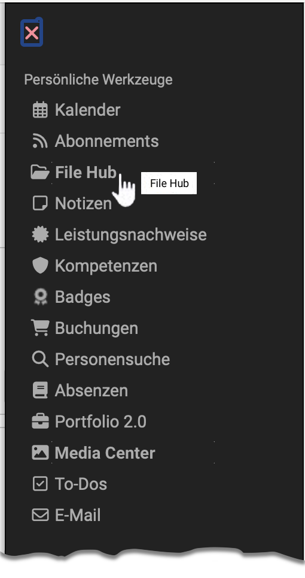

# Personal tools: File Hub {: #file_hub}

{ class="aside-right lightbox"}

As of Release 19, a file hub is available in OpenOlat as a **global file browser**, in which **all folders available in OpenOlat** are listed. (Course folders, group folders, archive folders, etc.)

However, only folders to which the person logged in has access authorization are displayed in the File Hub.

{ class="shadow lightbox"}

## Features of the File Hub {: #features}

* **Multi-file upload** via drag & drop
* If files are transferred to another location in the File Hub, they are **copied** in each case.  
(In contrast to the [Media Center](../personal_menu/Media_Center.md), where logos, terms and conditions, etc. are centrally managed, updated and made available to all authors. This is why the files are linked there).
* Only folders in the File Hub to which the person currently logged in has **access permissions** are displayed.

See also [File Hub (basic concept)](../basic_concepts/File_Hub_Concept.md)

## Where is the File Hub used? {: #where_used}

The folders and files are displayed in the File Hub according to individual, personal permissions, which is why the File Hub is also one of the **personal tools** and can be found in the **personal menu**.

However, the File Hub is also displayed in many other places whenever **selected from files** is to be selected.

To **display the contents of a folder**, you can find the File Hub in the course administration under **Administration > Files**. (From release 19)

## Toggle tile view - list view {: #views}

You can switch the view of the File Hub between tile and list view. In both views, you will find the other options (Open file / Download file) under the 3 dots.

{ class=" shadow lightbox" }

{ class=" shadow lightbox" }

## General information about folders {: #general_info}

Folders are used to store documents, make files available for download or exchange files with other users. 

If you have read **and** write permissions, which must first be assigned to you in courses or groups by the relevant coach, you can upload, create, copy, move and delete files in these folders. You automatically have read and write permissions in the personal folders.

File names of files you wish to upload to OpenOlat should contain only the following:

a-z, A-Z, 0-9, as well as "-", ".", "_" or space

Additionally you can zip or unzip files. All these actions can be performed
with single files and folders or with several ones at once. If you want to
upload many files at once there are two options at your disposal.

On the one hand, you can zip your files on your computer, upload the ZIP file and unzip it in the OpenOlat folder. You can also transfer and organize multiple files via WebDAV. All folders are WebDAV-capable, i.e. folders in OpenOlat are available to you as a normal network drive, which you can use to copy, move and delete files very easily. Further information can be found in the chapter "[Using WebDAV](../basic_concepts/Using_WebDAV.md)".

!!! info "Note"

    In order for the WebDAV access to work, it needs to be activated by your OpenOlat administrator first.

## Quota {: #quota}

The storage space per folder is limited. The administrator determines the available storage space. The default setting for the private and public folders is 100 MB. To increase this quota your respective OpenOlat support center. Please contact the responsible contact person if necessary.

## Personal Files {: #personal_files}

Users can also find their “Personal files” in the File Hub. In this folder you
can find 2 subfolders, the folders  "private"  and  "public".

 _Private_

Every user can upload every supported file here. This folder can be used as
temporary storage and to get access to files from different servers. Here
OpenOlat works like a cloud.

Additionally, that data, which is downloaded in the data archiving, is saved
here as well.

 _Public_

Files, which should be available for other OpenOlat users, can be stored in this
folder. The public folder is visible in the user's business card. In the
personal tools in Other users you can search for the user who uploaded a file
for you. This simplifies the data exchange between OpenOlat users.

## Further information {: #further_information}

[File Hub (Basic concept) >](../basic_concepts/File_Hub_Concept.md) 
[Media Center >](../personal_menu/Media_Center.md) 

In OpenOlat, several different versions of folders exist. Beside the two folders in the personal menu in OpenOlat, the following folder versions exist:

  * [Storage folder >](../learningresources/Storage_folder.md) (in courses)
  * [Course element folder >](../learningresources/Course_Element_Folder.md) (in courses)
  * [Participant folder >](../learningresources/Course_Element_Participant_Folder.md) (in courses)
  * [Resource folder >](../learningresources/index.md#resource-folder) (learning resource)  
  * [Group tool: folder >](../groups/Using_Group_Tools.md) (in groups, similar to the course element folder in courses)
