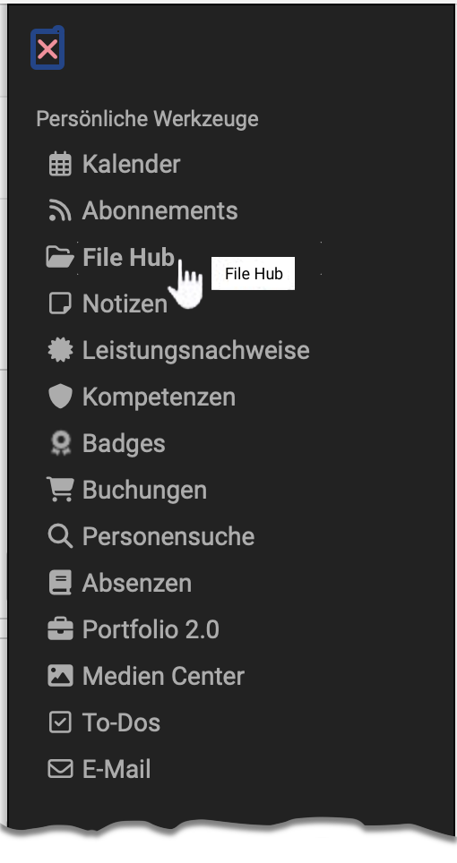
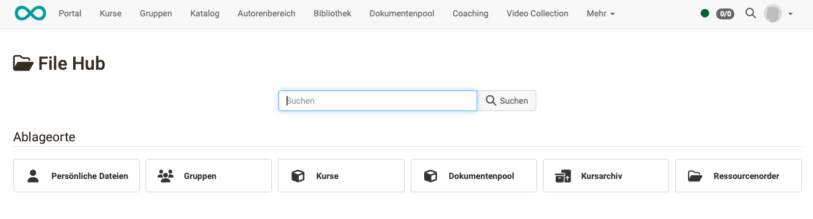
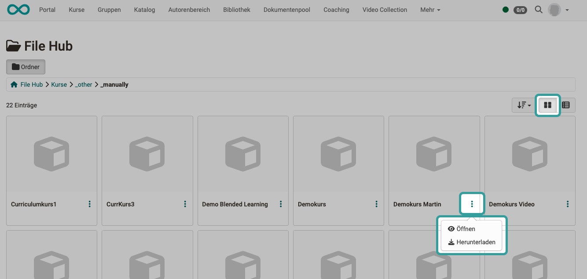
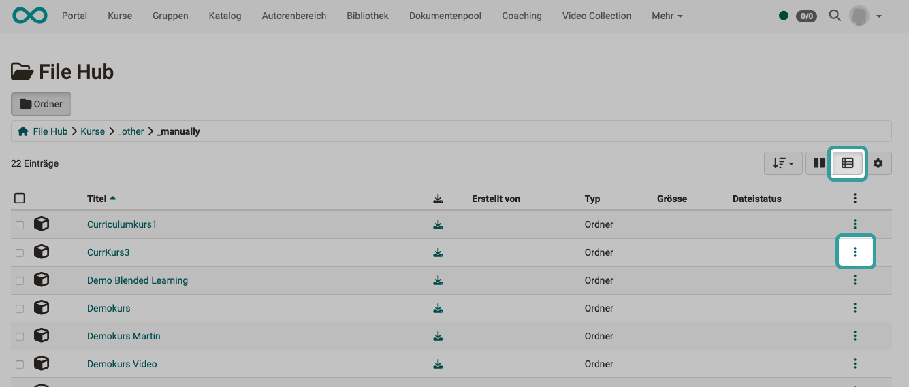

# Personal tools: File Hub

{ class="aside-right lightbox"}

As of Release 19, a file hub is available in OpenOlat as a **global file browser**, in which **all folders available in OpenOlat** are listed. (Course folders, group folders, archive folders, etc.)

However, only folders to which the person logged in has access authorization are displayed in the File Hub.

{ class="shadow lightbox"}

## Features of the File Hub

* **Multi-file upload** via drag & drop
* If files are transferred to another location in the File Hub, they are **copied** in each case.  
(In contrast to the [Media Center](../personal_menu/Media_Center.md), where logos, terms and conditions, etc. are centrally managed, updated and made available to all authors. This is why the files are linked there).
* Only folders in the File Hub to which the person currently logged in has **access permissions** are displayed.

See also [File Hub (basic concept)](../basic_concepts/File_Hub_Concept.md)

## Where is the File Hub used?

The folders and files are displayed in the File Hub according to individual, personal permissions, which is why the File Hub is also one of the **personal tools** and can be found in the **personal menu**.

However, the File Hub is also displayed in many other places whenever **selected from files** is to be selected.

To **display the contents of a folder**, you can find the File Hub in the course administration under **Administration > Files**. (From release 19)

## Toggle tile view - list view

You can switch the view of the File Hub between tile and list view. In both views, you will find the other options (Open file / Download file) under the 3 dots.

{ class=" shadow lightbox" }

{ class=" shadow lightbox" }

## Further information

[File Hub (Basic concept)](../basic_concepts/File_Hub_Concept.md) 
[Media Center](../personal_menu/Media_Center.md) 

