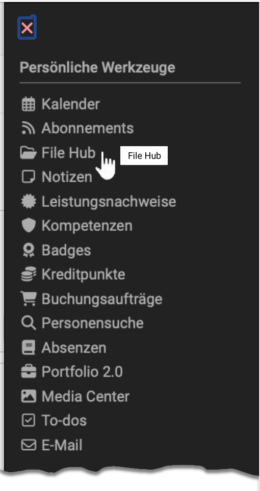
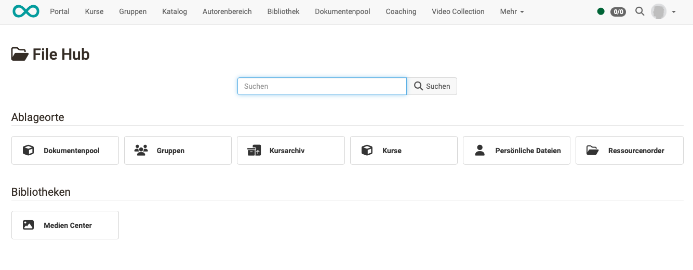
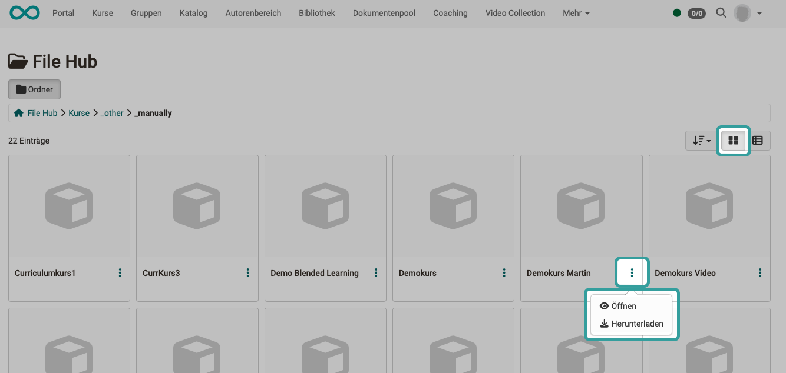
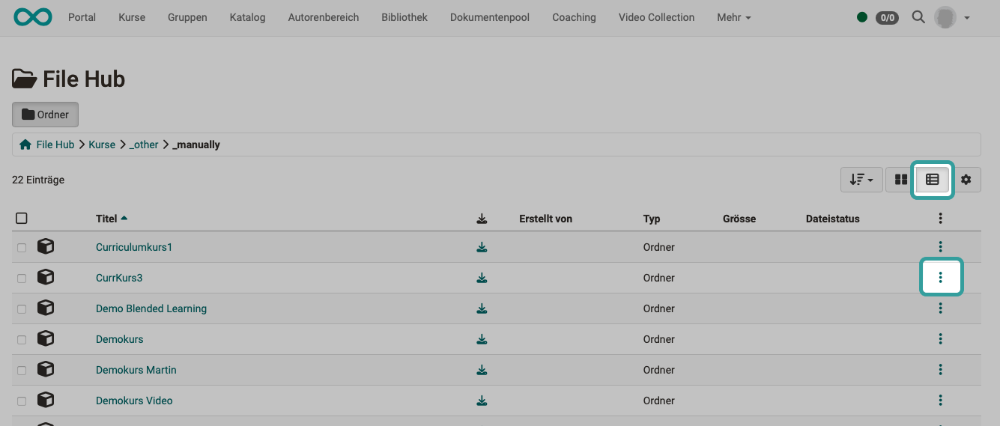

# Personal tools: File Hub {: #file_hub}

{ class="aside-right lightbox"}

The File Hub is the **global file browser** of OpenOlat. It lists **all folders available in OpenOlat**: course folders, group folders, archive folders and more.

The File Hub only displays folders to which the logged-in person has access permission.

{ class="shadow lightbox"}

[To the top of the page ^](#file_hub)

---

## Features of the File Hub [:octicons-tag-16:{ title="from Release 19.0.0 (OO-7700)" }](https://track.frentix.com/issue/OO-7700) {: #features}

* **Multi-file upload** via drag & drop
* If files are transferred to another location in the File Hub, they are **copied** in each case. 
(In contrast to the [Media Center](../personal_menu/Media_Center.md): There, logos, terms and conditions and similar files are centrally managed, updated and made available to all authors. This is why the files are linked there.)
* Only folders to which the currently logged-in person has **access permissions** are displayed in the File Hub.

See also [File Hub (basic concept)](../basic_concepts/File_Hub_Concept.md)

[To the top of the page ^](#file_hub)

---

## Where is the File Hub used? {: #where_used}

The folders and files are displayed in the File Hub according to the individual, personal permissions. This is why the File Hub is one of the **personal tools** and can be found in the **personal menu**.

However, the File Hub is also displayed in many other places whenever **files are to be selected**.

To **display the contents of a folder**, you can find the File Hub, for example, in the course administration: `Course > Administration > Files`.

[To the top of the page ^](#file_hub)

---

## Toggle tile view - list view {: #views}

You can switch the view of the File Hub between tile and list view. In both views, you will find the other options (open file, download file) in the menu with the three dots.

{ class="shadow lightbox" }

{ class="shadow lightbox" }

[To the top of the page ^](#file_hub)

---

## General information about folders {: #general_info}

Folders are used to store documents, make files available for download or exchange files with other users.

If you have read **and** write permissions, which must first be assigned to you in courses or groups by the coaches, you can upload, create, copy, move and delete files in these folders. You automatically have read and write permissions in the personal folders.

File names of files you wish to upload to OpenOlat should contain only the following:

a-z, A-Z, 0-9, as well as "-", ".", "_" or space

Additionally, you can zip or unzip files. All these actions can be performed with single files and folders or with several ones at once. If you want to upload many files at once, there are two options at your disposal.

On the one hand, you can zip your files on your computer, upload the ZIP file and unzip it in the OpenOlat folder. On the other hand, you can transfer and organize multiple files via WebDAV. All folders are WebDAV-capable, i.e. folders in OpenOlat are available to you as a normal network drive, which you can use to copy, move and delete files easily. Further information can be found in the chapter "[Using WebDAV](../basic_concepts/Using_WebDAV.md)".

!!! info "Important"

    In order for the WebDAV access to OpenOlat to work, WebDAV must be activated by your OpenOlat administrators.

[To the top of the page ^](#file_hub)

---

## Quota {: #quota}

The storage space per folder is limited. Administrators determine the available storage space. The default setting for the private and public folder is 200 MB. To increase this quota, contact your respective OpenOlat support center. Please contact the responsible contact persons if necessary.

[To the top of the page ^](#file_hub)

---

## Personal Files {: #personal_files}

Users can also find their "Personal files" in the File Hub. These are divided into the folders "private" and "public".

_Private_

Here, users can upload all supported files. This folder serves as temporary storage and allows access to documents from different computers. Here, OpenOlat works like a cloud.

Additionally, files that are saved via data archiving are stored in the private folder.

_Public_

Files that should be available to other OpenOlat users can be stored in this folder. The "public" folder is visible in the business card. In the personal tools, you can search under "Other users" for the person who uploaded a document there. This simplifies the data exchange between OpenOlat users.

In OpenOlat, several variants of folders exist. Beside the two folders in the personal menu, the following folder variants with different purposes exist:

* [Storage folder >](../learningresources/Storage_folder.md) (in courses)
* [Course element folder >](../learningresources/Course_Element_Folder.md) (in courses)
* [Participant folder >](../learningresources/Course_Element_Participant_Folder.md) (in courses)
* [Resource folder >](../learningresources/index.md#resource_folder) (learning resource)
* [Group tool: folder >](../groups/Using_Group_Tools.md) (in groups, similar to the course element folder in courses)

[To the top of the page ^](#file_hub)

---

## Further information {: #further_information}

**Mentioned on this page** 
[Media Center >](../personal_menu/Media_Center.md) 
[File Hub Concept >](../basic_concepts/File_Hub_Concept.md) 
[Using WebDAV >](../basic_concepts/Using_WebDAV.md) 
[Storage folder >](../learningresources/Storage_folder.md) 
[Course Element "Folder" >](../learningresources/Course_Element_Folder.md) 
[Course Element "Participant folder" >](../learningresources/Course_Element_Participant_Folder.md) 
[Various Types of Learning Resources >](../learningresources/index.md) 
[Using Group Tools >](../groups/Using_Group_Tools.md)

[To the top of the page ^](#file_hub)
