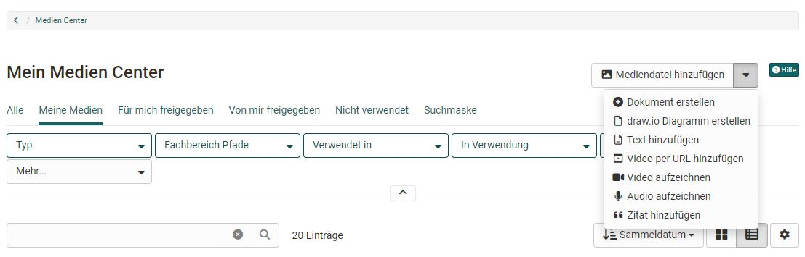
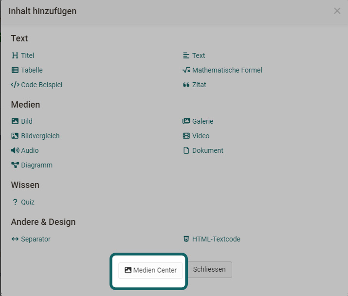
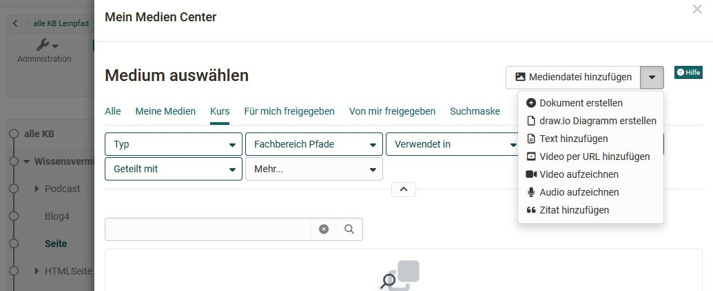
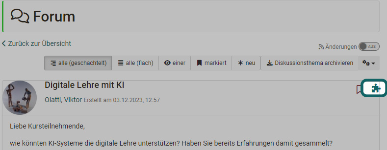
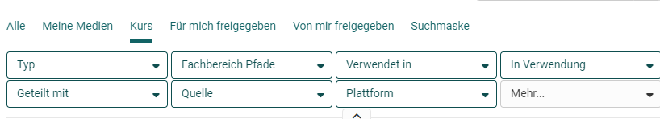

# Persönliche Werkzeuge: Das Medien Center

{ class="aside-right lightbox"}

Das Medien Center ist eine **zentrale Sammelstelle** für unterschiedlicher Medientypen. Medien können...

* ... direkt im Medien Center erstellt werden 
* ... in verschiedenen Kursbausteinen erstellt und dann im Medien Center abgelegt werden
* ... extern erstellt und als Datei hochgeladen werden
* ... kursübergreifend verwendet werden
* ... an andere Personen freigegeben (geteilt)  und gemeinsam genutzt werden
* ... versioniert werden
* ... mit Tags verschlagwortet werden
* ... einer Taxonomie zugeordnet werden
* ... gefiltert werden (z.B. "Meine Medien")
* ... nach Verwendungsort gesucht werden

{ class=" shadow lightbox" }

## Zugang

Das Medien Center ist zunächst ein individueller, persönlicher Bereich und deshalb auch im **persönlichen Menü** zu finden.

{ class=" shadow lightbox" }

{ class=" shadow lightbox" }

Auch wenn es sich um persönliche Medien handelt können diese mit anderen Personen geteilt und in verschiedenen OpenOlat Kontexten verwendet werden. 

## Medientypen

Im Medien Center können vielfältige **Dateiformate** und **Inhaltselemente** abgelegt und verwaltet werden. Hierzu gehören:  

* Bilder (png, jpg, ...)
* Video-Dateien (mp4)
* Audio-Dateien (mp3)
* Office-Dokumente (docx, xlsx, pptx, ...)
* Textelemente
* Diagramme (draw.io)
* eigene Video-Recordings per Webcam
* Audio-Recordings
* Zitate
* Forum-Postings
* Blog-Einträge
* Wiki-Seiten
* Leistungsnachweise aus Kursen

## Medien dem Medien Center hinzufügen

{ class=" shadow lightbox" } 

Um Medien im Medien Center zu hinterlegen gibt es verschiedene Wege: 

### Existierende Medien direkt im Medien Center hochladen bzw. verlinken

* **Mediendateien hinzufügen:** Bilder, Videos, pdf, Excel, usw. hochladen
* **Video per URL hinzufügen**: Videos aus externen Portalen wie YouTube, Vimeo, Panopto oder nanoo.tv können einfach per Link hinzugefügt werden. 
* **Zitat hinzufügen:** Hier können Zitate aus Büchern, Artikeln, Webseiten, Filmen u.ä. in Textform hinterlegt und mit Metadaten wie Quelle, Autor, URL usw. versehen werden. So können Zitate an mehreren Stellen in OpenOlat eingefügt werden, ohne immer wieder die gesamte Quelle eintragen zu müssen. Achten Sie aber darauf, alle Angaben sorgfältig und umfassend vorzunehmen.

### Neue Medien direkt im Medien Center erstellen

* **Dokument erstellen:** Dokumente integrierter Editoren, z.B. Word, Excel, PowerPoint
* **draw.io Diagramm erstellen**: Erstellt ein Diagramm, Flowchart bzw. eine Zeichnung mit dem Tool draw.io, ab :octicons-tag-24: Release 18.1. 
* **Text hinzufügen:** Textelemente zur Verwendung im Content Editor, mit einem einfachen HTML-Editor erstellt
* **Video aufzeichnen:** In OpenOlat integrierte Video-Recording-Funktion. Klickt man auf "Video aufzeichnen" wird direkt die Aufnahmefunktion für die Webcam gestartet, sofern man im Browser den Zugriff auf die Kamera erlaubt.
* **Audio aufzeichnen:** In OpenOlat integrierte Audio-Recording-Funktion. Klickt man auf "Audio aufzeichnen" wird die Aufnahmefunktion gestartet, sofern im Browser der Zugriff erlaubt wurde.

### Neue Medien jenseits des Medien Centers im Content Editor erstellen

Medien für das Medien Center können auch im OpenOlat Kurs oder im Portfolio per [Content Editor](../basic_concepts/Content_Editor.de.md) angelegt werden. Im Kurs geht das z.B. über den Kursbaustein ["Seite"](../learningresources/Course_Element_Page.de.md). Gehen Sie in den Bearbeitungsmodus und wählen Sie "Inhalt hinzufügen" aus. Anschliessend erscheint die Option **"Aus meinem Medien Center wählen"**.
{ class=" shadow lightbox" }

 Hier stehen dann alle Möglichkeiten wie beim direkten Erstellen im Medien Center zur Verfügung.

{ class=" shadow lightbox" }

### Inhaltselemente sammeln und mit dem Medien Center verknüpfen

Neben der Erstellung oder dem Upload von Medien im Medien Center können Medien auch an anderen Stellen in OpenOlat _gesammelt_ und mit dem Medien Center per Klick auf das Puzzleteil verknüpft werden. 

Zu den Elementen gehören:

  * Forum-Postings
  * Blogeinträge
  * Wiki Seiten
  * Leistungsnachweise aus Kursen

Um z.B. ein Posting hinzuzufügen, öffnen Sie Ihren Forumsbeitrag und klicken auf das Puzzleteil. 

{ class=" shadow lightbox" }

Es erscheint eine Seite, auf der Sie wie üblich Metadaten hinterlegen und alles speichern können. Anschliessend ist der Beitrag in Ihrem Medien Center verlinkt verfügbar.

!!! info "Wichtig"

    Bei Forenbeiträgen, Blogeinträgen und Wiki Seiten ist es erforderlich, dass man selbst Ersteller:in eines Eintrages bzw. einer Wikiseite ist. Nur eine Bearbeitung des Beitrags reicht nicht aus.

## Medien konfigurieren
Jedes Medienelement benötigt zwingend einen Titel und kann dann mit weiteren Informationen und Metadaten versehen werden. Später können diese Informationen über die Tabs eines Medienelements weiter konfiguriert werden.

### Metadaten hinzufügen

Folgende Informationen können einem Medienelement hinzugefügt werden: 

* Beschreibung 
* Tags zur Verschlagwortung und für eine bessere Übersicht
* Themen/Fachbereich Zuordnung
* Lizenzangabe
* "Alt-Text" bei draw.io Dateien oder Grafiken, besonders relevant für Screenreader

Je nach Art des Medientyps variieren die Informationen und Möglichkeiten der Metadaten. Alle Informationen können später problemlos in den entsprechenden Tabs geändert werden.  

### Medien Informationen verwalten 

Klicken Sie auf ein Medienelement um zu den entsprechenden Tabs zu gelangen. 

Jedes Medienelement umfasst folgende Tabs: 

* **Übersicht:** mit zentralen Details, Aktivitätslog, Bearbeitungsmöglichkeit, Versionierung, Möglichkeit die Datei zu ersetzen
* **Metadaten:** Infos zu Beschreibung, Lizenz, Tags, Fachbereich u.ä. 
* **Verwendungen:** Hier wird angezeigt wo das Element verwendet wird. 
* **Freigaben:** Hier kann festgelegt werden, für wen ein Inhaltselement freigegeben wird. Teilnehmende können nur Gruppen definieren. Autoren haben mehr Möglichkeiten und können spezifische OpenOlat Benutzer, Gruppen, oder Kurse angeben. Durch die Freigabe können Dateien auch kollaborativ genutzt werden, wenn die Bearbeitung erlaubt wird.
Darüber hinaus können über das 3Punkte-Menü auch einzelne Medien heruntergeladen oder gelöscht werden. 

{ class=" shadow lightbox" }

!!! info "Tipp"

    Interessant ist die Möglichkeit Medienelemente zu **versionieren**. So können z.B. verschiedene Arbeitsschritte oder Zwischenstufen gesichert werden. Ein Wechsel zu älteren Versionen ist dann jederzeit möglich. 

### Medien löschen

Selektieren Sie in der Tabellenansicht am Beginn einer Zeile mindestens einen Listeneintrag, erscheint über der Liste der Button "Löschen", mit dem sich mehrere Elemente auf einmal löschen lassen. 

{ class=" shadow lightbox" }

Einzelne Dateien können Sie auch im 3-Punkte-Menü löschen, wenn Sie ein einzelnes Medium angeklickt haben und die Informationen und Beschreibungen angezeigt werden. (Gleiches Menü wie zum Herunterladen.)

!!! info "Info"

    Beachten Sie, dass Sie nur **eigene** Medien, die nicht in OpenOlat an anderen Stellen eingebunden sind, löschen können. 

### Quota

Der im Medien Center verfügbare Speicherplatz kann vom OpenOlat Administrator eingeschränkt werden. Wieviel Speicher Ihnen genau zur Verfügung steht und wieviel Sie schon verbraucht haben, sehen Sie links unten.

{ class=" shadow lightbox" }

In der Regel haben Autor:innen einen höheren Speicherplatzbedarf, daher werden die Quota-Einstellungen separat für diese Poweruser vorgenommen. Wenden Sie sich bei Fragen zum Speicherbedarf an Ihre Administrator:innen.

## Medien verwenden

Und wie können die Medien, die sich im Medien Center befinden weiterverwendet werden? Die Dateien, Dokumente und Sammlungen können z.B. im Content Editor im Kursbaustein ["Seite"](../learningresources/Course_Element_Page.de.md) oder im [Portfolio](../area_modules/Portfolio.de.md) verwendet werden. 

{ class=" shadow lightbox" }

Die Filterfunktionen helfen, die gesuchten Medien schnell zu finden. Suchen oder filtern Sie nach ...

{ class=" shadow lightbox" }

!!! note "Hinweis"

    Bei der Einbindung von Dokumenten in einer Portfolio Mappe werden diese als _Links_ dargestellt und nicht direkt angezeigt.  
