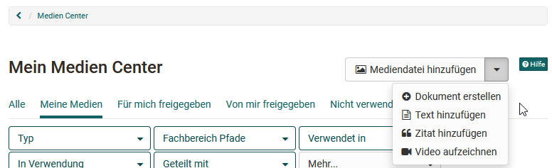

# Medien Center

Das Medien Center ist die zentrale Sammelstelle für alle persönlichen Artefakte (Medien) einer Person. Artefakte können unterschiedliche Medien und Dokumente oder auch OpenOlat spezifische Dinge sein. 

Die einzelnen Artefakte können im Kurs über den Kursbaustein ["Seite"](../learningresources/Course_Element_Page.de.md) oder generell im [Portfolio](../area_modules/Portfolio.de.md) verwendet werden.

Medien im Medien Center können nach verschiedenen Kriterien gefiltert werden z.B. Medientyp, eigene Medien ("Meine Medien"), gefiltert nach bestimmten Tags, ob und wo sie verwendet werden oder ob ein Artefakt mit Anderen geteilt wird oder nicht. 

Es gibt verschiedene Wege wie die Artefakte in das Medien Center gelangen können. Im Folgenden erfahren Sie wie genau. 

## Artefakte direkt im Medien Center hinzufügen

Hier können sie Artefakte erstellen oder hochladen.

Jede Datei bzw. jedes Artefakt erhält einen Titel. Zusätzlich können noch eine Beschreibung, eine Themen/Fachbereich Zuordnung und Tags hinzugefügt und auch definiert werden für wen das Artefakt freigegeben wird. Tags dienen hier der Verschlagwortung und helfen nach einem bestimmten Begriff zu suchen und somit die Übersicht im Medien Center zu behalten. 

!!! info "Info"

    Dasselbe Menü steht Ihnen auch im [E-Portfolio 2.0](../area_modules/The_portfolio_editor_17_1.de.md) zur Verfügung. Sie haben hier also über "Inhalt hinzufügen" -> "Aus meinem Medien Center wählen" ebenfalls die Möglichkeit Artefakte zu erstellen oder hochzuladen.

### Mediendatei hinzufügen

Hier gelangt man zum Upload-Bereich für Dateien. Es können diverse Dateitypen wie Word, Excel, PDF etc. hochgeladen werden. 

### Dokument erstellen

Je nachdem welche Editoren im OpenOlat System aktiviert sind können hier Dokumente wie docx, pptx oder xlsx erstellt werden. 

!!! "Hinweis"

    Bei der Einbindung eines Dokuments in einer Portfolio Mappe werden diese als Links dargestellt und nicht direkt angezeigt.  

### Text hinzufügen

Über diesen Link können Texte direkt im Medien Center mit dem einfachen HTML-Editor erstellt und gespeichert werden. Der Text wird bei der Einbindung in eine Portfolio Mappe direkt als Text dargestellt.

### Zitat hinzufügen

Es besteht die Möglichkeit, Zitate direkt in dem Medien Center zu erstellen. Dadurch wird es z.B. möglich, ein Zitat an mehreren Stellen im Portfolio einzufügen, ohne immer wieder die gesamte Quelle eintragen zu müssen. Man sollte aber darauf achten, alle Angaben sorgfältig und umfassend vorzunehmen. 

### Video aufzeichnen

Auch ein per Webcam aufgezeichnetes kurzes Video kann als Artefakt im Medien Center erstellt werden. Klickt man auf "Video aufzeichnen" wird direkt die Aufnahmefunktion für die Webcam gestartet, sofern man im Browser den Zugriff auf die Kamera erlaubt. 

## OpenOlat spezifische Artefakte mit dem Medien Center verknüpfen

Neben den Artefakten die im Medien Center erstellt oder hochgeladen werden können auch gewisse Beiträge/Elemente in OpenOlat gesammelt werden. Diese erscheinen dann ebenfalls im Medien Center

Zu den Elementen gehören:

  1. Forum Postings
  2. Blog Einträge
  3. Wiki Seiten
  4. Leistungsnachweise aus Kursen

Um z.B. ein Posting hinzuzufügen, öffnen Sie Ihren Forumsbeitrag und klicken auf das Puzzleteil. 

Anschliessend erscheint eine Seite auf der Sie den Titel, Tags sowie eine Beschreibung für den Postinginhalt eingeben können. Nach dem Speichern wird das Artefakt in Ihrem Medien Center angezeigt. 

Bei Forenbeiträgen, Blogeinträgen und Wiki Seiten ist es erforderlich, dass man selbst der Ersteller eines Eintrages bzw. einer Wikiseite ist. Nur eine Bearbeitung des Beitrags reicht nicht aus.

### Anzeige von Artefakten
Wählt man ein Artefakt aus erhält man weitere Informationen dazu. Alle Artefakte verfügen über die Tabs:
* **Übersicht:** Zentrale Details, Aktivitätslog, Bearbeitungsmöglichkeit, Versionierung, Datei ersetzen
* **Metadata:** Beschreibung, Lizenz, Tags, Fachbereich
* **Verwendungen:** Wo wird das Artefakt verwendet?
* **Freigaben:** Freigaben für Benutzer, Gruppen, Kurse definieren und ansehen

Artefakte können auch versioniert oder ersetzt werden. Ein Wechsel zu älteren Versionen ist ebenfalls möglich. Im Aktivitätenlog lassen sich die Änderungen nachvollziehen. 

Über das 3-Punkte Menü lassen sich Artefakte herunterladen und löschen 

!!! info "Info"

    Beachten Sie, dass Sie nur _eigene_ Artefakte, die nicht in OpenOlat an anderen Stellen eingebunden sind, löschen können. 

