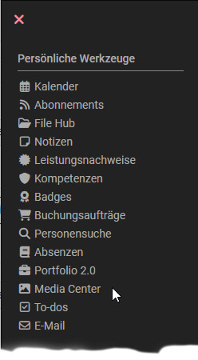

# Persönliche Werkzeuge: Das Media Center

{ class="aside-right lightbox"}

Alle OpenOlat User finden bei den „Persönlichen Werkzeugen“ ihr persönliches „Media Center“.  Hier können User Medien erstellen, hochladen und verwalten. Außerdem werden hier Medien angezeigt, die andere User für Sie freigegeben haben. 

Bei den Medien kann es sich beispielsweise um normale Dateien aber auch um OpenOlat spezifische Elemente wie Foreneinträge, Blog-Beiträge oder Leistungsnachweise handeln. 
Ferner stehen diverse Filtermöglichkeiten zur Verfügung um sich nur bestimmte Dateien anzeigen zu lassen. 

{ class=" shadow lightbox" }

„Mein Media Center“ spiegelt zunächst die individuellen Dateien einer Person wider. Deshalb findet man das Media Center auch unter den persönlichen Werkzeugen. Unabhängig davon kann an bestimmten Stellen in OpenOlat auch auf die Medien des Media Centers zugegriffen werden, z.B. in Kursen oder im Portfolio. Dort erscheint ein passendes Menü, über das man vorhandene Elemente aus dem eigenen Media Center auswählen oder neue Medien erstellen und direkt im Media Center speichern kann.

Ausführliche Informationen zur Funktionsweise des Media Centers finden Sie unter [„Konzept des Media Centers“](../basic_concepts/Media_Center_Concept.de.md).

## Weitere Informationen

[Ausführliche Informationen zum Media Center (Basiskonzept) >](../basic_concepts/Media_Center_Concept.de.md) 
[File Hub (Basiskonzept) >](../basic_concepts/File_Hub_Concept.de.md) 
[File Hub (Persönliches Menü) >](../personal_menu/File_Hub.de.md) 

