# Das Medien Center

Das Medien Center ist eine **zentrale Sammelstelle** unterschiedlicher Medientypen. Medien können...

* ... direkt im Medien Center erstellt werden (z.B. Videorecording, docx, pptx, …)
* ... in verschiedenen Kursbausteinen erstellt und dann im Medien Center abgelegt werden
* ... extern erstellt und als Datei hochgeladen werden

* ... kursübergreifend verwendet werden
* ... an andere Personen (Autor:innen) freigegeben (geteilt) werden und gemeinsam genutzt werden

* ... versioniert werden
* ... mit Tags verschlagwortet werden
* ... einer Taxonomie zugeordnet werden
* ... gefiltert werden (z.B. „Meine Medien“)
* ... nach Verwendungsort gesucht werden

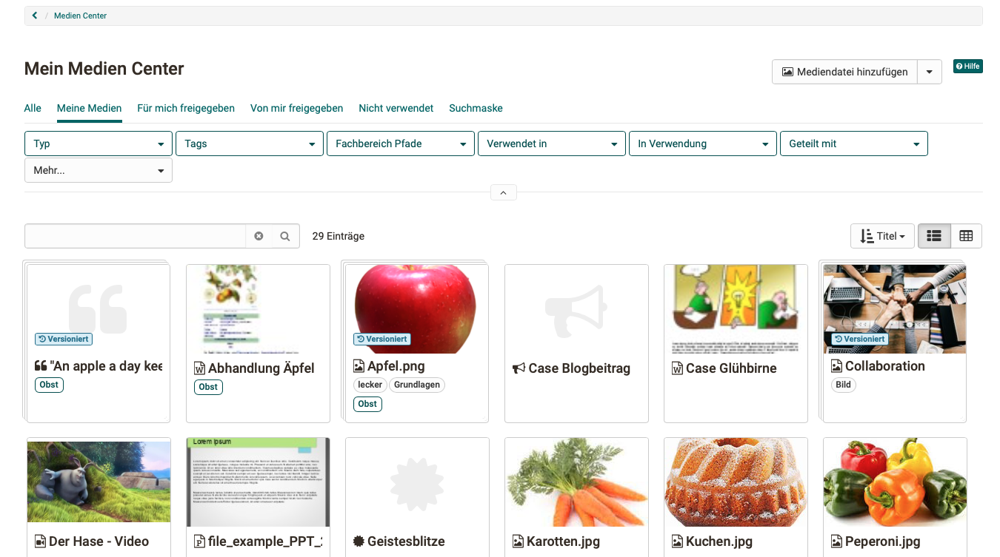{ class=" shadow lightbox" }

## Zugang

Im Medien Center sind manche Medien für mehrere Autor:innen verfügbar, manche nur für eine einzelne Person (Ersteller:in). Deshalb ist das Medien Center ein individueller, persönlicher Bereich und im **persönlichen Menü** zu finden.

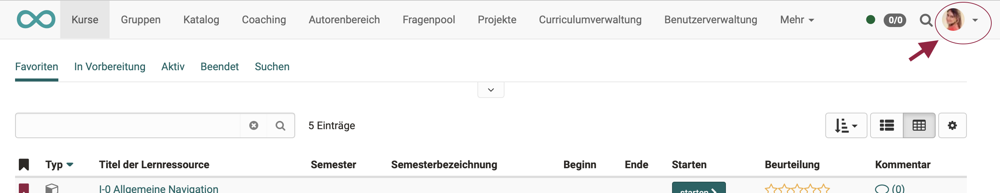{ class=" shadow lightbox" }

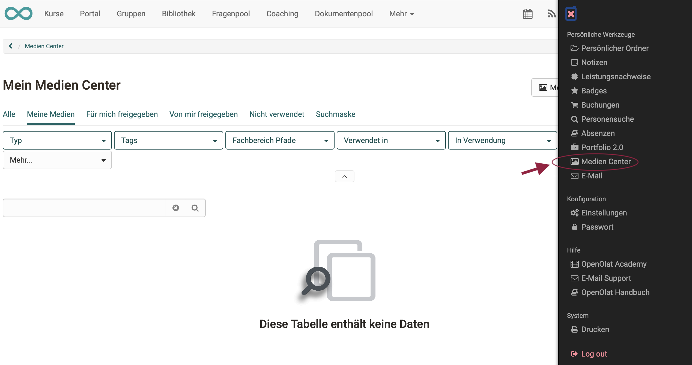{ class=" shadow lightbox" }

## Medientypen

Im Medien Center werden verschiedene **Dateiformate** und **Inhaltselemente** abgelegt.

Zum einen sind es bestimmte **Dateiformate**, wie

* Bilder (png, jpg, …)
* Video-Dateien (mp4)
* Audio-Dateien (mp3)
* Office-Dokumente (docx, xlsx, pptx, …)
* u.a.

Zum anderen sind es **Inhaltselemente** (im Content Editor verwendete Elemente), wie

* Elemente des Kursbausteins „Seite“ (mit dem Content Editor erstellt)
* Elemente des Kursbausteins „Portfolio“ (mit dem Content Editor erstellt)
* Texte
* Video-Recordings 
* Zitate
* Forum-Postings
* Blog-Einträge
* Wiki-Seiten
* Leistungsnachweise aus Kursen
* u.a.

## Medien hinzufügen

**1. Direkt im Medien Center hinzufügen**

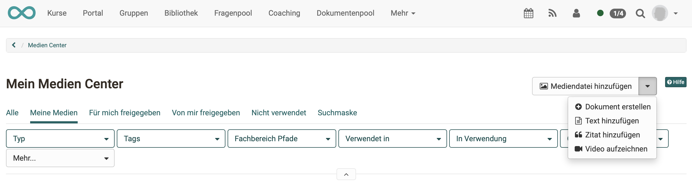{ class=" shadow lightbox" }

**Mediendateien hinzufügen:** Bilder, Videos, pdf, Excel, usw. hochladen 
**Dokumente erstellen:** Dokumente integrierter Editoren, z.B. Word, Excel, Powerpoint 
**Text hinzufügen:** Textelemente zur Verwendung im Content Editor, mit einem einfachen HTML-Editor erstellt 
**Zitat hinzufügen:** Direkt im Medien Center erstellte Zitate können an mehreren Stellen eingefügt werden, ohne immer wieder die gesamte Quelle eintragen zu müssen. Achten Sie aber darauf, alle Angaben sorgfältig und umfassend vorzunehmen.  
**Video aufzeichnen:** In OpenOlat integrierte Video-Recording-Funktion. Klickt man auf "Video aufzeichnen" wird direkt die Aufnahmefunktion für die Webcam gestartet, sofern man im Browser den Zugriff auf die Kamera erlaubt. 
**draw.io-Diagramme erstellen:** Ab Release 18.1

**2. Im Content Editor erstellen**

Wenn Sie mit dem Content Editor Inhaltselemente z.B. in einem Kursbaustein ["Seite"](../learningresources/Course_Element_Page.de.md) ergänzen, haben Sie unter "Inhalt hinzufügen" die Option **"Aus meinem Medien Center wählen"**. Dort können Sie ebenfalls Inhaltselemente erstellen oder hochladen, wie beim direkten Erstellen im Medien Center.

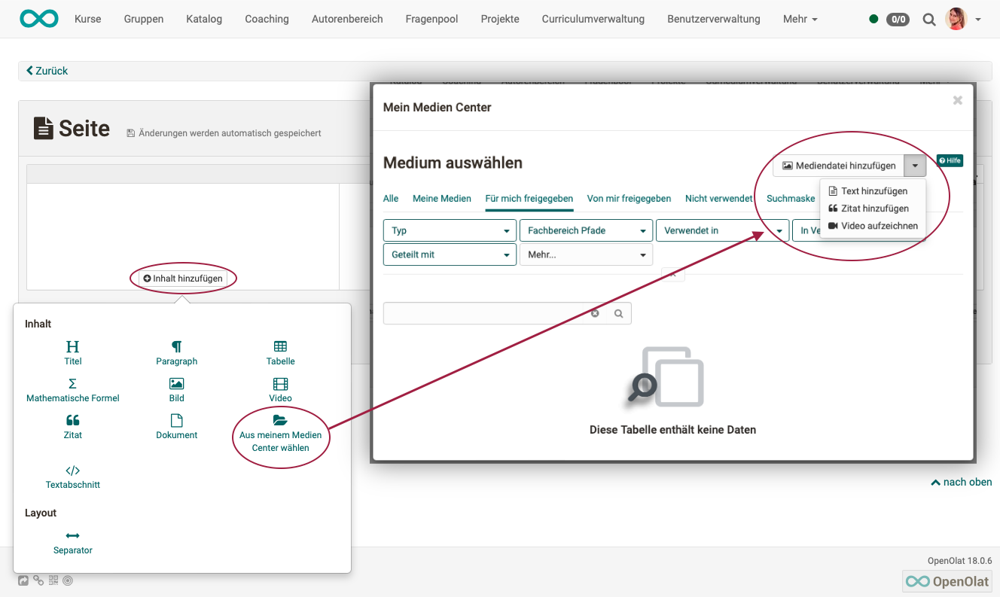{ class=" shadow lightbox" }

Jede Datei bzw. jedes Inhaltselement erhält einen Titel. Zusätzlich können noch eine Beschreibung, eine Themen-/Fachbereichszuordnung und Tags hinzugefügt werden. Es kann ausserdem festgelegt werden, für wen das Inhaltselement freigegeben wird. Tags dienen hier der Verschlagwortung und helfen nach einem bestimmten Begriff zu suchen und so die Übersicht im Medien Center zu behalten. 

!!! info "Info"

    Dateien und Inhaltselemente können auch **versioniert** oder ersetzt werden. Ein Wechsel zu älteren Versionen ist ebenfalls möglich. 
    
    Im **Aktivitätslog** lassen sich die Änderungen nachvollziehen. 

**3. Mit dem Medien Center verknüpfen**

Bestimmte Inhaltselemente können auch mit dem Medien Center verknüpft und als Links in OpenOlat gesammelt werden. Zu den Elementen gehören:

  1. Forum-Postings
  2. Blogeinträge
  3. Wikiseiten
  4. Leistungsnachweise aus Kursen

Um z.B. ein Posting hinzuzufügen, öffnen Sie Ihren Forumsbeitrag und klicken auf das Puzzleteil. 

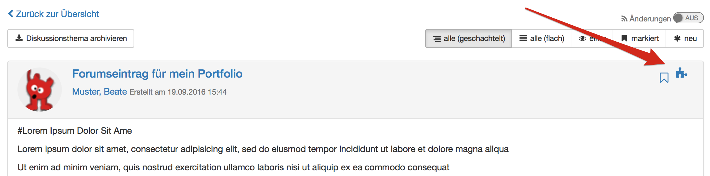

Anschliessend erscheint eine Seite, auf der Sie den Titel, Tags sowie eine Beschreibung für den Postinginhalt eingeben können. Nach dem Speichern wird der Beitrag in Ihrem Medien Center angezeigt. 

Bei Forenbeiträgen, Blogeinträgen und Wikiseiten ist es erforderlich, dass man selbst Ersteller:in eines Eintrages bzw. einer Wikiseite ist. Nur eine Bearbeitung des Beitrags reicht nicht aus.

## Medien nutzen

Die im Medien Center enthaltenen Medien können im **Content Editor** in Kursbausteine eingefügt werden.
Z.B. im Kursbaustein ["Seite"](../learningresources/Course_Element_Page.de.md) oder im [Portfolio](../area_modules/Portfolio.de.md). 

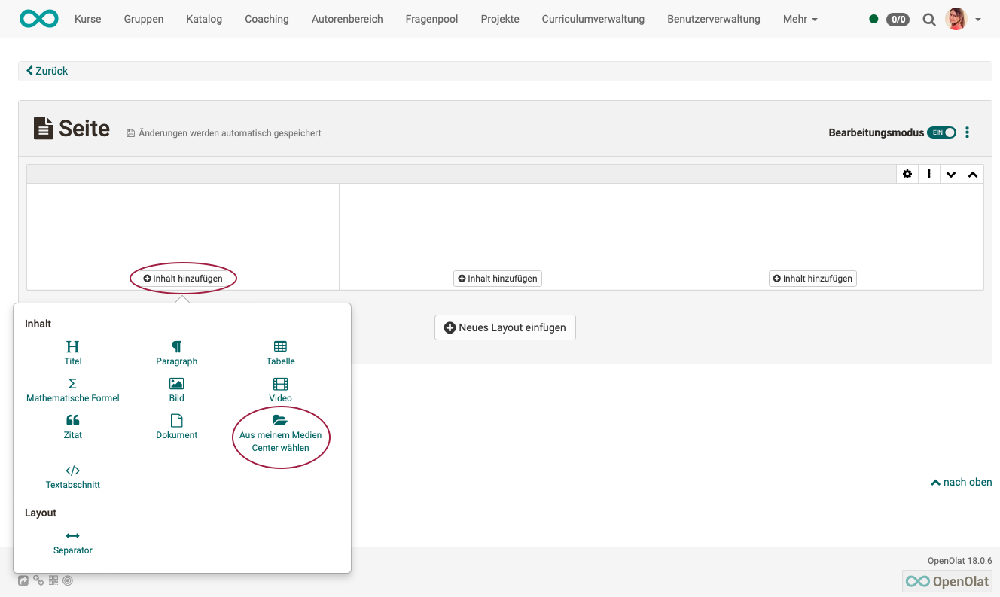{ class=" shadow lightbox" }

Die **Filterfunktionen** helfen, die gesuchten Medien schnell zu finden. Suchen Sie nach

* Medientyp
* "Meine Medien" (eigene Medien)
* Tags
* Taxonomie
* ob und wo ein Medium verwendet wird 
* ob ein Medium mit anderen geteilt wird oder nicht

**Informationen und Beschreibungen** sehen Sie durch Anklicken eines Eintrags im Medien Center. Alle Beschreibungen enthalten die Tabs:

* **Übersicht:** Zentrale Details, Aktivitätslog, Bearbeitungsmöglichkeit, Versionierung, Datei ersetzen
* **Metadata:** Beschreibung, Lizenz, Tags, Fachbereich
* **Verwendungen:** Wo wird die Datei oder das Inhaltselement verwendet?
* **Freigaben:** Freigaben für Benutzer, Gruppen, Kurse definieren und ansehen

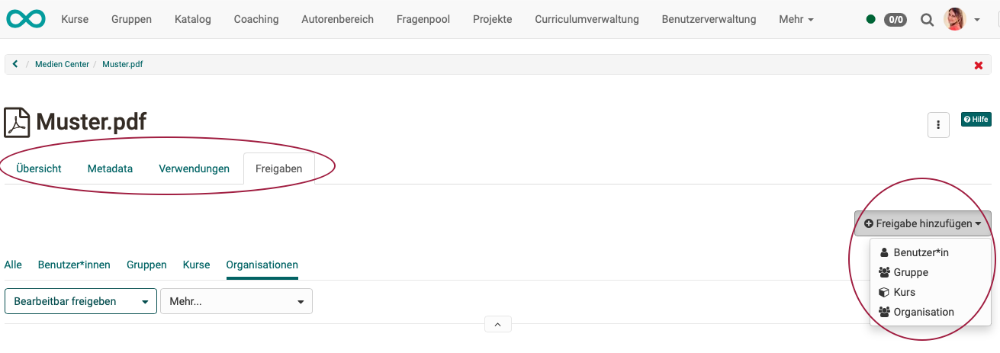{ class=" shadow lightbox" }

!!! note "Hinweis"

    Bei der Einbindung von Dokumenten in einer Portfolio Mappe werden diese als Links dargestellt und nicht direkt angezeigt.  

## Medien herunterladen

Die Medien können auch aus dem Medien Center heruntergeladen werden. Die Option dazu finden Sie im 3-Punkte-Menü, wenn Sie ein einzelnes Medium angeklickt haben und die Informationen und Beschreibungen angezeigt werden.

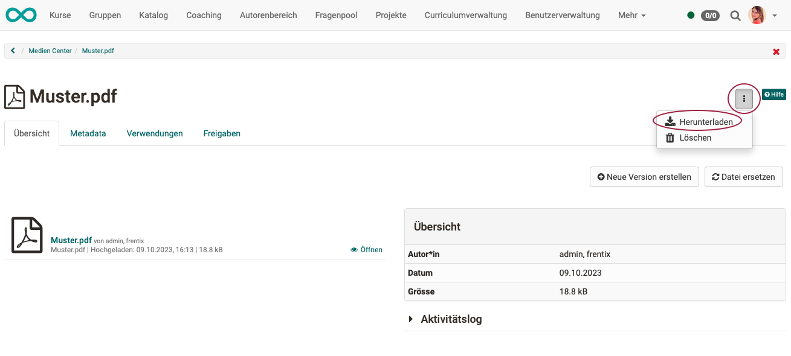{ class=" shadow lightbox" }

## Medien löschen

Selektieren Sie am Beginn einer Zeile mindestens einen Listeneintrag, erscheint über der Liste der Button "Löschen", mit dem sich mehrere Dateien und Inhaltselemente im Medien Center auf einmal löschen lassen. 

Einzelne Dateien können Sie auch im 3-Punkte-Menü löschen, wenn Sie ein einzelnes Medium angeklickt haben und die Informationen und Beschreibungen angezeigt werden. (Gleiches Menü wie zum Herunterladen.)

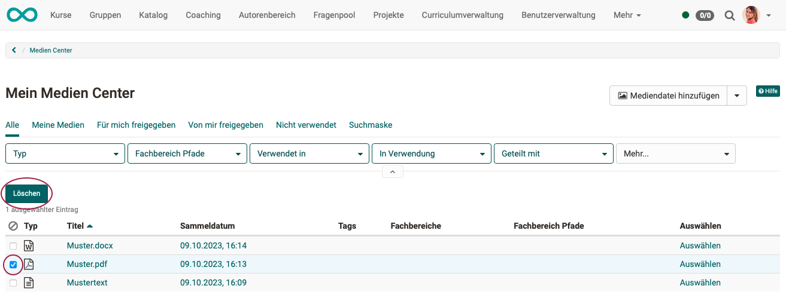{ class=" shadow lightbox" }

!!! info "Info"

    Beachten Sie, dass Sie nur **eigene** Medien, die nicht in OpenOlat an anderen Stellen eingebunden sind, löschen können. 

## Quota

Zur besseren Verwaltung der Medienelemente kann der verfügbare Speicherplatz im Medien Center konfiguriert werden. In der Regel haben Autor:innen einen höheren Speicherplatzbedarf, daher werden die Quota-Einstellungen separat für diese Poweruser vorgenommen.

Wenden Sie sich bei Fragen zum Speicherbedarf an Ihre Administrator:innen.

Sie finden die Information zum bereits verwendeten Speicherplatz links unten.

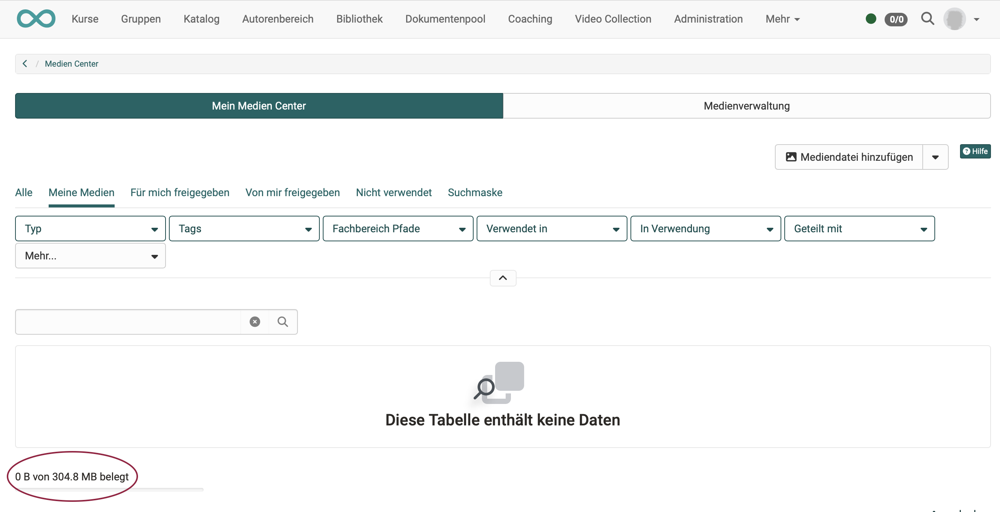{ class=" shadow lightbox" }

