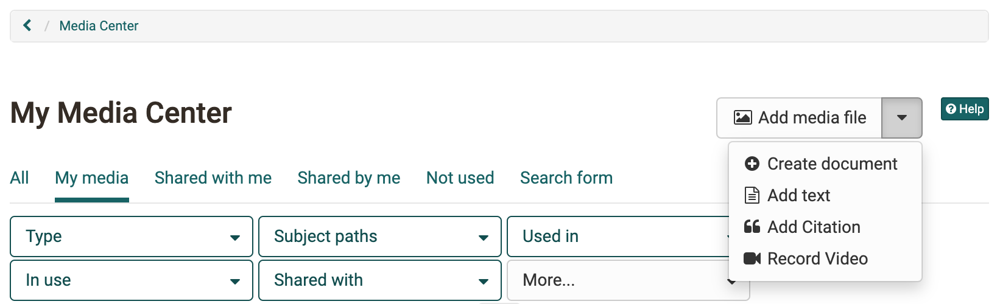

# Media Center

The Media Center is the central collection point for all of a person's personal artifacts (media). Artifacts can be different media and documents or OpenOlat specific things.

The individual artifacts can be used in the course via the course element [page](../learningresources/Course_Element_Page.md) or generally in the [portfolio](../area_modules/Portfolio.md).

Media in the Media Center can be filtered by different criteria e.g. media type, own media ("My Media"), filtered by certain tags, if and where they are used or if an artifact is shared with others or not.

There are different ways how the artifacts can enter the media center. Below you will learn exactly how.

## Upload file directly in the Media Center

Here you can create or upload artifacts. Additionally, a description, a topic/subject assignment and tags can be added. It can also defined for whom the artifact is released. Tags are used here for keywording and help to search for a specific term and thus to keep the overview in the media center.

!!! info "Info"

    The same menu is also available in the [E-Portfolio 2.0](../area_modules/The_portfolio_editor_17_1.md). Here you also have the possibility to create or upload artifacts via "Add content" -> "Choose from my media center".

### Add media file

Here you can access the upload area for files. Various file types such as Word, Excel, PDF etc. can be uploaded.

### Add document

Depending on which editors are activated in the OpenOlat system, documents such as docx, pptx or xlsx can be created here.

!!! info "Note"

    When including a document in a portfolio folder, they are displayed as links and not shown directly.

### Add text

Using this link, texts can be created and saved directly in the Media Center with the simple HTML editor. The text is displayed directly as text when included in a portfolio binder.

### Add citation

It is possible to create citations directly in the Media Center. This makes it possible, for example, to insert a quotation in several places in the portfolio without having to enter the entire source again and again. However, care should be taken to provide all information carefully and comprehensively.

### Record video

A short video recorded by webcam can also be created as an artifact in the Media Center. Clicking on "Record video" will directly start the recording function for the webcam, provided that you allow access to the camera in the browser.

## Linking OpenOlat specific artifacts to the Media Center

In addition to the artifacts created or uploaded in the Media Center, certain contributions/elements can also be collected in OpenOlat. These then also appear in the Media Center

  1. forum entries 
  2. blog entries
  3. wiki pages
  4. certificate of performance from courses

For example, to add a post, open your forum post and click on the puzzle piece.

After that, a page will appear where you can enter the title, tags as well as a description for the posting content. After saving, the artifact appears in your Media Center.

For forum posts, blog entries and wiki pages, it is required that you are the creator of an entry or wiki page. Just editing the post is not enough.

Please note that you must be the author when connecting forum entries, blog entries or wiki pages. It is not sufficient to just have editing rights.

## Artifacts display
If you select an artifact, you will get more information about it. All artifacts have the tabs:

* **Overview:** Central details, activity log, editing possibility, versioning, file replace
* **Metadata:** Description, License, Tags, Subject
* **Usage:** Where is the artifact used?
* **Clearances:** Define and view shares for users, groups, courses

Artifacts can also be versioned or replaced. Switching to older versions is also possible. The changes can be tracked in the activity log.

Artifacts can be downloaded and deleted via the 3-point menu

!!! info "Info"

    Note that you can only delete _own_ artifacts that are not included elsewhere in OpenOlat.

## Quota

For better management of media items, the available storage space can be configured in the Media Center. Generally, authors have higher storage requirements, so the quota settings are made separately for these power users.

If you have any questions about storage requirements, contact your administrator.

You can find the information about the storage space already used in the bottom left corner.

{ class=" shadow lightbox" }

