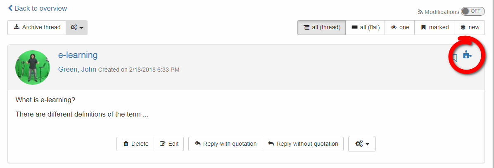

# Media Center

The Media Center allows you to collect various media files and other artefacts which can then be used in different portfolios. There are several options how to add elements to the Media Center, see below. The individual artifacts can be compiled in portfolio [binders](../area_modules/My_portfolio_binders.md) and thus structured and further developed.

In doing so, the items can enter the media library in different ways.

## Upload file directly in the Media Center

### Add document

Various file types like word, excel, pdf, etc. can be uploaded here. Every file gets a title. Additionally, a description and categories can be added. Categories are like tags and help if you are looking for a certain term or just want to simplify the overview of the portfolio. When adding a file from the Media Center to a portfolio binder, the file will only be shown as a link.

!!! info ""

    If external document editors are used in OpenOlat, files can also be created here.

### Add media file

In addition to documents media like images or videos can be uploaded.

### Add text

This allows you to create and save simple texts within the Media Center itself. When adding such a text to a portfolio binder, the text will be displayed (html format).

### Add citation

As far as possible you can upload a citation in the Media Center. It allows you to insert a citation more than once in a portfolio without entering the whole source every time again and again. Therefore it is essential to implement carefully and completely the [source of citation](../area_modules/My_portfolio_binders.md#my-portfolio-binders) already the first time.

## Connect files from OpenOlat into your portfolio

It is possible to connect certain inputs of your OpenOlat with your portfolio, such as:

  1. forum entries 
  2. blog entries
  3. wiki pages
  4. certificate of performance

If you wish to connect e.g. a forum entry, open it and click on the blue puzzle icon. Type in a title and add a description and categories if available. Klick on "Save" and the entry will appear in your Media Center.

Please note that you must be the author when connecting forum entries, blog entries or wiki pages. It is not sufficient to just have editing rights.

## Upload Media to Portfolio Binders

When creating a new entry within a portfolio binder, you may upload files to the binder directly. More information is provided under [My portfolio binders](../area_modules/My_portfolio_binders.md).

  

  

