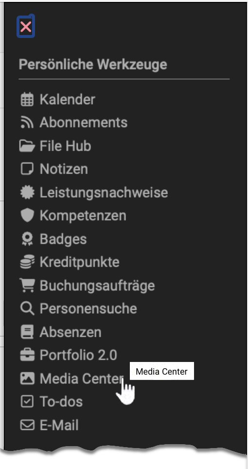

# Personal tools: Media Center {: #media_center}

{ class="aside-right lightbox"}

All OpenOlat users can find their personal Media Centre under Personal Tools. Here, users can create, upload and manage media. Media that other users have shared with you is also displayed here. 

The media can be normal files, for example, but also OpenOlat-specific elements such as forum entries, blog posts or performance records.
Furthermore, various filter options are available to display only certain files. 

{ class=" shadow lightbox" }

‘My Media Centre’ initially reflects a person's individual files. This is why the Media Centre can also be found under personal tools. Regardless of this, the media in the Media Centre can also be accessed at certain points in OpenOlat, e.g. in courses or in the portfolio. A corresponding menu appears there, which can be used to select existing elements from your own Media Centre or to create new media and save it directly in the Media Centre.

Detailed information on how the Media Centre works can be found at [„Media Center concept“](../basic_concepts/Media_Center_Concept.md).

---

## Further information {: #further_information}

[Detailed information on the Media Center (basic concept) >](../basic_concepts/Media_Center_Concept.md) 
[Configuration of Media Center (by administrators) >](../../manual_admin/administration/Modules_Media_Center.md) 
[File Hub (basic concept) >](../basic_concepts/File_Hub_Concept.md) 
[File Hub (personal menu) >](../personal_menu/File_Hub.md) 

