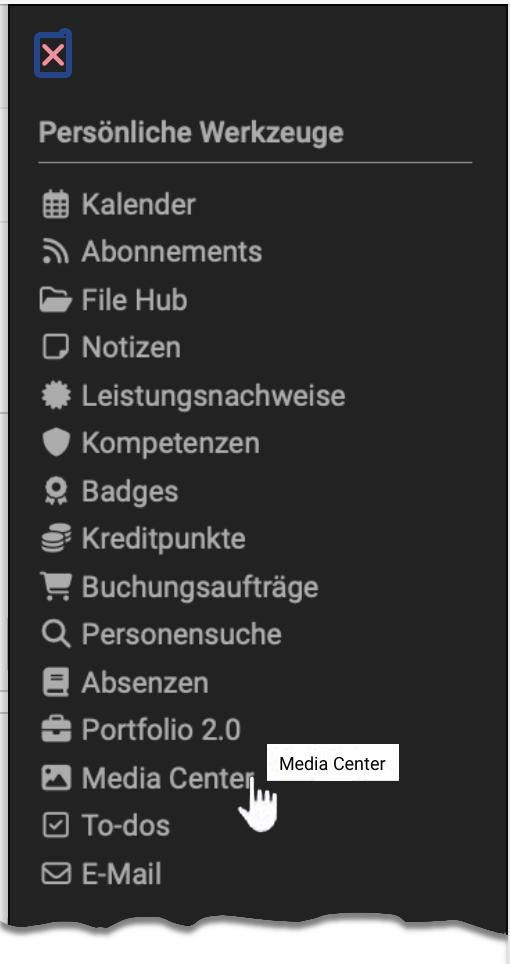

# Personal tools: Media Center {: #media_center}

{ class="aside-right lightbox"}

All OpenOlat users find their personal "Media Center" under "Personal tools". Here, users can create, upload and manage media. Media that other users have shared with you is also displayed here. 

The media can be normal files, for example, but also OpenOlat-specific elements such as forum posts, blog entries or evidence of achievement. 
Furthermore, various filter options are available to display only certain files. 

{ class=" shadow lightbox" }

"My Media Center" initially reflects a person's individual files. This is why the Media Center can also be found under Personal tools. Regardless of this, the media in the Media Center can also be accessed at certain points in OpenOlat, e.g. in courses or in the portfolio. A corresponding menu appears there, which can be used to select existing elements from your own Media Center or to create new media and save them directly in the Media Center.

Detailed information on how the Media Center works can be found at ["Media Center Concept"](../basic_concepts/Media_Center_Concept.md).

---

## Further information {: #further_information}

[Detailed information on the Media Center (basic concept) >](../basic_concepts/Media_Center_Concept.md) 
[Configuration of Media Center (by administrators) >](../../manual_admin/administration/Modules_Media_Center.md) 
[File Hub (basic concept) >](../basic_concepts/File_Hub_Concept.md) 
[File Hub (personal menu) >](../personal_menu/File_Hub.md)

[To the top of the page ^](#media_center)
