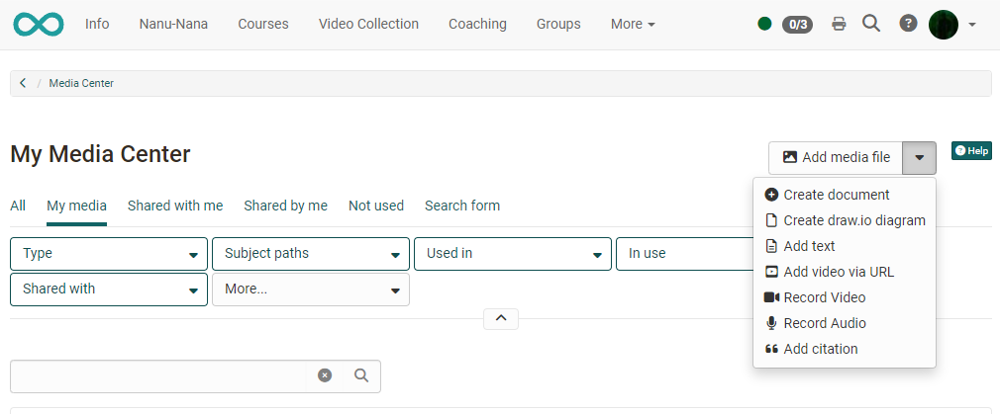
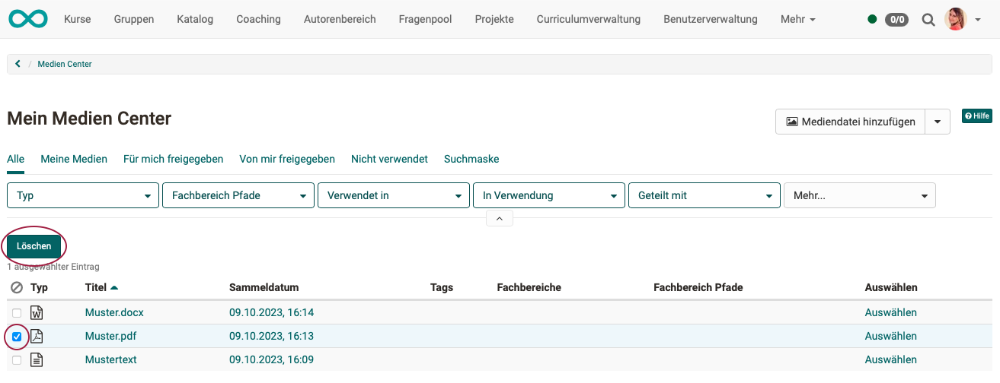
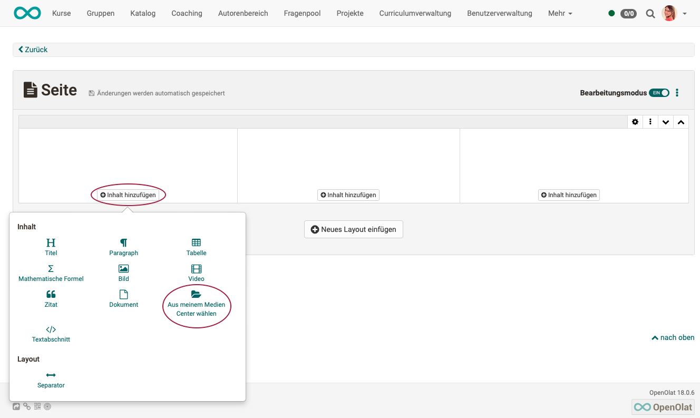

# Personal tools: Media Center

{ class="aside-right lightbox"}

The Media Center is a **central collection point** for different types of media. Media can be...

* ... created directly in the Media Center (e.g. video recording, docx, pptx, ...)
* ... created in various course elements and then stored in the Media Center
* ... created externally and uploaded as a file
* ... used across courses
* ... released (shared) to other persons (authors) and used jointly
* ... versioned
* ... tagged
* ... assigned to a taxonomy
* ... filtered (e.g. "My media")
* ... searched by place of use

{ class=" shadow lightbox" }

## Access

The Media Center is initially an individual, personal area and can therefore also be found in the **personal tools**.

{ class=" shadow lightbox" }

{ class=" shadow lightbox" }

Even if they are personal media, they can be shared with other people and used in various OpenOlat contexts.

## Types of Media

Different **file formats** and **content elements** are stored in the media center.

* images (png, jpg, ...)
* video files (mp4)
* audio files (mp3)
* Office documents (docx, xlsx, pptx, ...)
* texts
* video recordings via webcam
* audio recordings
* quotes
* forum posts
* blog entries
* wiki pages
* certificates of achievement from courses

# Add media to the Media center

There are various ways to store media in the Media center:

### Add directly in the Media Center

{ class=" shadow lightbox" }

**Upload or link existing media**

* **Add media file:** Upload images, videos, pdf, Excel, etc.
* **Add video via URL**: Videos from external portals such as YouTube, Vimeo, Panopto or nanoo.tv can simply be added via a link.
* **Add citation:**  Quotations from books, articles, websites, films, etc. can be stored in text form and provided with metadata such as source, author, URL, etc. This means that citations can be inserted in several places in OpenOlat without having to enter the entire source again and again. However, make sure that you enter all details carefully and comprehensively.

**Create completely new media**

* **Create document:** Documents of integrated editors, e.g. Word, Excel, Powerpoint 
* **Add text:** Text elements for use in the content editor, created with a simple HTML editor 
* Create **draw.io diagram**: Creates a diagram, flowchart or drawing with the draw.io tool, as of :octicons-tag-24: Release 18.1.
**Add text:** Text elements for use in the content editor, created with a simple HTML editor
* **Record video:** Video recording function integrated in OpenOlat. If you click on "Record video", the recording function for the webcam is started directly, provided you allow access to the camera in the browser.
* **Record Audio**:Audio recording function integrated in OpenOlat. If you click on "Record audio", the recording function is started, provided access has been permitted in the browser.

### Create media form the content editor

Media for the Media Center can also be created in the OpenOlat course or in the portfolio using the content editor. In the course, for example, this can be done via the course element ["Page"](../learningresources/Course_Element_Page.md). Go to edit mode and select "Add content". The option **"Select from my Media Center"** will then appear next to opther options.
{ class=" shadow lightbox" }

All the same options are available here as when creating directly in the Media Center.

{ class=" shadow lightbox" }

### Collect content elements and link them to the Media Center
In addition to creating or uploading media in the Media Center, media can also be _collected_ in other places in OpenOlat and linked to the Media Center by clicking on the puzzle piece.

The elements include:

1. forum posts
2. blog entries
3. wiki pages
4. evidences of achievement from courses

For example, to add a post, open your forum post and click on the puzzle piece.

A page will then appear where you can enter the title, tags and a description for the post content. After saving, the post will be displayed in your Media Center.

!!! info "Important"

    For forum posts, blog entries and wiki pages, it is necessary to be the creator of an entry or wiki page. Simply editing the post is not sufficient.

## Configure media
Each media element requires a title and can then be provided with further information and metadata. This information can later be further configured via the tabs of a media element.

### Add metadata

The following information can be added to a media element:

* Description 
* Tags for indexing and for a better overview
* Topics/subject area assignment
* License information
* "Alt-Text" for draw.io files or graphics, particularly relevant for screen readers

The information and metadata options vary depending on the type of media. All information can be easily changed later in the corresponding tabs.

### Manage media information 

Click on a media element to access the corresponding tabs. 

Each media element includes the following tabs:

* **Overview:** Central details, activity log, editing option, versioning, file replacement
* **Metadata:** Description, License, Tags, Department
* **Uses:** This shows where the element is used
* **Shares:** Here you can define who a content element is shared with. Participants can only define groups. Authors have more options and can specify specific OpenOlat users, groups or courses.

In addition, individual media can also be downloaded or deleted via the 3-dot menu.

{ class=" shadow lightbox" }

!!! info "Hint"

    The option of **versioning** media elements is interesting. For example, different work steps or intermediate stages can be saved. It is then possible to switch to older versions at any time.

### Delete media

If you select at least one list entry at the beginning of a line, the "Delete" button appears above the list, which can be used to delete several files and content elements in the Media Center at once.
{ class=" shadow lightbox" }

You can also delete individual files in the 3-dot menu if you have clicked on an individual medium and the information and descriptions are displayed. (Same menu as for downloading.)

!!! info "Info"

    Please note that you can only delete **your own** media that are not integrated in other places in OpenOlat.

## Quota

The storage space available in the Media Center can be limited by the OpenOlat administrator. You can find the information about the storage space already used in the bottom left corner.

{ class=" shadow lightbox" }

Generally, authors have higher storage requirements, so the quota settings are made separately for these power users. If you have any questions about storage requirements, contact your administrator.

## Use media

And how can the media in the Media Center be reused? The media contained in the Media Center can be inserted into course elements in the **Content Editor**, for example in the course element ["Page"](../learningresources/Course_Element_Page.md) or in the [Portfolio](../area_modules/Portfolio.md).

{ class=" shadow lightbox" }

The **filter functions** help you to find the media you are looking for quickly. Search or filter for ...

{ class=" shadow lightbox" }

!!! note "Note"

    When documents are included in a portfolio folder, they are displayed as _links_ and are not displayed directly.