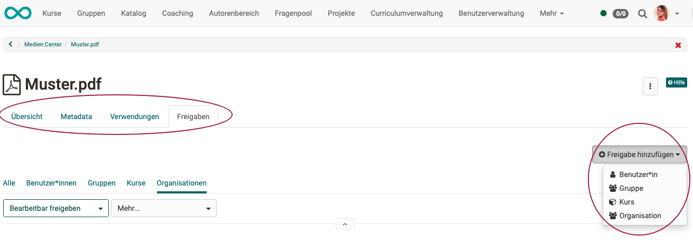

# Media Center

The Media Center is a **central collection point** for different types of media. Media can be...

* ... created directly in the Media Center (e.g. video recording, docx, pptx, ...)
* ... created in various course elements and then stored in the Media Center
* ... created externally and uploaded as a file
  
* ... used across courses
* ... released (shared) to other persons (authors) and used jointly

* ... versioned
* ... tagged
* ... assigned to a taxonomy
* ... filtered (e.g. "My media")
* ... searched by place of use

{ class=" shadow lightbox" }

## Access

In the Media Center, some media are available for several authors, some only for a single person (creator). That is why the Media Center is an individual, personal area and can be found in the **personal menu**.

{ class=" shadow lightbox" }

{ class=" shadow lightbox" }

## Types of Media

Different **file formats** and **content elements** are stored in the media center.

On one hand, these are specific **file formats** such as

* images (png, jpg, ...)
* video files (mp4)
* audio files (mp3)
* Office documents (docx, xlsx, pptx, ...)
* and others

On the other hand, these are content elements (elements used in the content editor), such as

* elements of the course element "Page" (created with the Content Editor)
* elements of the "Portfolio" course element (created with the Content Editor)
* texts
* video recordings
* quotes
* forum posts
* blog entries
* wiki pages
* certificates of achievement from courses
* and others

# Add media

**1. Add directly in the Media Center**

{ class=" shadow lightbox" }

**Add media file:** Upload images, videos, pdf, Excel, etc. 
**Create documents:** Documents of integrated editors, e.g. Word, Excel, Powerpoint 
**Add text:** Text elements for use in the content editor, created with a simple HTML editor 
**Add quote:**  Quotes created directly in the Media Center can be inserted in several places without having to enter the entire source again and again. However, make sure that you provide all details carefully and comprehensively. 
**Record video:** Video recording function integrated in OpenOlat. If you click on "Record video", the recording function for the webcam is started directly, provided you allow access to the camera in the browser. 
**Create draw.io diagrams:** As of release 18.1

**2. Create in the content editor**

If you use the Content Editor to add content elements, e.g. in a course element ["Page"](../learningresources/Course_Element_Page.md), you have the option **"Select from my Media Center"** under "Add content". You can also create or upload content elements there, as when creating directly in the Media Center.

{ class=" shadow lightbox" }

Each file or content element is given a title. In addition, a description, a topic/subject area assignment and tags can be added. You can also specify who the content element is shared with. Tags are used here for indexing and help to search for a specific term and thus maintain an overview in the Media Center.

!!! info "Info"

    Files and content elements can also be **versioned** or replaced. It is also possible to switch to older versions.

    The changes can be tracked in the **activity log**.

**3. Connect to the Media Center**

Certain content elements can also be linked to the Media Center and collected as links in OpenOlat. The elements include:

1. forum posts
2. blog entries
3. wiki pages
4. evidences of achievement from courses

For example, to add a post, open your forum post and click on the puzzle piece.

A page will then appear where you can enter the title, tags and a description for the post content. After saving, the post will be displayed in your Media Center.

For forum posts, blog entries and wiki pages, it is necessary to be the creator of an entry or wiki page. Simply editing the post is not sufficient.

## Use media

The media contained in the Media Center can be inserted into course elements in the **Content Editor**, for example in the course element ["Page"](../learningresources/Course_Element_Page.md) or in the [Portfolio](../area_modules/Portfolio.md).

{ class=" shadow lightbox" }

The **filter functions** help you to find the media you are looking for quickly. Search for

* media type
* "My media" (your own media)
* tags
* taxonomy
* where and whether media is used
* whether media is shared or not

**Information and descriptions** can be viewed by clicking on an entry in the Media Center. All descriptions contain the tabs:

* **Overview:** Central details, activity log, editing option, versioning, file replacement
* **Meta data:** Description, License, Tags, Department
* **Usage:** Where is the file or content element used?
* **Shares:** Define and view approvals for users, groups and courses

{ class=" shadow lightbox" }

!!! note "Note"

    When documents are included in a portfolio folder, they are displayed as links and are not displayed directly.

## Download media

The media can also be downloaded from the Media Center. You will find the option to do this in the 3-dot menu when you have clicked on an individual medium and the information and descriptions are displayed.

{ class=" shadow lightbox" }

## Delete media

If you select at least one list entry at the beginning of a line, the "Delete" button appears above the list, which can be used to delete several files and content elements in the Media Center at once.

You can also delete individual files in the 3-dot menu if you have clicked on an individual medium and the information and descriptions are displayed. (Same menu as for downloading.)

{ class=" shadow lightbox" }

!!! info "Info"

    Please note that you can only delete **your own** media that are not integrated in other places in OpenOlat.

## Quota

For better management of media items, the available storage space can be configured in the Media Center. Generally, authors have higher storage requirements, so the quota settings are made separately for these power users.

If you have any questions about storage requirements, contact your administrator.

You can find the information about the storage space already used in the bottom left corner.

{ class=" shadow lightbox" }

