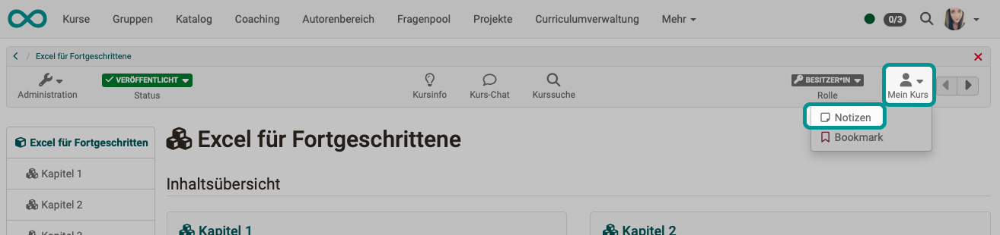

# Persönliche Werkzeuge: Notizen

{ class="aside-right lightbox"}

## Notizen in OpenOlat

In OpenOlat können an verschiedenen Stellen Notizen gemacht werden:

* Notizen zum Kurs
* Notizen in Projekten
* Notizen in Tests

In den persönlichen Werkzeugen finden Sie alle Notizen, die Sie **zu Ihren Kursen** gemacht haben. (Die Notizen zu Tests und Projekten sind hier nicht enthalten.) 

## Wo kann ich Notizen zu einem Kurs erstellen?

Notizen zu einem Kurs können Sie erstellen, wenn Sie in einem Kurs rechts oben das **Dropdown-Menü "Mein Kurs"** öffnen und dann die Option "Notizen" wählen. Hier können Sie kursspezifische Notizen eintragen, die nur Sie lesen können.

{ class="shadow lightbox"}

Es öffnet sich ein Editor, in dem pro Kurs ein Notizblatt zur Verfügung steht. 

{ class="shadow lightbox"}

!!! hint "Hinweis"

    Auf Wunsch können Sie Ihr Notizblatt auch ausdrucken. Sie finden den Button in der Kopfzeile des Editors.
    
    Vergessen Sie nicht zu speichern, wenn Sie den Editor verlassen. Scrollen Sie dazu zum Button am unteren Rand.

## Wo kann ich die Notizen zu Kursen ansehen?

Die Notizblätter aus den verschiedenen Kursen können Sie **gesammelt in den persönlichen Werkzeugen** ansehen, bearbeiten, ausdrucken und löschen. 
Klicken Sie zur Bearbeitung einer Notiz auf den Namen des Kurses.

{ class="shadow lightbox"}

## Weitere Informationen

[Unterbindung von Notizen im Prüfungsmodus](../learningresources/Assessment_mode.de.md#was-versteht-man-unter-prufungsmodus) 
[Unterschied zu Projekt-Notizen](../area_modules/Project_Notes.de.md) 
[Unterschied zu Notizen in Tests](../learningresources/Configure_tests.de.md#expert) 
[Notizen und Datenschutz](../../manual_admin/usermanagement/Data_protection.de.md#daten-die-exportiert-werden-konnen) 

