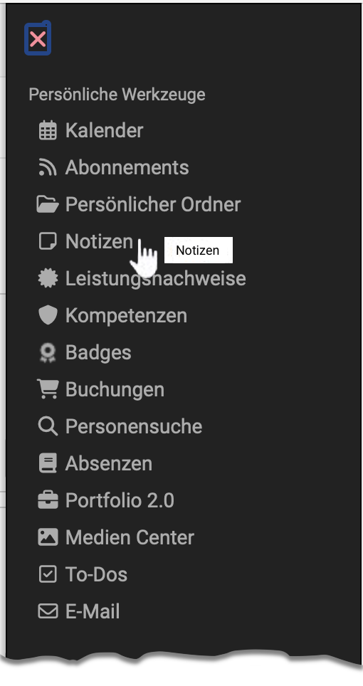
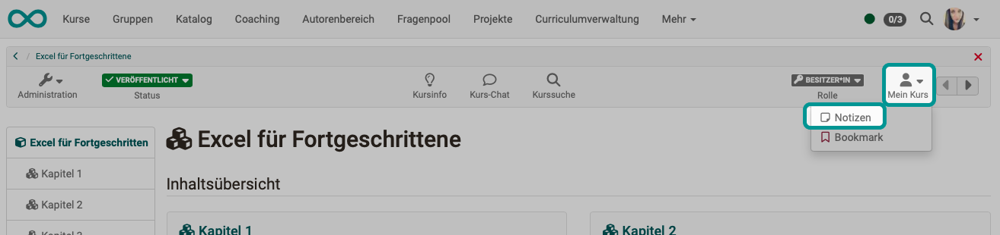
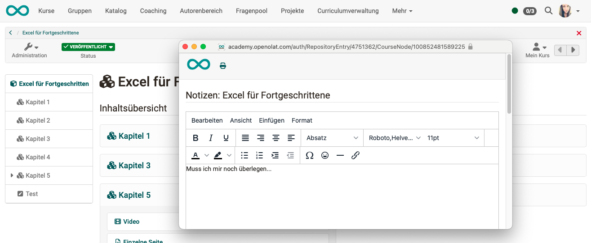
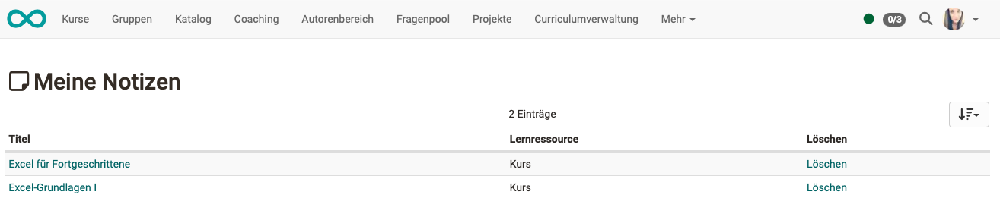

# Personal tools: Notes

{ class="aside-right lightbox"}

## Notes in OpenOlat

Notes can be made in various places in OpenOlat:

* Notes on the course
* Notes in projects
* Notes in tests

In the personal tools you will find all the notes you have made **on your courses**. (The notes on tests and projects are not included here).

## Where can I create notes on a course?

You can create notes for a course by opening the **"My course"** drop-down menu in the top right-hand corner of a course and then selecting the "Notes” option. Here you can enter course-specific notes that only you can read.

{ class="shadow lightbox"}

An editor opens in which one note sheet is available per course.

{ class="shadow lightbox"}

!!! hint "Note"

    If you wish, you can also print out your note sheet. You will find the button in the header of the editor.

    Don't forget to save when you leave the editor. To do this, scroll to the button at the bottom.

## Where can I view the course notes?

You can view, edit, print and delete the note sheets from the various courses **collected in the personal tools**. 
To edit a note, click on the name of the course.

{ class="shadow lightbox"}

## Further information

[Preventing notes in assessment mode](../learningresources/Assessment_mode.md#what-is-meant-by-assessment-mode) 
[Difference to project notes](../area_modules/Project_Notes.md) 
[Difference to notes in tests](../learningresources/Configure_tests.md#tab-expert--expert) 
[Notes and data protection](../../manual_admin/usermanagement/Data_protection.md) 

