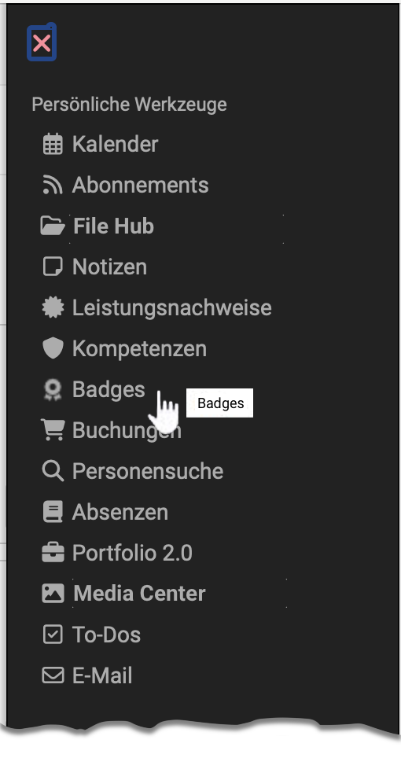

# Persönliche Werkzeuge: Badges {: #badges}

{ class="aside-right lightbox"}

"Badges" in Ihrem persönlichen Menü sind der Ort, an dem Sie alle Ihre erworbenen Badges aufbewahren und einsehen können, unabhängig davon, wie und wo sie in OpenOlat verliehen wurden.

Es werden zentrale Informationen zu den einzelnen Badges angezeigt, und einzelne Badges können heruntergeladen und zu LinkedIn hinzugefügt werden.

Klickt man auf ein erhaltenes Badge gelangt man zur Badge Infoseite mit weiteren Informationen.

## Badge Infoseite

Auf dieser Seite erfahren Sie, wann und von wem das Badge vergeben wurde, sowie den Kontext, in dem es vergeben wurde. Darüber hinaus enthält die Seite eine Beschreibung und insbesondere die Vergabekriterien, die vom Ersteller des Badges festgelegt wurden, und bieten somit weitere wichtige Informationen.

Die Badge-Infoseite kann über den öffentlichen Link geteilt und in anderen Webkontexten eingebunden werden, sodass Personen auch ohne OpenOlat-Account darauf zugreifen können.

## Weitere Informationen zu den Badges für Lehrende {: #further_information}

* [Badges im Bewertungswerkzeug >](../learningresources/OpenBadges.de.md) 
* [Badges in der eAssessment-Administration >](../../manual_admin/administration/e-Assessment_openBadges.de.md)  
* [Wie vergebe ich in meinem Kurs Badges? >](../../manual_how-to/badges/badges.de.md) 
* [Leistungsnachweise in Kursen >](../learningresources/Course_Settings_Assessment.de.md#leistungsnachweis) 
* [Zertifikate >](../learningresources/Course_Settings_Assessment.de.md#kurs-zertifikat) 

