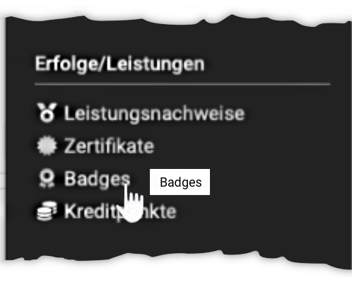
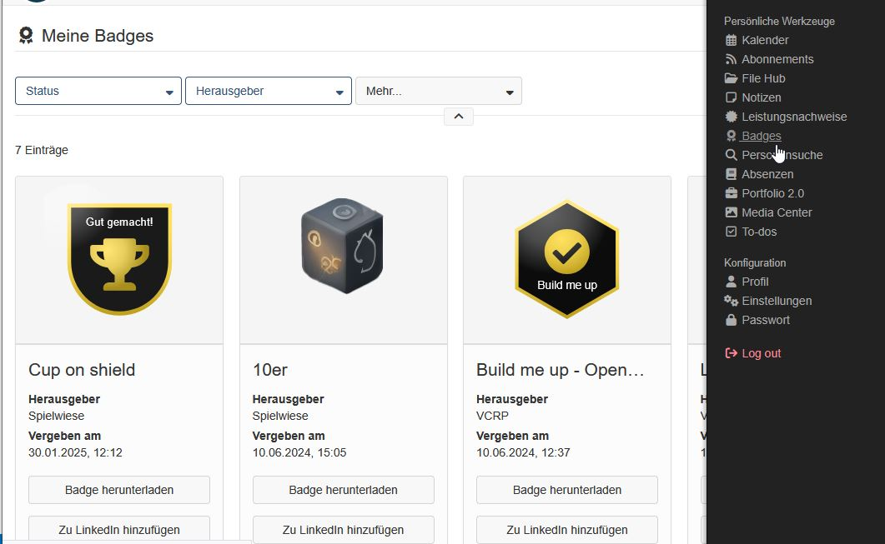
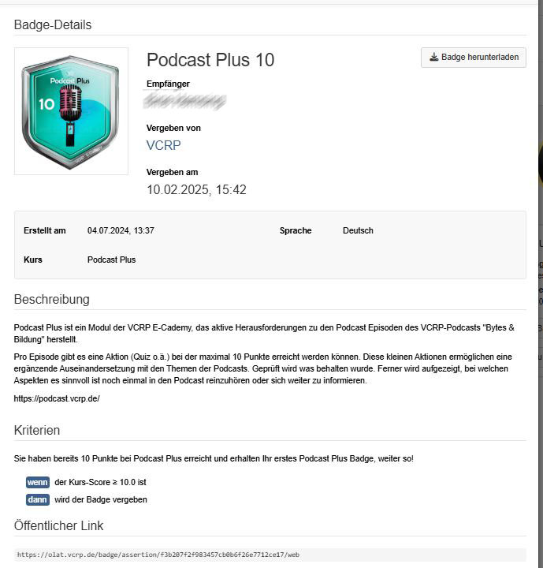

# Persönliche Erfolge/Leistungen: Badges {: #badges}

{ class="aside-right lightbox"}

"Badges" in Ihrem persönlichen Menü sind der Ort, an dem Sie alle Ihre erworbenen Badges aufbewahren und einsehen können, unabhängig davon, wie und wo sie in OpenOlat verliehen wurden.

Die Übersicht "Meine Badges" zeigt zu jedem Badge den Herausgeber und das Datum der Vergabe. Die Liste lässt sich nach Status und Herausgeber filtern. Mit "Badge herunterladen" speichern Sie das Badge als Bilddatei, mit "Zu LinkedIn hinzufügen" übernehmen Sie es in Ihr LinkedIn-Profil.

{ class="shadow lightbox" }

Mit einem Klick auf ein erhaltenes Badge öffnen Sie die Badge-Details.

---

## Badge-Details {: #badge_info}

Die Badge-Details zeigen, wann und von wem das Badge vergeben wurde, sowie den Kontext, in dem es vergeben wurde. Darüber hinaus enthält die Seite eine Beschreibung und die Vergabekriterien, die die Ersteller:in des Badges festgelegt hat.

Unter "Öffentlicher Link" finden Sie die Adresse, mit der Sie die Badge-Details teilen oder in andere Webseiten einbinden. Personen ohne OpenOlat-Account können so darauf zugreifen.

{ class="shadow lightbox" }

[Zum Seitenanfang ^](#badges)

---

## Weiterführende Informationen {: #further_information}

[Badges im Bewertungswerkzeug >](../learningresources/OpenBadges.de.md) 
[Badges in der eAssessment-Administration >](../../manual_admin/administration/e-Assessment_openBadges.de.md) 
[Wie vergebe ich in meinem Kurs Badges? >](../../manual_how-to/badges/badges.de.md) 
[Kurseinstellungen - Tab Bewertung >](../learningresources/Course_Settings_Assessment.de.md)

[Zum Seitenanfang ^](#badges)
