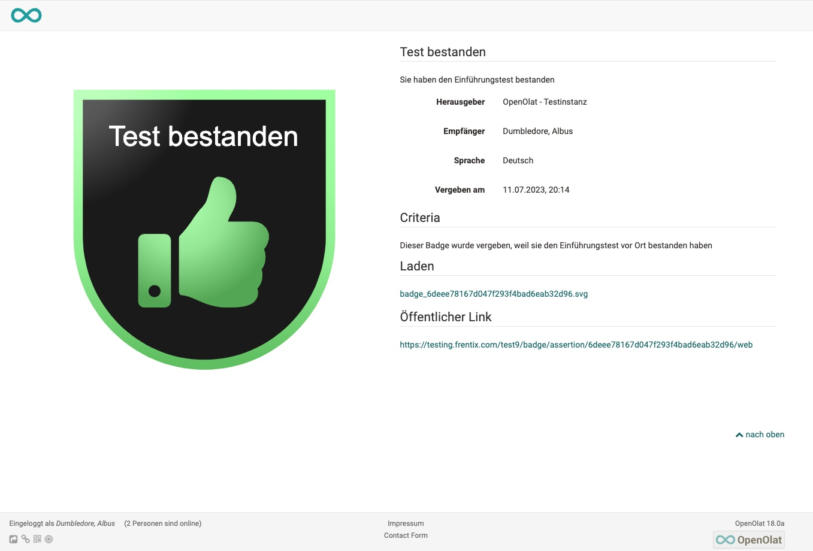

# Persönliche Werkzeuge: Badges

{ class="aside-right lightbox"}

Die Badges in Ihrem persönlichen Menü sind der Ort, an dem Sie alle Ihre erworbenen Badges aufbewahren bzw. einsehen können, unabhängig davon, ob sie durch einen Kurs oder von einer Person oder Institution verliehen wurden.

Es werden der Titel des Badges und die Verleihungszeit angezeigt.

Klickt man auf ein erhaltenes Badge gelangt man zur Badge Infoseite mit weiteren Informationen.

## Badge Infoseite

Hier erfährt man wann und von wem das Badge vergeben wurde und erhält Informationen zum Vergabekontext. Eine Beschreibung und besonders die Vergabekriterien, die vom Erstellenden des Badges vergeben wurden, enthalten weitere wichtige Informationen. 

Die Badge Infoseite kann über den aufgeführten öffentlichen Link geteilt werden und in anderen Webkontexten eingebunden werden. So können Personen auch ohne OpenOlat Account auf die Badge Infoseite zugreifen. 

## Weitere Informationen

[Badges im Bewertungswerkzeug](../learningresources/OpenBadges.de.md) 
[Badges in der eAssessment-Administration](../../manual_admin/administration/e-Assessment_openBadges.de.md) 
[Leistungsnachweise in Kursen](../learningresources/Course_Settings_Assessment.de.md#leistungsnachweis) 
[Zertifikate](../learningresources/Course_Settings_Assessment.de.md#kurs-zertifikat) 

