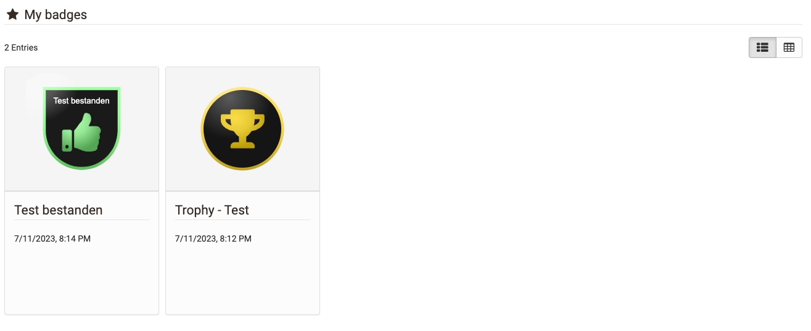
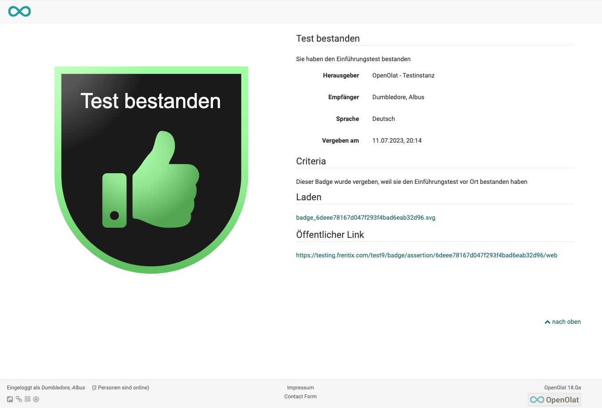

# Personal tools: Badges

{ class="aside-right lightbox"}

The badges in your personal menu are the place where you can store or view all the badges you have earned, regardless of whether they were awarded by a course or by a person or institution.

The title of the badge and the award period are displayed.

If you click on a badge you have received, you will be taken to the badge information page with further information.

## Badge info page

Here you can find out when and by whom the badge was awarded and information on the award context. A description and, in particular, the award criteria assigned by the creator of the badge contain further important information.

The badge info page can be shared via the listed public link and integrated into other web contexts. This means that people can also access the badge info page without an OpenOlat account. 

## Further information

[Badges in the assessment tool](../learningresources/OpenBadges.md) 
[Badges in the e-Assessment Administration](../../manual_admin/administration/e-Assessment_openBadges.md) 
[How do I award badges in my course? >](../../manual_how-to/badges/badges.md) 
[Evidences of achievement in courses](../learningresources/Course_Settings_Assessment.md#evidences-of-achievement) 
[Certificates](../learningresources/Course_Settings_Assessment.md#course-certificate) 
