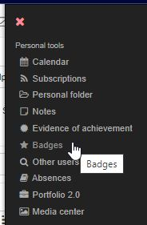

# Badges

Badges in your personal menu are your place for all your earned badges, whether they are awarded through a course or from a person or institution.

The badge title and the award time are displayed.

Clicking onto the Badge opens up the Info Site with further information. 

## Badge info page

Hier erfährt man wann und von wem das Badge vergeben wurde und erhält Informationen zum Vergabekontext. Eine Beschreibung und besonders die Vergabe-Kriterien, die vom Erstellenden des Badges vergeben wurden, erhalten weitere wichtige Informationen. 

Die Badge Infoseite kann über den aufgeführten öffentlichen Link geteilt werden und in anderen Webkontexten eingebunden werden. So können Personen auch ohne OpenOlat Account auf die Badge Infoseite zugreifen. 

