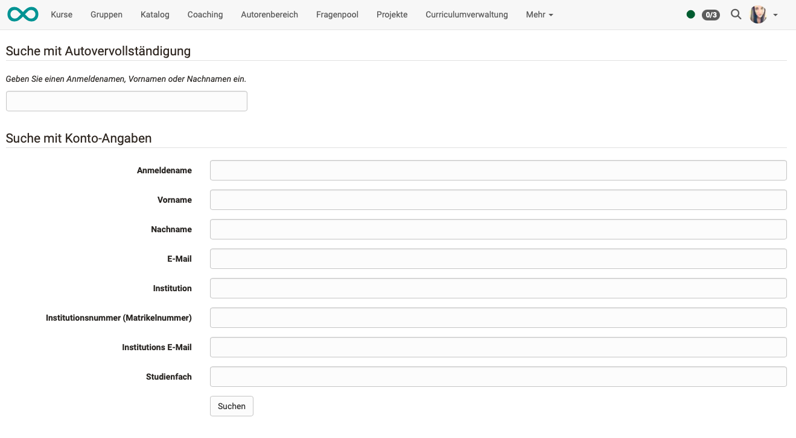

# Persönliche Werkzeuge: Personensuche

{ class="aside-right lightbox"}

Im Unterschied zur allgemeinen Volltextsuche, die unter dem Lupensymbol in der Kopfzeile aufgerufen werden kann, ist die Suchfunktion im persönlichen Menü eine **Personensuche**. Das Suchformular enthält die entsprechenden Felder, mit denen die Suche eingegrenzt werden kann.

{ class="shadow lightbox"}

!!! tip "Hinweis"

    Es muss mindestens ein Begriff zur Eingrenzung eingegeben werden. 
    Ausserdem muss der Suchbegriff eine gewisse Mindestlänge haben.

## Weitere Informationen

* [Volltextsuche](../basic_concepts/Full_Text_Search.de.md) 

