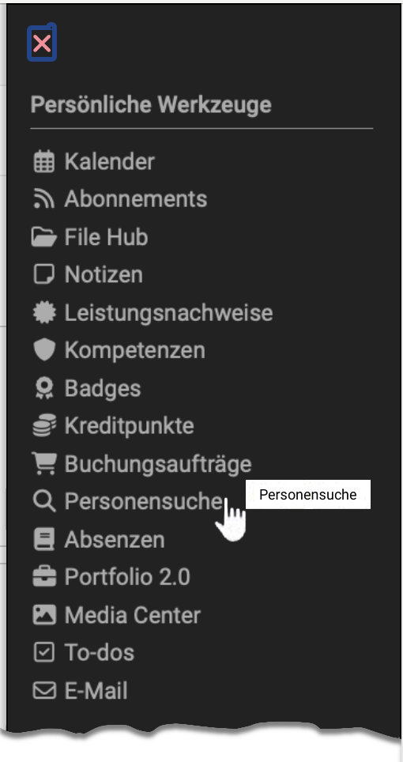
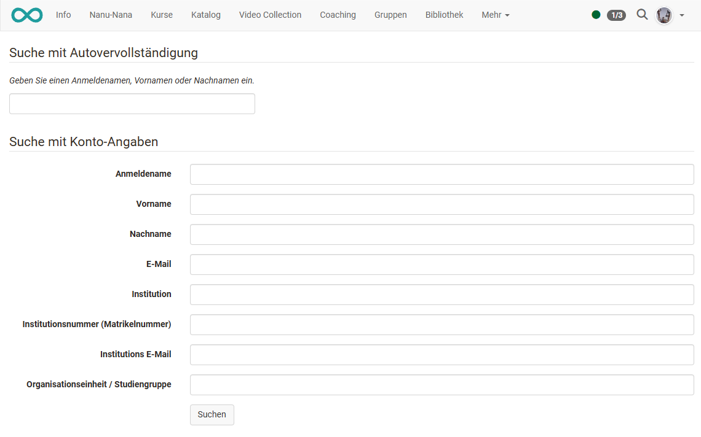

# Persönliche Werkzeuge: Personensuche {: #other_users}

{ class="aside-right lightbox"}

Im Unterschied zur allgemeinen Volltextsuche, die Sie über das Lupensymbol in der Kopfzeile aufrufen, ist die Suchfunktion im persönlichen Menü eine **Personensuche**. Das Suchformular enthält die Felder, mit denen Sie die Suche eingrenzen.

Die zur Verfügung stehenden Suchfelder können je nach Rolle variieren. Geben Sie mindestens einen Suchbegriff mit mindestens vier Zeichen ein.

{ class="shadow lightbox"}

## Weiterführende Informationen {: #further_information}

[Personensuche >](../basic_concepts/Search_Person.de.md) 
[Allgemeines zur Suche >](../basic_concepts/Search_General.de.md) 
[Globale Suche >](../basic_concepts/Search_Global.de.md) 
[Lokale Suche >](../basic_concepts/Search_Local.de.md) 
[Suche in einem Kurs >](../basic_concepts/Search_in_Course.de.md) 
[Suche im File Hub >](../basic_concepts/Search_in_FileHub.de.md)

[Zum Seitenanfang ^](#other_users)
