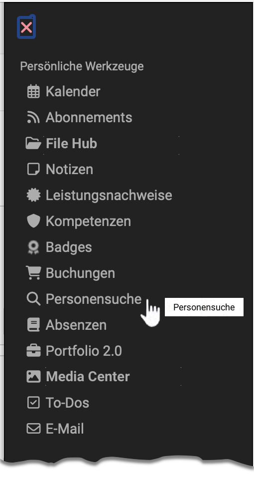
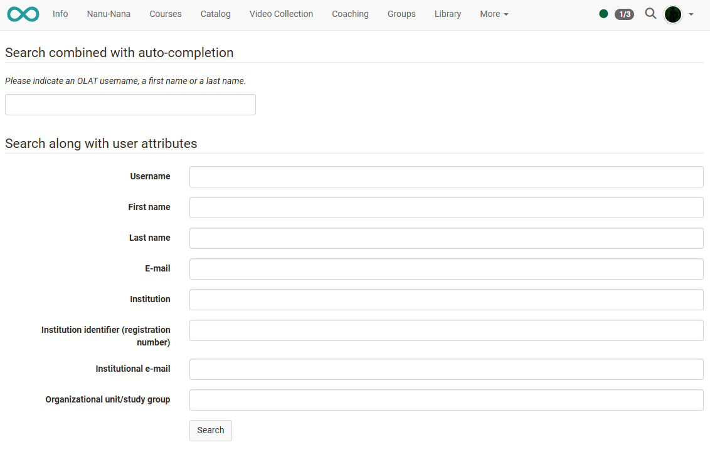

# Personal tools: Other users {: #other_users}

{ class="aside-right lightbox"}

In contrast to the general full-text search, which can be called up under the magnifying glass symbol in the header, the search function in the personal menu is a **person search**. The search form contains the corresponding fields with which the search can be narrowed down. 

The search fields available may vary depending on the role.

{ class="shadow lightbox"}

!!! tip "Note"

    At least one term must be entered to narrow it down. 
    In addition, the search term must have a certain minimum length.

## Further information {: #further_information}

General options for [Search for other users >](../basic_concepts/Search_Person.md) 

[General information about the search >](../basic_concepts/Search_General.md) 
[Global search >](../basic_concepts/Search_Global.md) 
[Local search >](../basic_concepts/Search_Local.md) 
[Search in a course >](../basic_concepts/Search_in_Course.md) 
[Search in File Hub >](../basic_concepts/Search_in_FileHub.md) 

