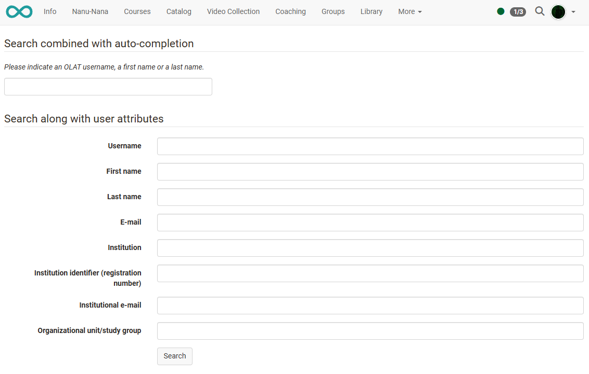

# Personal tools: Other users {: #other_users}

{ class="aside-right lightbox"}

In contrast to the general full-text search, which you open via the magnifying glass symbol in the header, the search function in the personal menu is a **search for other users**. The search form contains the fields with which you narrow down the search.

The available search fields may vary depending on the role. Enter at least one search term with at least four characters.

{ class="shadow lightbox"}

## Further information {: #further_information}

[Search other Users >](../basic_concepts/Search_Person.md) 
[General information on the search >](../basic_concepts/Search_General.md) 
[Global search >](../basic_concepts/Search_Global.md) 
[Local search >](../basic_concepts/Search_Local.md) 
[Search in a course >](../basic_concepts/Search_in_Course.md) 
[Search in the File Hub >](../basic_concepts/Search_in_FileHub.md)

[To the top of the page ^](#other_users)
