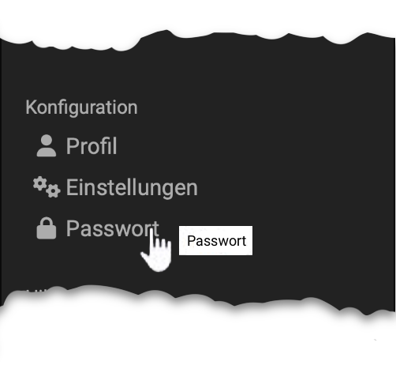
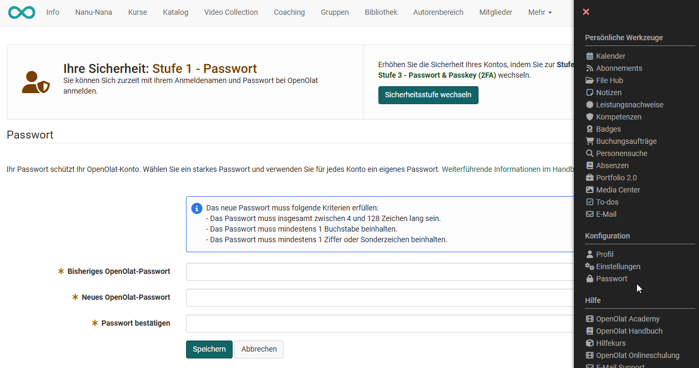

# Persönliche Konfiguration: Passwort {: #personal_configuration_password}

{ class="aside-right lightbox"}

Sofern Ihr Konto nicht von einem externen Benutzerverwaltungssystem gesteuert wird (siehe [Login-Konzept](../login_registration/Login_Concept.de.md)), können Sie im persönlichen Menü im Abschnitt "Konfiguration" Ihr Passwort ändern. Geben Sie dazu Ihr bisheriges OpenOlat-Passwort ein und danach zweimal das neue Passwort. Die Kriterien, die das neue Passwort erfüllen muss, zeigt OpenOlat über den Eingabefeldern an.

{ class="shadow lightbox" }

* Administrator:innen können die Erneuerung des Passworts in bestimmten Abständen erzwingen.
* Achten Sie darauf, bei der Vergabe eines neuen Passworts nicht noch einmal das alte Passwort zu verwenden.
* Die Verwendung von vorherigen Passwörtern kann durch Administrator:innen unterbunden werden.
* Wenn Sie Ihr Passwort vergessen haben, können Sie auf der [Login-Seite](../login_registration/Login_Page.de.md) über "Passwort vergessen?" ein neues Passwort anfordern. OpenOlat sendet Ihnen dazu einen 8-stelligen Validierungscode per E-Mail. [:octicons-tag-16:{ title="ab Release 20.0 (OO-8189)" }](https://track.frentix.com/issue/OO-8189)
* Falls in Ihrem System die SMS-Authentifizierung möglich ist und Sie eine Mobiltelefon-Nummer hinterlegt haben, kann der Validierungscode auch per SMS zugestellt werden.
* Sofern von den OpenOlat-Administrator:innen aktiviert, können Sie mit "Sicherheitsstufe wechseln" auch Ihre [Sicherheitsstufe](../login_registration/Security_levels.de.md) selbst wechseln.

## Weiterführende Informationen {: #further_information}

[Login-Konzept >](../login_registration/Login_Concept.de.md) 
[Login-Seite >](../login_registration/Login_Page.de.md) 
[Sicherheitsstufen >](../login_registration/Security_levels.de.md) 
[Passwort (Login und Registrierung) >](../login_registration/Password.de.md) 
[Passkey >](../login_registration/Passkey.de.md)

[Zum Seitenanfang ^](#personal_configuration_password)
