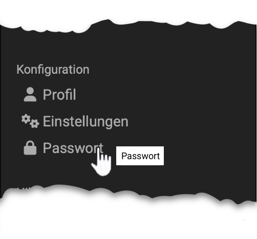

# Persönliche Konfiguration: Passwort

{ class="aside-right lightbox"}

Sofern Ihr Account nicht von einem externen Benutzerverwaltungssystem
gesteuert wird (siehe [Login-Konzept](../login_registration/Login_Concept.de.md)), können Sie im persönlichen Menü im Abschnitt "Konfiguration" Ihr Passwort ändern. 

*  Administrator:innen können die Erneuerung eines neuen Passworts in bestimmten Abständen auch erzwingen. 

* Achten Sie darauf, bei der Vergabe eines neuen Passworts nicht noch einmal das alte Passwort zu verwenden. 

* Die Verwendung von vorherigen Passwörtern kann durch Administrator:innen auch unterbunden werden.

* Wenn Sie Ihr Passwort vergessen haben, können Sie auf der Login-Seite ein neues Passwort anfordern. Der Aktivierungslink wird Ihnen anschliessend per Mail zugestellt. 

* Falls in Ihrem System die SMS-Authentifizierung möglich ist und Sie diese aktiviert haben, kann der Aktivierungscode auch per SMS zugestellt werden.

* Sofern von den OpenOlat Administrator:innen aktiviert können Sie auch Ihre Sicherheitsstufe selbst wechseln.

## Weitere Informationen

[Passwortänderung und -verwaltung](../login_registration/Password.de.md) 
[Login-Seite](../login_registration/Login_Page.de.md) 
[Login-Konzept](../login_registration/Login_Concept.de.md) 
[Passkey](../login_registration/Passkey.de.md) 
[Sicherheitsstufen](../login_registration/Security_levels.de.md) 

