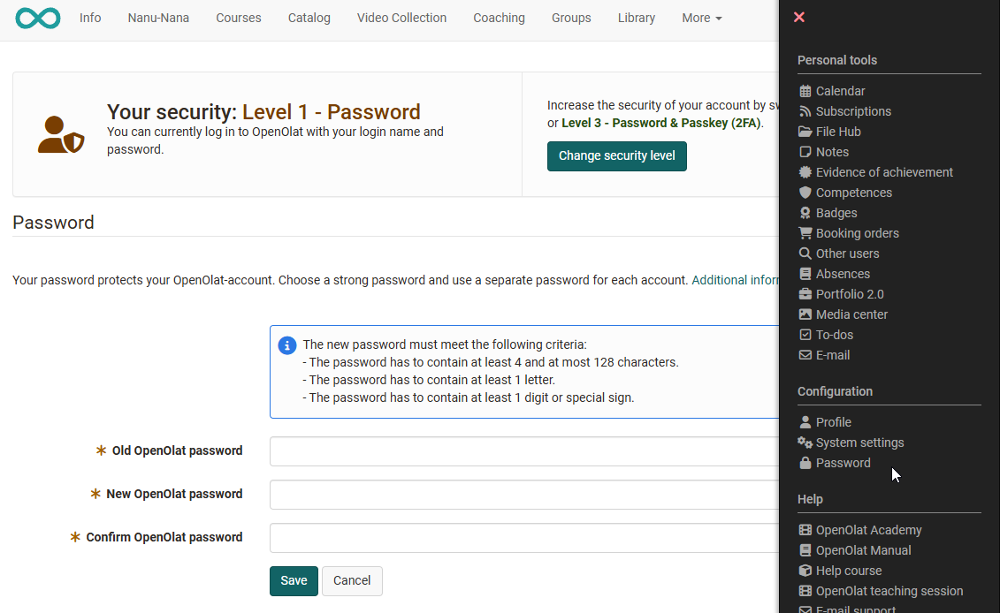

# Personal Configuration: Password {: #personal_configuration_password}

{ class="aside-right lightbox"}

If your account is not controlled by an external user management system (see [Login Concept](../login_registration/Login_Concept.md)), you can change your password in the personal menu, section "Configuration". Enter your old OpenOlat password and then the new password twice. OpenOlat displays the criteria the new password must meet above the input fields.

{ class="shadow lightbox" }

* Administrators can force the renewal of the password at certain intervals.
* When assigning a new password, make sure not to use the old password again.
* The use of previous passwords can be prevented by administrators.
* If you have forgotten your password, you can request a new one on the [login page](../login_registration/Login_Page.md) via "Forgot password?". OpenOlat sends you an 8-digit validation code by e-mail. [:octicons-tag-16:{ title="from Release 20.0 (OO-8189)" }](https://track.frentix.com/issue/OO-8189)
* If SMS authentication is possible in your system and you have stored a mobile phone number, the validation code can also be sent by SMS.
* If enabled by the OpenOlat administrators, you can also change your [security level](../login_registration/Security_levels.md) yourself with "Change security level".

## Further information {: #further_information}

[Login Concept >](../login_registration/Login_Concept.md) 
[Login Page >](../login_registration/Login_Page.md) 
[Security Levels >](../login_registration/Security_levels.md) 
[Password (login and registration) >](../login_registration/Password.md) 
[Passkey >](../login_registration/Passkey.md)

[To the top of the page ^](#personal_configuration_password)
