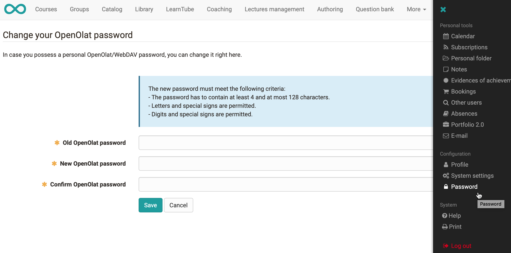

# Password

If your account is not controlled by an external user management system (ses [Login](../login_registration/index.md)), you can change your password in your personal menu, section configuration.

* Administrators can also force a new password to be assigned at certain intervals.

* When assigning a new password, make sure not to use the old password again.

* The use of previous passwords might not be allowed by your administrator.

* If you have forgotten your password you can request a new one on the login page. The activation link will then be sent to you by e-mail.

* If SMS authentication is possible in your system and you have activated it the activation code can also be sent by SMS.

