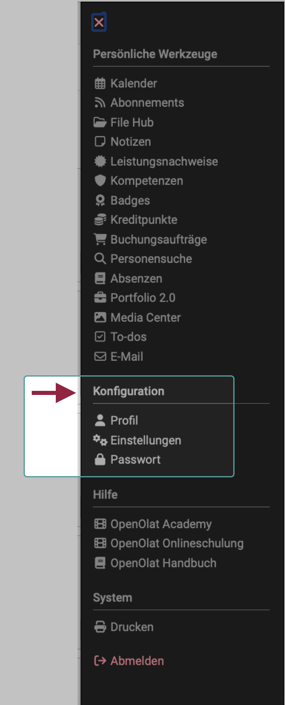

# Persönliche Konfiguration {: #personal_configuration}

{ class="aside-right shadow lightbox"}

Die persönlichen Konfigurationen finden Sie als einen Abschnitt im [persönlichen Menü](../personal_menu/index.de.md), unterhalb der persönlichen Werkzeuge.

Welche Konfigurationswerkzeuge Ihnen hier angeboten werden, wird zum einen von Voreinstellungen/Aktivierung in der Systemadministration bestimmt. Zum anderen können Sie entscheiden, ob die Werkzeuge im [persönlichen Menü](../personal_menu/index.de.md) oder im Schnellzugriff in der Kopfzeile erscheinen sollen.

 
 

##  Profil

Im persönlichen Menu unter der Option "Profil" können Sie die Angaben zu Ihrer Person ändern und ihre Visitenkarte einrichten.

[Zu den Details >](Profile.de.md) 

##  Einstellungen

Alle Benutzer:innen können OpenOlat individuell nach ihren eigenen Bedürfnissen anpassen und z.B. die Sprache der Bedieneroberfläche auswählen oder die persönlich wichtigsten Funktionen in der Kopfzeile anzeigen lassen.

[Zu den Details >](Settings.de.md)

##  Passwort

Hier können Sie Ihr Passwort ändern.

[Zu den Details >](Password.de.md)

##  COVID Zertifikat

Während der COVID-Pandemie wurden von frentix Funktionen zum Hochladen und Verwalten von COVID-Zertifikaten in OpenOlat integriert. Falls diese Funktionen von Administrator:innen aktiviert wurden, sind sie ebenfalls unter dem Abschnitt "Persönliche Konfiguration" zu finden.

[Zu den Details >](COVID_certificate.de.md)

