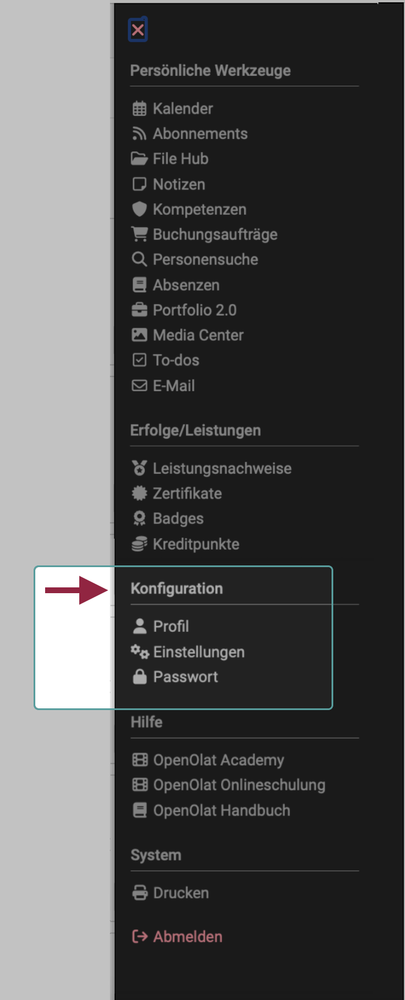

# Persönliche Konfiguration {: #personal_configuration}

{ class="aside-right shadow lightbox"}

Die persönlichen Konfigurationen finden Sie als Abschnitt "Konfiguration" im [persönlichen Menü](../personal_menu/index.de.md), unterhalb der Abschnitte "Persönliche Werkzeuge" und "Erfolge/Leistungen".

Welche Konfigurationswerkzeuge Ihnen hier angeboten werden, bestimmt zum einen die Aktivierung in der System-Administration: `Administration > Core Konfiguration > Persönliche Werkzeuge`. Zum anderen entscheiden Sie selbst, ob die Werkzeuge im [persönlichen Menü](../personal_menu/index.de.md) oder im Schnellzugriff in der Kopfzeile erscheinen sollen.

 
 

## Profil {: #profile}

Im persönlichen Menü unter "Profil" ändern Sie die Angaben zu Ihrer Person und richten Ihre Visitenkarte ein.

[Zu den Details >](Profile.de.md)

## Einstellungen {: #settings}

Alle Benutzer:innen können OpenOlat individuell nach ihren eigenen Bedürfnissen anpassen und z.B. die Sprache der Bedieneroberfläche auswählen oder die persönlich wichtigsten Funktionen in der Kopfzeile anzeigen lassen.

[Zu den Details >](Settings.de.md)

## Passwort {: #password}

Hier können Sie Ihr Passwort ändern.

[Zu den Details >](Password.de.md)

## COVID-Zertifikat {: #covid_certificate}

Während der COVID-Pandemie hat frentix Funktionen zum Hochladen und Verwalten von COVID-Zertifikaten in OpenOlat integriert. Falls Administrator:innen diese Funktionen aktiviert haben, finden Sie sie ebenfalls im Abschnitt "Konfiguration".

[Zu den Details >](COVID_certificate.de.md)
