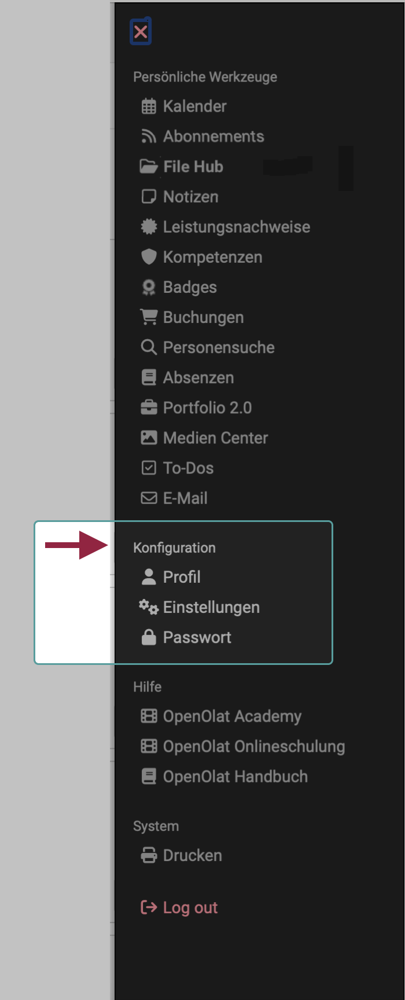

# Personal Configuration

{ class="aside-right shadow lightbox"}

The personal configurations can be found as a section in the [personal menu](index.md), below the personal tools.

Which configuration tools are offered to you here is determined on the one hand by the default settings/activation in the system administration. On the other hand, you can decide whether the tools should appear in the [personal menu](../index.md) or in the quick access in the header.

 
 

##  Profile

In the personal menu under the "Profile" option, you can change your personal details and set up your business card.

[View the details >](Profile.md) 

##  Settings

All users can customise OpenOlat according to their own needs and, for example, select the language of the user interface or display the most important personal functions in the header.

[View the details >](Settings.md)

##  Password

You can change your password here.

[View the details >](Password.md)

##  COVID Certificate

During the COVID pandemic, frentix integrated functions for uploading and managing COVID certificates in OpenOlat. If these functions have been activated by administrators, they can also be found in the "Personal configuration" section.

[View the details >](COVID_certificate.md)

