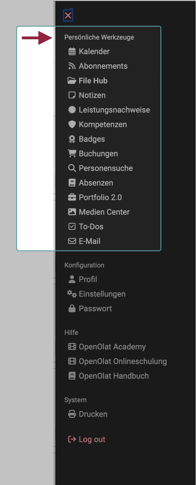

# Persönliche Werkzeuge {: #personal_tools}

{ class="aside-right shadow lightbox"}

Die persönlichen Werkzeuge finden Sie als einen Abschnitt im [persönlichen Menü](../personal_menu/index.de.md).

Welche Werkzeuge Ihnen hier angeboten werden, wird zum einen von Voreinstellungen/Aktivierung in der Systemadministration bestimmt. Zum anderen können Sie entscheiden, ob die Werkzeuge im [persönlichen Menü](../personal_menu/index.de.md) oder im Schnellzugriff in der Kopfzeile erscheinen sollen.

 
 

##  Kalender {: #calendar}

Im persönlichen Kalender sehen Sie Ihre privaten Termine, sowie Einträge aus Gruppen- und Kurskalendern, die über die Kalenderliste Ihrem persönlichen Kalender hinzugefügt wurden.

Sie können private Termine erstellen, die nur Sie sehen, oder öffentliche Termine, die andere OpenOlat-Benutzer mit Zugriffsrechten ebenfalls sehen.

[Zu den Details >](Calendar.de.md) 

##  Abonnements {: #subscriptions}

:octicons-device-camera-video-24: **Video-Einführung**: [Abonnements](<https://www.youtube.com/embed/h9gOqt7TR7Q>){:target="_blank”}

Möchten Sie zeitnah über Änderungen in Kursen und Gruppen informiert werden? Dann können Sie auf den gewünschten Kursbausteinen Abonnements einrichten. Neuigkeiten werden Ihnen dann ein Mal pro Tag als E-Mail zugeschickt.

Von folgenden Kursbausteinen können Sie Änderungsmeldungen im Abonnement beziehen: 

  * Forum 
  * Ordner 
  * Wiki 
  * Kalender
  * Aufgabe
  * Dateidiskussion
  * Portfoliomappen
  * Mitteilung
  * Teilnehmer-Ordner
  * Blog
  * Podcast
  * Video 

[Zu den Details >](Subscriptions.de.md)

##  File Hub {: #file_hub}

Ab Release 19 steht in OpenOlat ein File Hub zur Verfügung, in dem alle in OpenOlat vorhandenen Ordner aufgelistet sind. (Kursordner, Gruppenordner, Archivordner, usw.) Es werden im File Hub jedoch nur Ordner angezeigt, auf die der eingeloggte Benutzer auch Zugriffsberechtigung hat. Auch auf den **persönlichen Ordner** kann via File Hub zugegriffen werden.

Deshalb wurde in den Auswahloptionen der persönlichen Werkzeuge ab Release 19 "Persönlicher Ordner" ersetzt durch "File Hub".

[Zu den Details >](File_Hub.de.md)

## Notizen {: #notes}

In jedem Kurs können Sie Notizen verfassen. Unter diesem Punkt sehen Sie, welche Notizen Sie gemacht haben und können diese bearbeiten und ausdrucken.

[Zu den Details >](Notes.de.md)

##  Leistungsnachweise {: #evidences_of_achievement}

Ein Leistungsnachweis ist eine Bestätigung einer erfolgten Leistungskontrolle und zeigt beispielsweise absolvierte Tests oder abgegebene und bewertete Aufgaben an. Kursautoren legen in ihren Kursen fest, ob OpenOlat Leistungsnachweise erstellen soll. Kursteilnehmende sehen ihre Leistungsnachweise dann, wenn sie Kurse mit Leistungsnachweisen besuchen, bereits Leistungen erbracht haben und diese auch bewertet wurden. 

Eine besondere Form von Leistungsnachweis sind Zertifikate.

[Zu den Details >](Evidence_of_Achievements.de.md) 
[Zu den Details der **Zertifikate** >](../learningresources/Course_Settings_Assessment.de.md#certificate)

## Kompetenzen {: #competences}

Hier erhält der Benutzer eine Übersicht zu allen persönlichen Kompetenzen, die in OpenOlat zugewiesen sind, z.B. in ePortfolio-Einträgen oder als Kompetenz im Benutzerprofil.

[Zu den Details >](Competences.de.md)

## Badges {: #badges}

Auch in OpenOlat können Badges (Abzeichen) erworben werden, wie sie in Online-Spielen und -Lernangeboten üblich sind. Als Kursautor:in können Sie bestimmen, ob ein Badge vergeben wird, für welche erbrachte Leistung er vergeben wird und wie der Badge aussehen soll.

[Zu den Details >](../personal_menu/OpenBadges.de.md)

## Buchungen {: #bookings}

Alle Kurs-Buchungen des Benutzers werden hier inklusive weiterer Buchungsinformationen aufgelistet.

[Zu den Details >](Bookings.de.md)

##  Andere Benutzer (Personensuche) {: #other_users}

Sie können nach anderen OpenOlat-Benutzern suchen, öffentliche Visitenkarten ansehen, den "public"-Bereich der persönlichen Ordner von Benutzern durchstöbern, freigegebene Portfoliomappen anschauen oder mit Hilfe des Kontaktformulars die jeweiligen Personen kontaktieren.

[Zu den Details >](Other_users.de.md)

## Absenzen {: #absences}

Bei aktiviertem Modul "Absenzenmanagement" können Benutzer an dieser Stelle die für sie erfassten Absenzen einsehen.

[Zu den Details >](Absences.de.md)

##  Portfolio 2.0 {: #portfolio}

Ein Portfolio dient der Sammlung und Dokumentation von (Lern-)Artefakten, Lernergebnissen und Lernprozessen, sowie zur Förderung der Reflexion über den eigenen Entwicklungsprozess. Lernprodukte können hier gesammelt und bei Bedarf bestimmten Personen zugänglich gemacht werden.

[Zu den Details >](Portfolio.de.md)

##  Media Center {: #media_center}

Das Media Center ist die zentrale Sammelstelle für Medien:

* Unterschiedliche Medientypen (Dateiformate), 
* die (je nach vergebener Zugriffsberechtigung) auch von verschiedenen Personen genutzt
* und an unterschiedlichen Stellen in OpenOlat verwendet werden können.

[Zu den Details >](Media_Center.de.md)

##  To-Dos {: #to_dos}

Die zu erledigenden Aufgaben (To-Dos) finden sich an mehreren Stellen in OpenOlat (z.B. innerhalb eines Projektes). Im persönlichen Menü finden Sie alle Ihre persönlichen To-Dos zusammengefasst in einer Übersicht.

[Zu den Details >](To-Dos.de.md)

##  E-Mails {: #mail}

Unter E-Mails können Sie alle in OpenOlat versandten und erhaltenen E-Mails einsehen. Die E-Mail-Historie in OpenOlat wird gespeichert und somit der Überblick über erhaltene und versendete E-Mails gewahrt. Zur besseren Übersicht können Sie E-Mails nach Kontext sortieren und anzeigen lassen.

[Zu den Details >](E-Mail.de.md)

!!! info "Genereller Hinweis"

    Wenn Sie Ihre Tools statt im persönlichen Menü lieber in der Kopfzeile angezeigt haben möchten, können Sie die Menüoption vom persönlichen Menü dorthin verschieben. Die Einstellung dazu nehmen Sie vor unter 
    **Persönliches Menü > Einstellungen > Tab System > Abschnitt Persönliche Werkzeuge** 
    Alle Werkzeuge, die Sie hier markieren, werden statt im persönlichen Menü in der Kopfzeile rechts oben angezeigt und sind so schneller erreichbar.
