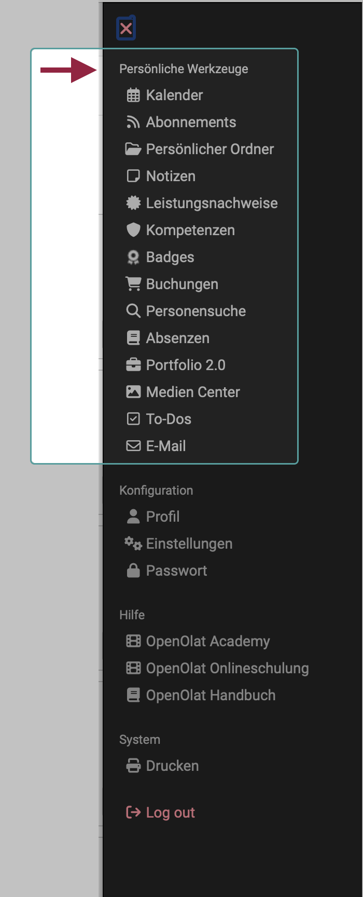

# Personal Tools

{ class="aside-right shadow lightbox"}

You can find the personal Tools as a section in the [Personal Menu](index.md).

Which tools are offered to you here is determined on the one hand by the default settings/activation in the system administration. On the other hand, you can decide whether the tools should appear in the [personal menu](index.md) or in the quick access in the header.

 
 

## Calendar
  
In the personal calendar, you can see your private appointments as well as entries from group and course calendars that have been added to your personal calendar via the calendar list.

You can create private appointments that only you can see, or public appointments that other OpenOlat users with access rights can also see.

Find out [more >](Calendar.md)

##  Subscriptions {: #subscriptions}

Would you like to be informed promptly about changes to courses and groups? Then you can set up subscriptions for the desired course modules. News will then be sent to you once a day by e-mail.

You can subscribe to change notifications for the following course elements: 

* Forum
* Folder
* Wiki
* Calendar
* Task
* File discussion
* Portfolio maps
* Notifications
* Participant folder
* Blog
* Podcast
* Video

Find out [more >](Subscriptions.md)

##  Personal folder (up to Release 18)

OpenOlat provides you with storage space in your personal folder. For example, you can store presentations there that you want to access from another computer, cache research papers, etc.

Find out [more >](../personal_menu/Personal_folders.md)

## File Hub (Release 19)

From Release 19, a file hub is available in OpenOlat in which all folders available in OpenOlat are listed. (Course folders, group folders, archive folders, etc.) However, only folders to which the logged-in user has access authorization are displayed in the File Hub. The **personal folder** can also be accessed via the File Hub.

For this reason, "Personal Folder" has been replaced by "File Hub" in the selection options for personal tools from Release 19.

Find out [more >](File_Hub.md)

##  Notes

You can write notes in every course. Here you can see which notes you have made and can edit and print them out.

Find out [more >](Notes.md)

##  Evidences of achievement

A certificate of achievement is a confirmation of a completed performance assessment and shows, for example, completed tests or submitted and assessed tasks. Course authors specify in their courses whether OpenOlat should create certificates of achievement. Course participants see their transcripts of records if they are attending courses with transcripts of records, have already performed and have been assessed. 

Certificates are a special form of proof of performance.

Find out [more >](Evidence_of_Achievements.md) 
[For more details on **certificates** >](../learningresources/Course_Settings_Assessment.md#certificate) 

## Competences

Here the user receives an overview of all personal skills assigned in OpenOlat, e.g. in ePortfolio entries or as skills in the user profile.

Find out [more >](Competences.md)

## Badges

Badges can also be earned in OpenOlat, as is common in online games and learning opportunities. As the course author, you can determine whether a badge is awarded, for which achievement it is awarded and what the badge should look like.

Find out [more >](OpenBadges.md)

## Bookings

All of the users course bookings are listed here, including further booking information.

Find out [more >](Bookings.md)

##  Other users

You can search for other OpenOlat users, view public business cards, browse the "public" section of users' personal folders, view shared portfolio folders or contact the respective persons using the contact form.

Find out [more >](Other_users.md)

## Absences

If the "Absence Management" module is activated, users can view the absences recorded for them at this point.

Find out [more >](Absences.md)

##  Portfolio 2.0

A portfolio is used to collect and document (learning) artifacts, learning outcomes and learning processes, as well as to promote reflection on one's own development process. Learning products can be collected here and made accessible to specific people if required.

Find out [more >](Portfolio.md)

## Media Center

The Media Center is the central collection point for media:

* Different media types (file formats),
* which (depending on the access authorization assigned) can also be used by different people.
* and can be used in different places in OpenOlat.

Find out [more >](Media_Center.md)

## To-dos

The tasks to be completed (to-dos) can be found in several places in OpenOlat (e.g. within a project). In the personal menu you will find all your personal to-dos summarized in an overview.

Find out [more >](To-Dos.md)

##  E-mail

You can view all emails sent and received in OpenOlat under Emails. The email history in OpenOlat is saved, thus maintaining an overview of emails received and sent. For a better overview, you can sort and display emails by context.

Find out [more >](E-Mail.md)

