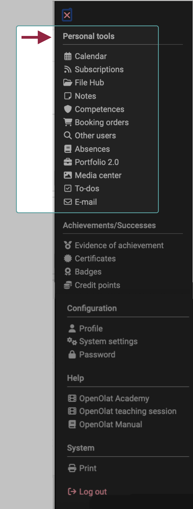

# Personal tools {: #personal_tools}

{ class="aside-right shadow lightbox"}

You can find the personal tools as a section in the [personal menu](index.md).

Which tools are offered to you here is determined on the one hand by the activation in the system administration. On the other hand, you decide yourself whether the tools appear in the [personal menu](index.md) or in the quick access in the header.

 
 

## Calendar {: #calendar}

In the personal calendar, you can see your private appointments as well as entries from group and course calendars that have been added to your personal calendar via the calendar list.

You can create private appointments that only you can see, or public appointments that other OpenOlat users with access rights can also see.

Find out [more >](Calendar.md)

## Subscriptions {: #subscriptions}

:octicons-device-camera-video-24: **Video introduction (German)**: [Subscriptions](<https://www.youtube.com/embed/h9gOqt7TR7Q>){:target="_blank"}

Would you like to be informed promptly about changes to courses and groups? Then you can set up subscriptions for the desired course elements. News will then be sent to you once a day by e-mail.

You can subscribe to change notifications for the following objects:

  * Forum
  * Folder
  * Wiki
  * Calendar
  * Task
  * File dialog
  * Portfolio binders
  * Notifications
  * Participant folder
  * Blog
  * Podcast
  * Video
  * Projects [:octicons-tag-16:{ title="from Release 18.0 (OO-6980)" }](https://track.frentix.com/issue/OO-6980)

Find out [more >](Subscriptions.md)

## File Hub {: #file_hub}

The File Hub lists all folders you have access to: course folders, group folders, archive folders and more. You can also reach your **personal files** via the File Hub.

Find out [more >](File_Hub.md)

## Notes {: #notes}

You can write notes in every course. Here you can see which notes you have made and can edit and print them out.

Find out [more >](Notes.md)

## Evidence of achievement {: #evidences_of_achievement}

An evidence of achievement is a confirmation of a completed assessment and shows, for example, completed tests or submitted and assessed tasks. Course authors specify in their courses whether OpenOlat should create evidences of achievement. Participants see their evidences of achievement if they attend courses with evidences of achievement, have already performed and have been assessed.

Certificates are a special form of evidence of achievement.

Find out [more >](Evidence_of_Achievements.md) 
[For more details on **certificates** >](../learningresources/Course_Settings_Assessment.md#section_certificate)

## Competences {: #competences}

Here you get an overview of all personal competences assigned to you in OpenOlat, e.g. in ePortfolio entries or as a competence in the user profile.

Find out [more >](Competences.md)

## Badges {: #badges}

Badges can also be earned in OpenOlat, as is common in online games and learning opportunities. As the course author, you can determine whether a badge is awarded, for which achievement it is awarded and what the badge should look like.

Find out [more >](OpenBadges.md)

## Booking orders {: #bookings}

All your booking orders are listed here, including further booking information.

Find out [more >](Bookings.md)

## Other users {: #other_users}

You can search for other OpenOlat users, view public visiting cards, browse the "public" section of other users' personal files, view shared portfolio binders or contact the respective persons using the contact form.

Find out [more >](Other_users.md)

## Absences {: #absences}

If the module for lectures and absences is activated, you can view the absences recorded for you at this point.

Find out [more >](Absences.md)

## Portfolio 2.0 {: #portfolio}

A portfolio is used to collect and document (learning) artifacts, learning outcomes and learning processes, as well as to promote reflection on one's own development process. Learning products can be collected here and made accessible to specific people if required.

Find out [more >](Portfolio.md)

## Media Center {: #media_center}

The Media Center is the central collection point for media:

* Different media types (file formats),
* which (depending on the access authorization assigned) can also be used by different people
* and can be used in different places in OpenOlat.

Find out [more >](Media_Center.md)

## To-dos {: #to_dos}

The tasks to be completed (to-dos) can be found in several places in OpenOlat (e.g. within a project). In the personal menu you will find all your personal to-dos summarized in an overview.

Find out [more >](To-Dos.md)

## E-mails {: #mail}

You can view all e-mails sent and received in OpenOlat under E-mails. The e-mail history in OpenOlat is saved, thus maintaining an overview of e-mails received and sent. For a better overview, you can sort and display e-mails by context.

Find out [more >](E-Mail.md)

!!! tip "Tip"

    If you prefer to have your tools displayed in the header instead of the personal menu, you can move the menu option from the personal menu to the header. You make the setting for this under 
    `Personal menu > Configuration > Settings > Tab "System" > User tools` 
    All tools that you mark here are displayed in the header at the top right instead of in the personal menu and can thus be accessed more quickly.
