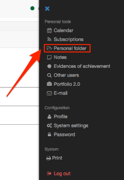

# Personal folders

## Folder in the personal menu

Every OpenOlat user has a folder icon in the personal menu. In this folder you
can find 2 subfolders, the folders  _private_  and  _public._

 _Private_

Every user can upload every supported file here. This folder can be used as
temporary storage and to get access to files from different servers. Here
OpenOlat works linke a cloud.

Additionally that data, which is downloaded in the data archiving is saved
here as well.

 _Public_

Files which should be available for other OpenOlat users can be stored in this
folder. The public folder is visible in the user's visiting card. In the
personal tools in Other users you can search for the user who uploaded a file
for you. This simplifies the data exchange between OpenOlat users.

## General Information about folders

Folders can be used to store documents, to make files available for downloads
or to provide an exchange platform for various users. If you have read **and**
write access, which have to be assigned to users in courses and groups by a
coach first, you are generally allowed to upload files, create, copy, move or
delete them in folders.

File names of files you wish to upload to OpenOlat should contain only the
following:

a-z, A-Z, 0-9, as well as "-", ".", "_" or space

Additionally you can zip or unzip files. All these actions can be performed
with single files and folders or with several ones at once. If you want to
upload many files at once there are two options at your disposal.

On one side you can zip your files on your computer, upload the zip-file and
unzip it in the OpenOlat folder. On the other side several files can be
transferred and organized by WebDAV. All folders are WebDAV compatible. This
means OpenOlat is available as a normal net-device, with which you can easily
copy, move and delete files. Further information can be found in the chapter
"[Using WebDAV](../basic_concepts/Using_WebDAV.md)".

In order for the WebDAV access to work, it needs to be [activated
](../../manual_admin/administration/WebDAV.de.md)by your OpenOlat administrator first.

## Quota

For each course element "Folder" you can dispose of ca. 100 MB storage space.
Your OpenOlat support is responsible for the increase of the quota. Please
contact the corresponding contact person.

## Other types of folders  

In OpenOlat exist several different versions of folders. Beside the two
folders in the personal menu in OpenOlat exist the following folder versions:

  * [Storage folder](../course_operation/Storage_folder.md)  (in courses)
  * [Course element folder](../learningresources/Course_Element_Folder.md) (in courses)
  * Folders in Topic assignment (in courses)
  * [Participant folder](../learningresources/Communication_and_Collaboration.md#CommunicationandCollaboration-_participantfolder) (in courses)
  * [Resource folder ](../learningresources/index.md#resource-folder)(learning resource)  

