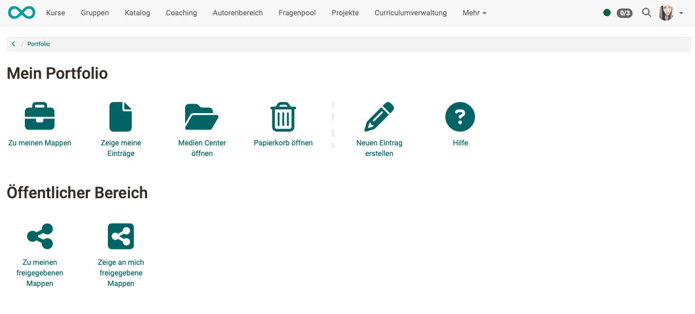

# Persönliche Werkzeuge: Portfolio {: #portfolio}

{ class="aside-right lightbox"}

Ein Portfolio dient der Sammlung und Dokumentation von (Lern-)Artefakten,
Lernergebnissen und Lernprozessen sowie zur Förderung der [Reflexion](../area_modules/Portfolio_General_Information.de.md#was-ist-eine-reflexion) über den
eigenen Entwicklungsprozess. 

Lernprodukte können hier gesammelt und bei Bedarf
bestimmten Personen zugänglich gemacht werden. Unter dem Menüeintrag "Portfolio 2.0" können Sie Portfoliomappen erstellen, diese bestimmten
Personen (OpenOlat-Benutzer:innen sowie Externen) [zugänglich machen](../area_modules/Shared_by_me.de.md), die Mappen anderer Benutzer:innen [betrachten](../area_modules/Shared_with_me.de.md) und auch
[Portfolioaufgaben](../learningresources/Course_Element_Portfolio_Task.de.md), die Lehrende im Rahmen eines OpenOlat-Kurses bereitgestellt haben, bearbeiten.

{ class="shadow lightbox"}

---

## Weiterführende Informationen {: #further_information}

[Allgemeines zum Portfolio >](../area_modules/Portfolio_General_Information.de.md) 
[Von mir freigegeben >](../area_modules/Shared_by_me.de.md) 
[An mich freigegeben >](../area_modules/Shared_with_me.de.md) 
[Portfolioaufgaben in Kursen >](../learningresources/Course_Element_Portfolio_Task.de.md) 
[Übersicht zur Portfolio-Erstellung >](../area_modules/Portfolio.de.md) 
[Bestandteile des Portfolios >](../area_modules/Components_of_the_portfolio.de.md) 
[Prozess eines Bewertungsportfolios >](../portfolio/Process_of_an_assessment_portfolio.de.md)

[Zum Seitenanfang ^](#portfolio)
