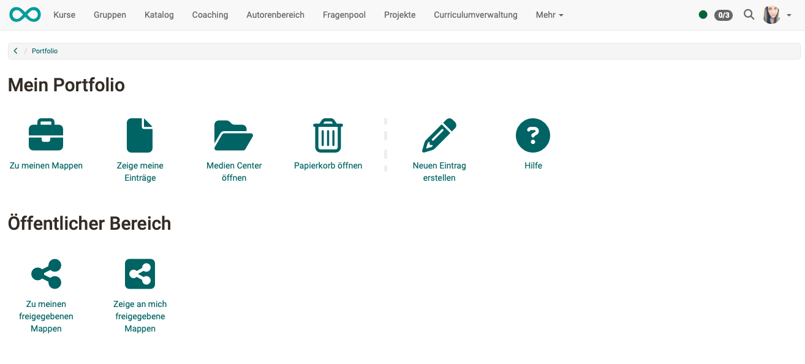

# Persönliche Werkzeuge: Portfolio

{ class="aside-right lightbox"}

Ein Portfolio dient der Sammlung und Dokumentation von (Lern-)Artefakten,
Lernergebnissen und Lernprozessen sowie zur Förderung der [Reflexion](../area_modules/Portfolio_General_Information.de.md#was-ist-eine-reflexion) über den
eigenen Entwicklungsprozess. 

Lernprodukte können hier gesammelt und bei Bedarf
bestimmten Personen zugänglich gemacht werden. Unter dem Menueintrag Portfolio
2.0 können Sie Portfolio-Mappen erstellen, diese bestimmten
Personen (OpenOlat-Benutzern sowie Externen) [zugänglich machen](../area_modules/Shared_by_me.de.md), die Mappen anderer Benutzer [betrachten ](../area_modules/Shared_with_me.de.md)und auch
[Portfolioaufgaben](../learningresources/Portfolio_task_and_assignment_Collecting_and_editing.de.md), die Lehrende im Rahmen eines OpenOlat-Kurses bereitgestellt haben, bearbeiten.

{ class="shadow lightbox"}

## Weitere Informationen

[Übersicht zum Portfolio](../area_modules/Portfolio.de.md) 
[Allgemeines zum Portfolio](../area_modules/Portfolio_General_Information.de.md) 
[Bestandteile des Portfolio](../area_modules/Components_of_the_portfolio.de.md) 
[Prozess eines Bewertungsportfolios](../portfolio/Process_of_an_assessment_portfolio.de.md) 
[Portfolioaufgaben](../learningresources/Portfolio_task_and_assignment_Collecting_and_editing.de.md) 
[Was ist eine Reflexion?](../area_modules/Portfolio_General_Information.de.md#was-ist-eine-reflexion) 

