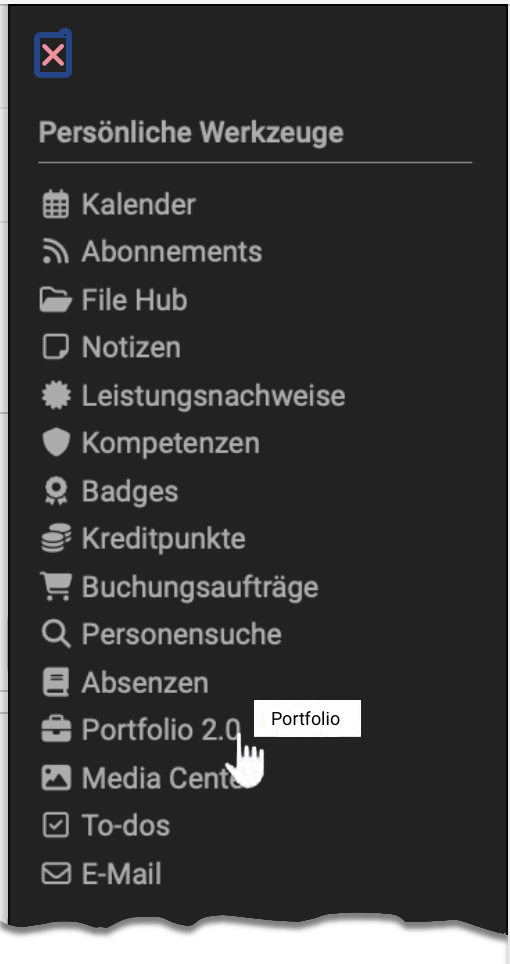
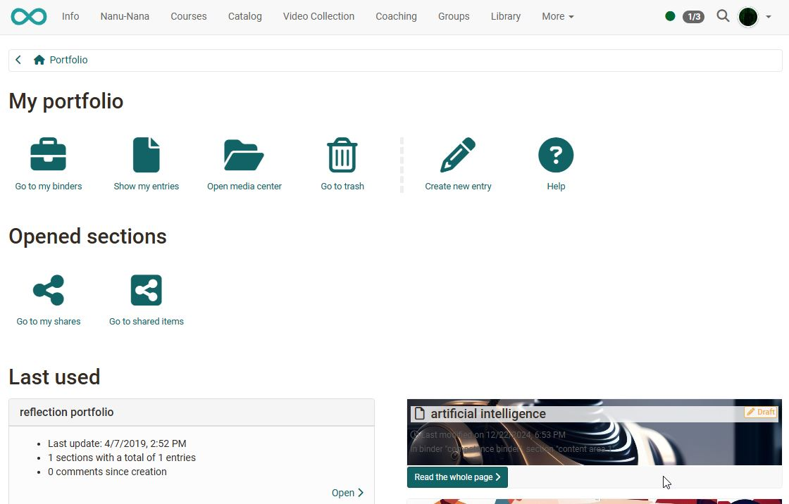

# Personal tools: Portfolio {: #portfolio}

{ class="aside-right lightbox"}

A portfolio serves to collect and document (learning) artifacts, learning outcomes and learning processes as well as to promote [reflection](../area_modules/Portfolio_General_Information.md#what-is-a-reflection) on one's own development process. 

Learning products can be collected here and, if required be made accessible to specific persons. Under the menu item Portfolio 2.0, you can create Portfolio folders. You can make these [accessible](../area_modules/Shared_by_me.md) for OpenOlat users as well as external users, [see](../area_modules/Shared_with_me.md) the folders of other users, and edit [Portfolio tasks](../learningresources/Course_Element_Portfolio_Task.md), which were made accessible by teachers of an OpenOlat course.

{ class="shadow lightbox"}

---

## Further information {: #further_information}

[Portfolio overview for creating >](../area_modules/Portfolio.md) 
[General information about the portfolio >](../area_modules/Portfolio_General_Information.md) 
[Components of a portfolio >](../area_modules/Components_of_the_portfolio.md) 
[Process of an assessment portfolio >](../portfolio/Process_of_an_assessment_portfolio.md) 
[Portfolio tasks in courses >](../learningresources/Course_Element_Portfolio_Task.md) 

