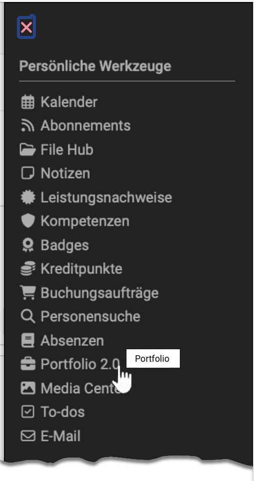
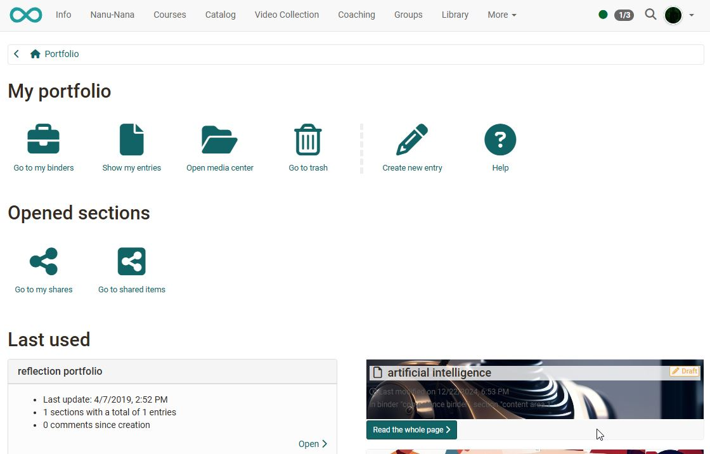

# Personal tools: Portfolio {: #portfolio}

{ class="aside-right lightbox"}

A portfolio serves to collect and document (learning) artifacts, learning outcomes and learning processes as well as to promote [reflection](../area_modules/Portfolio_General_Information.md#what-is-a-reflection) on one's own development process. 

Learning products can be collected here and, if required, be made accessible to specific persons. Under the menu item "Portfolio 2.0", you can create portfolio binders, make them [accessible](../area_modules/Shared_by_me.md) to specific persons (OpenOlat users as well as external persons), [view](../area_modules/Shared_with_me.md) the binders of other users, and edit [portfolio tasks](../learningresources/Course_Element_Portfolio_Task.md) that teachers have provided as part of an OpenOlat course.

{ class="shadow lightbox"}

---

## Further information {: #further_information}

[General information about the portfolio >](../area_modules/Portfolio_General_Information.md) 
[Shared by me >](../area_modules/Shared_by_me.md) 
[Shared with me >](../area_modules/Shared_with_me.md) 
[Portfolio tasks in courses >](../learningresources/Course_Element_Portfolio_Task.md) 
[Portfolio overview for creating >](../area_modules/Portfolio.md) 
[Components of the portfolio >](../area_modules/Components_of_the_portfolio.md) 
[Process of an assessment portfolio >](../portfolio/Process_of_an_assessment_portfolio.md)

[To the top of the page ^](#portfolio)
