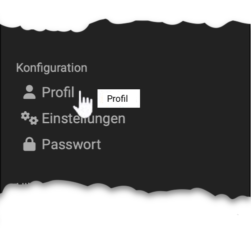

# Profile

{ class="aside-right lightbox"}

In the personal menu, section "Configuration", under the "Profile" option, you can change your personal
data and set up your business card. Simply complete the fields provided.

Changes to the e-mail address will only be applied if the new e-mail address
is activated. For this purpose an activation link will be sent to the new
address after the change. You select the link or copy it into the address line
of your browser and log in to OpenOlat to activate the new e-mail address.
Until activation, the previous e-mail address is used in OpenOlat. If you do
not dial the activation link within two days (48 hours), the change request
expires. In that case, please contact your administrator.

    
E-Mail-Signature

	If the option to enter your e-mail signature is not displayed, please contact your administrator.
	

A phone number for sending SMS can be added in the contact data. If an SMS
service is stored with your system, the password can be reset with an SMS
authentication. For this purpose, a phone number must be stored here. The
number must be stored in the internationally valid format +41 12 345 67 89. A
mobile phone number is recommended. For fixed network numbers, the number is
called for verification and the code is read out.

In the "About me" section, you can enter some information about yourself as
free text if required.

It is also important for online learning that you add a photo of yourself to
your profile. This makes online learning more personal and online
communication and cooperation more pleasant and easier for everyone. The photo
stored in your profile appears in OpenOlat in various places, e.g. on your
business card, in forum posts or in the list of participants. OpenOlat will
crop the picture to a width of 100 pixels.

  
!!! attention
	Some fields may not be changeable.

### Tab "My business card"

With the help of the check boxes you can determine which entries appear on
your business card and can therefore be viewed by other OpenOlat users. Some
check boxes cannot be edited. These are predefined system-wide.

!!! tip
	To view the business cards of other OpenOlat users, select **Other users** in the
	personal menu and search for the desired person using the search mask.

## Further information

[Personal tools: E-Mail](../personal_menu/E-Mail.md) 

