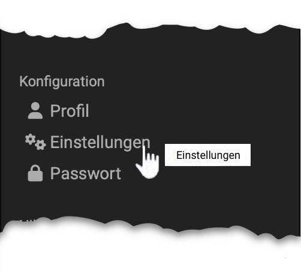
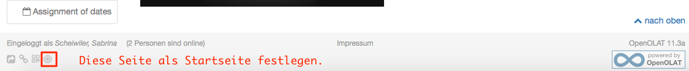
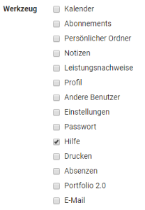
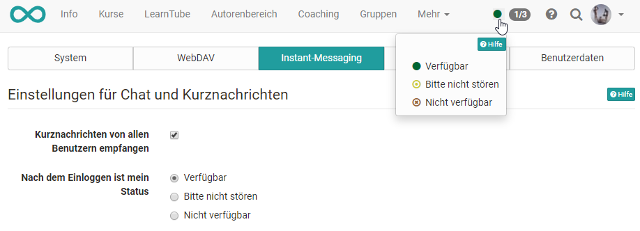
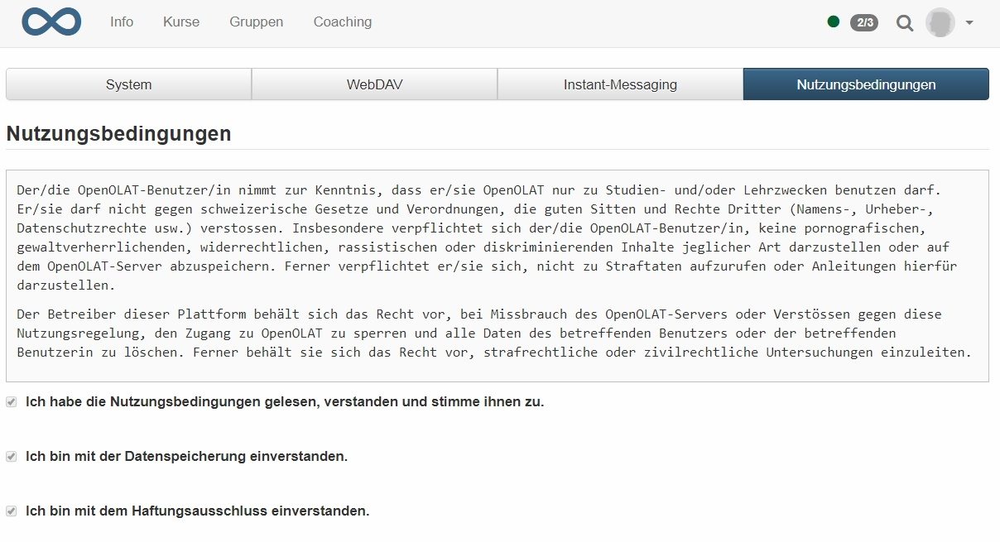
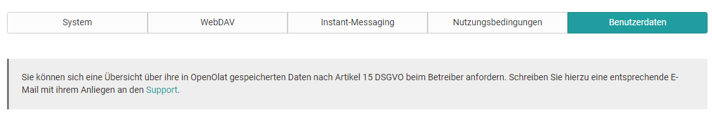

# Persönliche Konfiguration: Einstellungen

{ class="aside-right lightbox"}

:octicons-device-camera-video-24: **Video-Einführung**: [Benutzereinstellungen](<https://www.youtube.com/embed/7osBJ99FIN8>){:target="_blank”}

Mit Hilfe der Einstellungen können Sie OpenOlat nach Ihren Bedürfnissen
anpassen.

### Tab System

#### Allgemeine Systemeinstellungen: {: #general}

Hier können Sie Ihren Benutzernamen und Ihre OpenOlat Rolle auslesen. Darüber
hinaus können Sie Ihre individuelle Systemsprache auswählen. OpenOlat ist in
zahlreiche Sprachen übersetzt worden. Die Änderung der Sprache wird erst nach
dem nächsten Einloggen aktiv.

!!! attention 
	Die Sprache von Kursinhalten wird von der Sprachwahl hier aber nicht
	beeinflusst.

Darüber hinaus können Sie einstellen, wie oft Sie Benachrichtigungen per
E-Mail erhalten wollen. Zur Auswahl stehen: ausgeschaltet, monatlich,
wöchentlich, täglich, halbtäglich, alle vier und alle zwei Stunden. Legen Sie
zusätzlich fest ob OpenOlat E-Mails nur in dem Posteingang innerhalb des
OpenOlat Systems angezeigt, oder ob Sie auch an ihre im Profil konfigurierte
externe E-Mail Adresse verschickt werden sollen. In der Benachrichtigungsmail
finden Sie auch einen Hinweis bezüglich neuer E-Mails innerhalb des OpenOlat
Postfachs, falls Sie die Option "E-Mails an das interne OpenOlat Postfach
zustellen" gewählt haben.

Über den "Zeichensatz für Download bestimmen Sie, in welchem Zeichensatz
Dateien abgespeichert werden sollen, die Sie über die Datenarchivierung
herunterladen. Dies betrifft den Download der Test- und Fragebogenresultate
sowie der Kursresultate. Voreingestellt ist der Zeichensatz ISO-8859-1.
Enthalten Ihre Tests oder Fragebogen z.B. Arabische Zeichen, müssen Sie hier
den Zeichensatz UTF-8 wählen.

In den Speziellen Systemeinstellungen sehen und ändern Sie die
Einstellungen, die Ihnen den tagtäglichen Einstieg und die Arbeit mit OpenOlat
erleichtern können.

In der Auswahl "Sitzung wiederherstellen" legen Sie fest, was direkt nach dem
Login passiert: Entweder wird

  * die Startseite geladen,
  * es wird automatisch der in OpenOlat zuletzt besucht Ort geladen, oder
  * Sie legen situationsbezogen jeweils fest, wohin Sie nach dem Login gelangen wollen.

Wenn Sie die Einstellung "Ja, automatisch" gewählt haben, wird das Feld zur
Eingabe der Startseite ausgeblendet. Dieses Feld gestattet Ihnen, jede
beliebige Seite innerhalb OpenOlat als Ihre persönliche Startseite festzulegen
und damit die systemweit eingestellte Startseite zu überschreiben.
Seitenspezifische Links finden Sie in der Social Sharing - Leiste links unten
unter "Link kopieren". Noch einfacher ist es auf der gewünschten Startseite
einfach das Startseiten Icon anzuklicken. Hierfür kann jede OpenOlat Seite auf
die Sie Zugriff haben, gewählt werden.

  

#### Benutzerwerkzeuge: 

Hier wählen Sie aus, welche Benutzerwerkzeuge
direkt oben rechts in der Menüleiste (neben Ihrem Profilbild) erscheinen
sollen, so dass Sie sehr schnell auf diese Werkzeuge zugreifen können.

Werkzeuge die nicht als Schnellzugriff in der Navigationsleiste liegen, sind
als Menüeintrag im persönlichen Menü verfügbar. Mit Hilfe kommen Sie auf die
Startseite des Benutzerhandbuchs und mit Drucken können Sie die aktuell
geöffnete Seite drucken.

!!! tip
	Versuchen Sie nicht alle Werkzeuge zu aktivieren, sondern wählen sie gezielt
	die Werkezeuge aus, Sie Sie häufig benutzen. So bleibt die Menüleiste
	übersichtlich.

Als letztes haben Sie unter "Einstellungen" im Tab "System" die Möglichkeit,
ihre vorgenommenen systembezogenen Änderungen wieder **auf die Standardeinstellungen zurückzusetzen**, Hierzu zählen Einstellungen bezüglich der Personalisierung, der Benachrichtigungen und der Sitzungswiederherstellung.

### Tab WebDAV {: #webdav}

Im Tab "WebDAV" finden Sie den [WebDAV-Link zu Ihrer OpenOlat-Instanz](../basic_concepts/Using_WebDAV.de.md), mit der bequem Dateien verwaltet werden
können. Über WebDAV können Sie als OpenOlat User auf ihren persönlichen Ordner
zugreifen. OpenOlat Autoren können über WebDAV ihre gesamten Kursdateien
organisieren.

### Tab Instant-Messaging

Im Tab "Instant-Messaging" legen Sie die Einstellungen für die [Chat-Funktion](../../manual_admin/administration/Instant_Messaging.de.md) und Ihren Kommunikations-Status nach dem Login fest.

### Tab Nutzungsbedingungen

Hier können Sie die Nutzungsbedingungen nachlesen, welche Sie beim ersten
Login bestätigt haben. Die genauen Nutzungsbedingungen werden vom OLAT
Administrator festgelegt.

Ferner kann hier auch die Löschung des kompletten OpenOlat Kontos beantragt
werden.

### Tab Benutzerdaten

In diesem Bereich können Sie eine Übersicht über ihre in OpenOlat
gespeicherten Daten nach Artikel 15 DSGVO beim Betreiber anfordern. Der
entsprechende Support-Link ist hinterlegt. Sobald der Export durchgeführt
wurde, können Sie die über Sie gespeicherten Benutzerdaten hier herunterladen.

## Weitere Informationen

[Persönliche Werkzeuge: E-Mail](../personal_menu/E-Mail.de.md) 