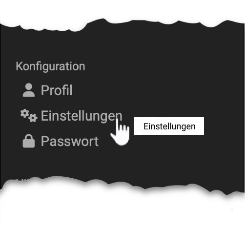
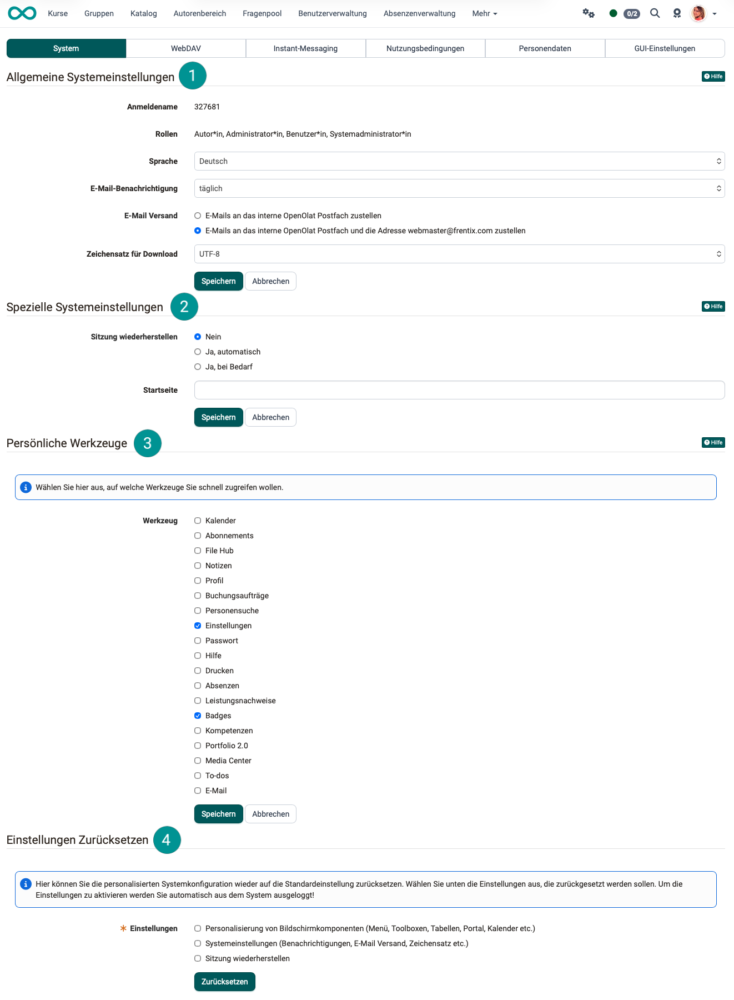
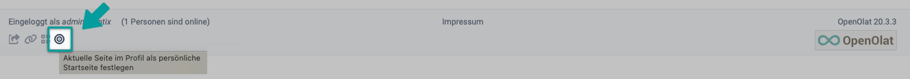
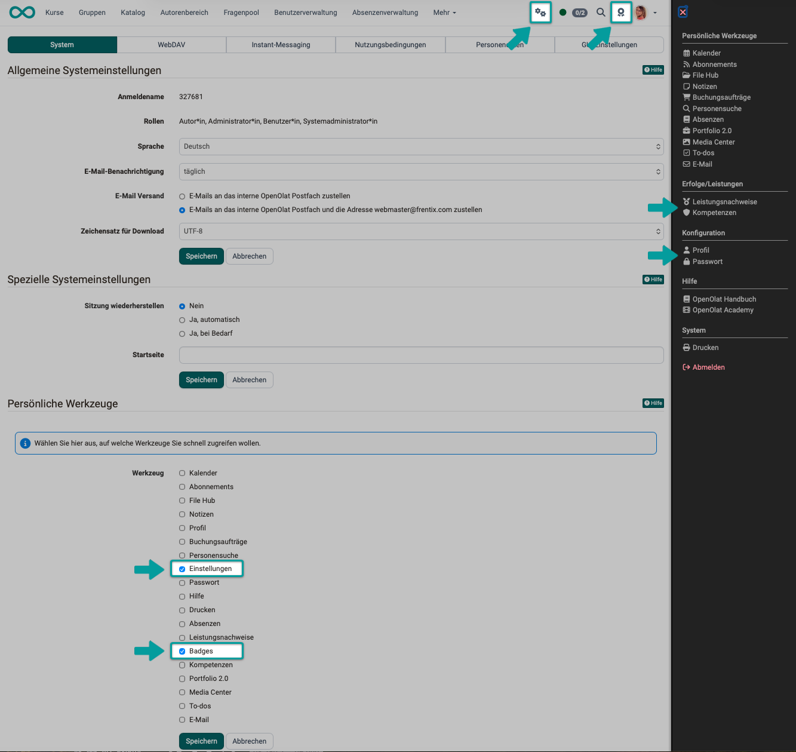
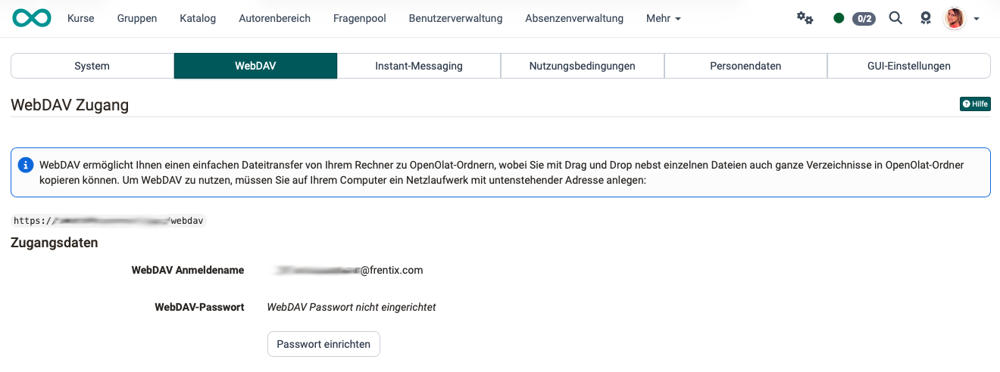
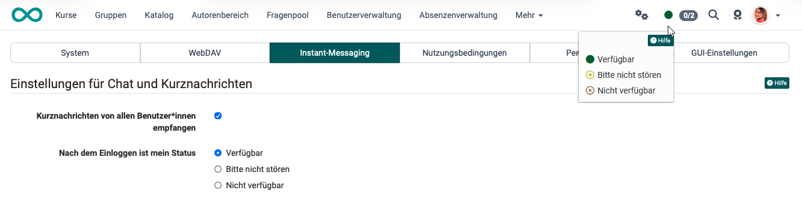
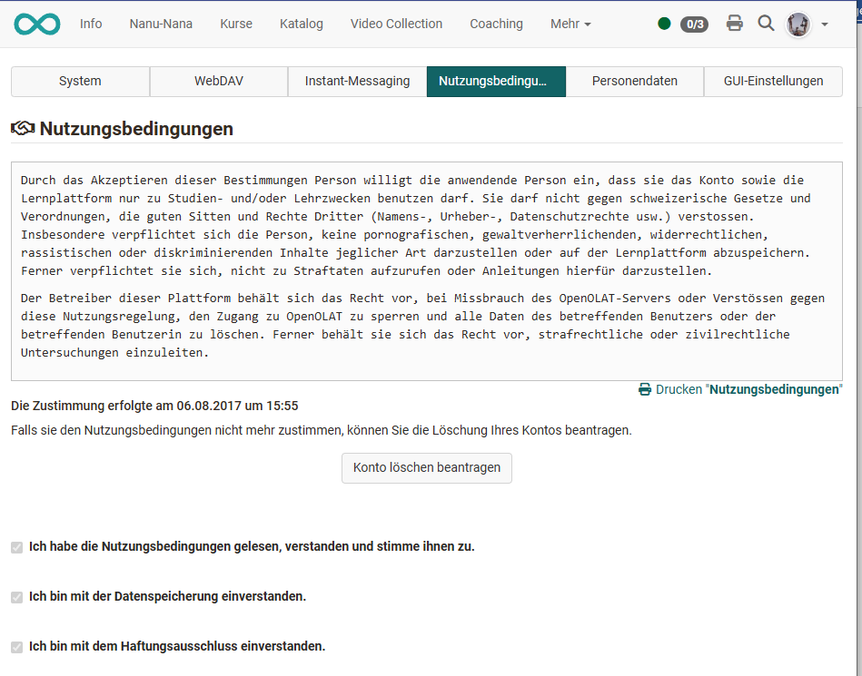
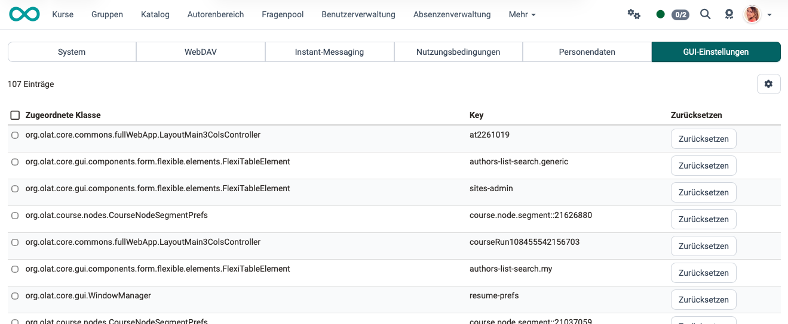

# Persönliche Konfiguration: Einstellungen {: #personal_configuration_settings}

{ class="aside-right lightbox"}

:octicons-device-camera-video-24: **Video-Einführung**: [Benutzereinstellungen](<https://www.youtube.com/embed/7osBJ99FIN8>){:target="_blank”}

Mit Hilfe der Einstellungen können Sie OpenOlat nach Ihren Bedürfnissen
anpassen.

## Tab System {: #tab_system}

{ class=" shadow lightbox" }

###  Allgemeine Systemeinstellungen: {: #general}

Hier können Sie Ihren Anmeldenamen und Ihre OpenOlat Rolle auslesen. Darüber hinaus können Sie Ihre individuelle Systemsprache auswählen. OpenOlat ist in zahlreiche Sprachen übersetzt worden. Die Änderung der Sprache wird erst nach dem nächsten Einloggen aktiv.

!!! warning "Achtung"

	Die Sprache von Kursinhalten wird von der Sprachwahl hier nicht beeinflusst.

Darüber hinaus können Sie einstellen, wie oft Sie Benachrichtigungen per E-Mail erhalten wollen. Zur Auswahl stehen: ausgeschaltet, monatlich, wöchentlich, täglich, halbtäglich, alle vier und alle zwei Stunden. Legen Sie zusätzlich fest ob OpenOlat E-Mails nur in dem Posteingang innerhalb des OpenOlat Systems angezeigt, oder ob Sie auch an ihre im Profil konfigurierte externe E-Mail-Adresse verschickt werden sollen. In der Benachrichtigungsmail finden Sie auch einen Hinweis bezüglich neuer E-Mails innerhalb des OpenOlat Postfachs, falls Sie die Option "E-Mails an das interne OpenOlat Postfach zustellen" gewählt haben.

Über den "Zeichensatz für Download bestimmen Sie, in welchem Zeichensatz Dateien abgespeichert werden sollen, die Sie über die Datenarchivierung herunterladen. Dies betrifft den Download der Test- und Fragebogenresultate sowie der Kursresultate. Voreingestellt ist der Zeichensatz ISO-8859-1.
Enthalten Ihre Tests oder Fragebogen z.B. Arabische Zeichen, müssen Sie hier den Zeichensatz UTF-8 wählen.

###  Spezielle Systemeinstellungen

In den Speziellen Systemeinstellungen sehen und ändern Sie die Einstellungen, die Ihnen den tagtäglichen Einstieg und die Arbeit mit OpenOlat erleichtern können.

**Sitzung wiederherstellen** 
In der Auswahl "Sitzung wiederherstellen" legen Sie fest, was direkt nach dem Login passiert: Entweder wird

  * die Startseite geladen,
  * es wird automatisch der in OpenOlat zuletzt besucht Ort geladen, oder
  * Sie legen situationsbezogen jeweils fest, wohin Sie nach dem Login gelangen wollen.

**Startseite** 
Wenn Sie die Einstellung "Ja, automatisch" gewählt haben, wird das Feld zur Eingabe der Startseite ausgeblendet. Dieses Feld gestattet Ihnen, jede beliebige Seite innerhalb OpenOlat als Ihre persönliche Startseite festzulegen und damit die systemweit eingestellte Startseite zu überschreiben.

Seitenspezifische Links finden Sie in der Social Sharing - Leiste links unten unter "Link kopieren". Noch einfacher ist es auf der gewünschten Startseite einfach das Startseiten-Icon anzuklicken. Jede OpenOlat Seite auf die Sie Zugriff haben, kann so als persönliche Startseite gewählt werden.

**Startseiten-Icon in der Fusszeile:**
{ class=" shadow lightbox" }

 

###  Persönliche Werkzeuge

Hier wählen Sie aus, welche persönlichen Werkzeuge direkt oben in der Menüleiste (links neben Ihrem Profilbild) erscheinen sollen, so dass Sie sehr schnell auf diese Werkzeuge zugreifen können. 
Werkzeuge, die im Schnellzugriff angezeigt werden, sind nicht mehr im persönlichen Menü aufgeführt.

**Beispiel: "Einstellungen" und "Badges" sind aus dem persönlichen Menü in den Schnellzugriff verschoben**
{ class=" shadow lightbox" }

!!! tip "Tipp"

	Versuchen Sie nicht, alle Werkzeuge zu aktivieren, sondern wählen Sie gezielt die Werkzeuge aus, die Sie häufig benutzen. So bleibt die Menüleiste übersichtlich.

###  Einstellungen zurücksetzen

Unter "Einstellungen zurücksetzen" im Tab "System" haben Sie die Möglichkeit, Ihre vorgenommenen systembezogenen Änderungen wieder **auf die Standardeinstellungen zurückzusetzen**. Zurückgesetzt werden können

* die personalisierten Einstellungen der Bildschirmkomponenten (Menü, Toolboxen, Tabellen, Portal, Kalender, usw.), 
* Systemeinstellungen (Benachrichtigungen, E-Mail-Versand, Zeichensatz, usw.) 
* sowie die Einstellungen zur Wiederherstellung der letzten Sitzung. 

[Zum Seitenanfang ^](#personal_configuration_settings)

---

## Tab WebDAV {: #tab_webdav}

Im Tab "WebDAV" finden Sie den [WebDAV-Link zu Ihrer OpenOlat-Instanz](../basic_concepts/Using_WebDAV.de.md), mit der bequem Dateien verwaltet werden können. Über WebDAV können Sie als OpenOlat User auf ihren persönlichen Ordner zugreifen. OpenOlat Autoren können über WebDAV ihre gesamten Kursdateien organisieren.

{ class=" shadow lightbox" }

[Zum Seitenanfang ^](#personal_configuration_settings)

---

## Tab Instant-Messaging {: #tab_instant-messaging}

Im Tab "Instant-Messaging" legen Sie die Einstellungen für die [Chat-Funktion](../../manual_admin/administration/Instant_Messaging.de.md) und Ihren Kommunikations-Status nach dem Login fest.

{ class=" shadow lightbox" }

[Zum Seitenanfang ^](#personal_configuration_settings)

---

## Tab Nutzungsbedingungen {: #tab_terms_of_use}

Hier können Sie die Nutzungsbedingungen nachlesen, welche Sie beim ersten Login bestätigt haben. Die genauen Nutzungsbedingungen werden von den OpenOlat Administrator:innen festgelegt.

Ferner kann hier auch die Löschung des kompletten OpenOlat Kontos beantragt werden.

[Zum Seitenanfang ^](#personal_configuration_settings)

---

## Tab Personendaten {: #tab_user_data}

In diesem Bereich können Sie eine Übersicht über Ihre in OpenOlat gespeicherten Daten nach Artikel 15 DSGVO beim Betreiber anfordern. Es ist der entsprechende Support-Link hier hinterlegt.

Sobald der Export durchgeführt wurde, können Sie die über Sie gespeicherten Benutzerdaten hier herunterladen.

[Zum Seitenanfang ^](#personal_configuration_settings)

---

## Tab GUI {: #tab_GUI}

Die Einstellungen des GUI (Graphical User Interface) werden in Variablen gespeichert. Expert:innen können hier gezielt einzelne Variablenwerte zurücksetzen.

{ class=" shadow lightbox" }

[Zum Seitenanfang ^](#personal_configuration_settings)

---

## Weitere Informationen {: #further_information}

[Persönliche Konfiguration: Profil](../personal_menu/Profile.de.md) 
[Persönliche Konfiguration: Passwort](../personal_menu/Password.de.md) 
[Persönliche Werkzeuge: Übersicht](../personal_menu/Personal_Tools.de.md) 
[Persönliche Werkzeuge: E-Mail](../personal_menu/E-Mail.de.md) 

[Zum Seitenanfang ^](#personal_configuration_settings)

