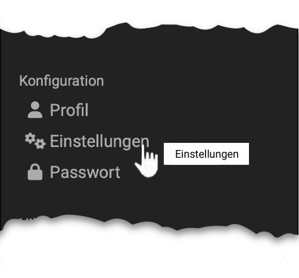
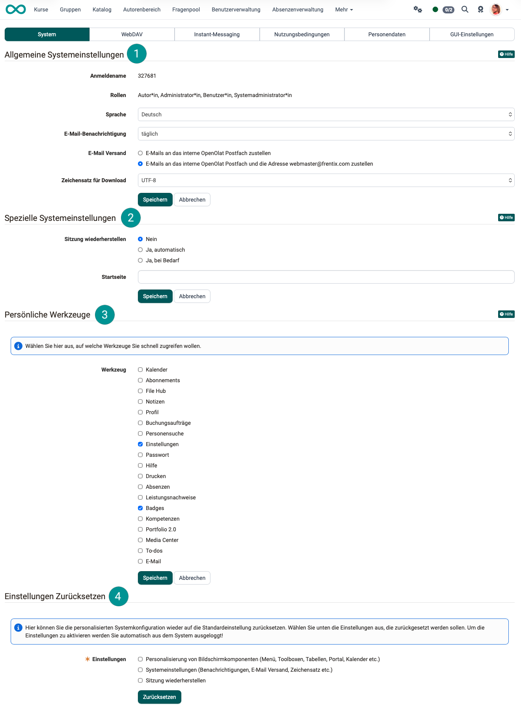
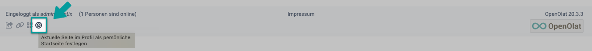
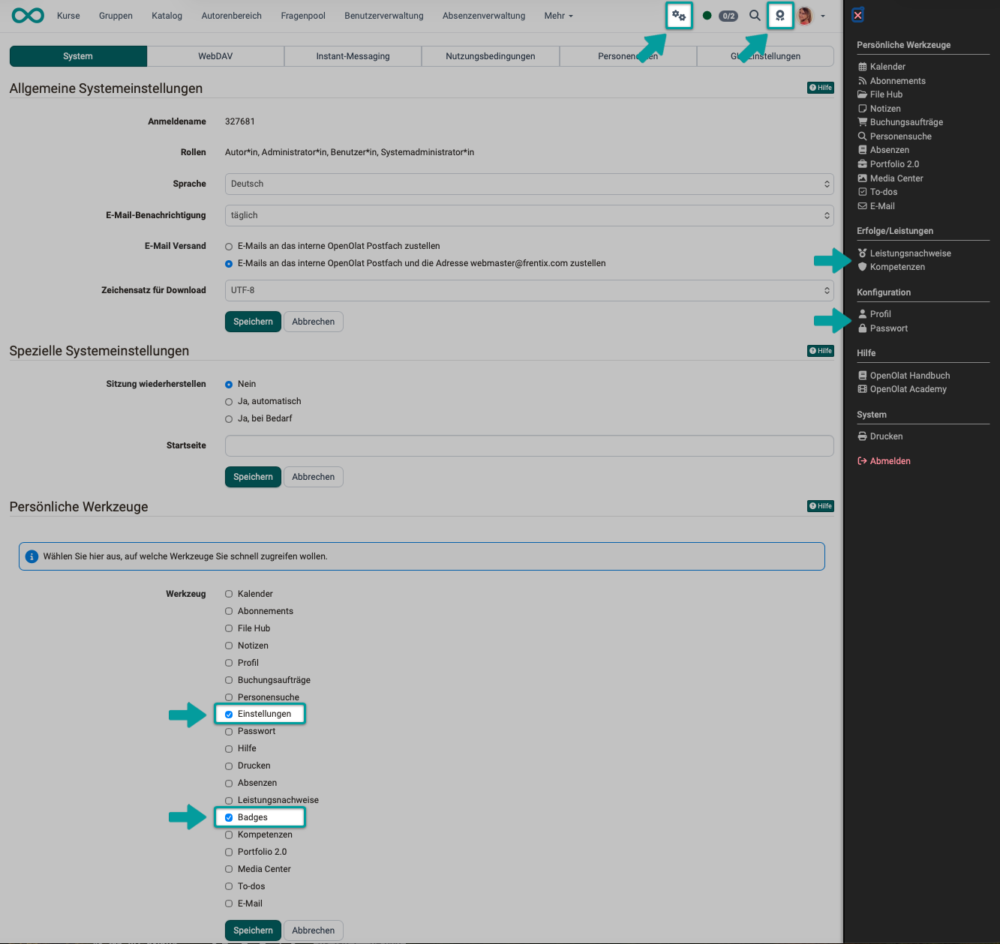
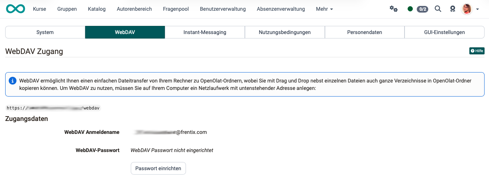
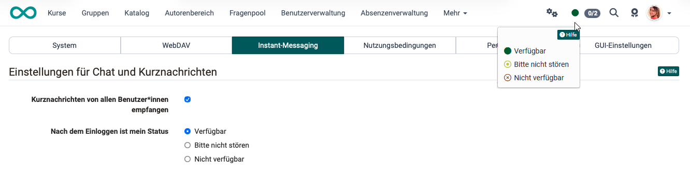
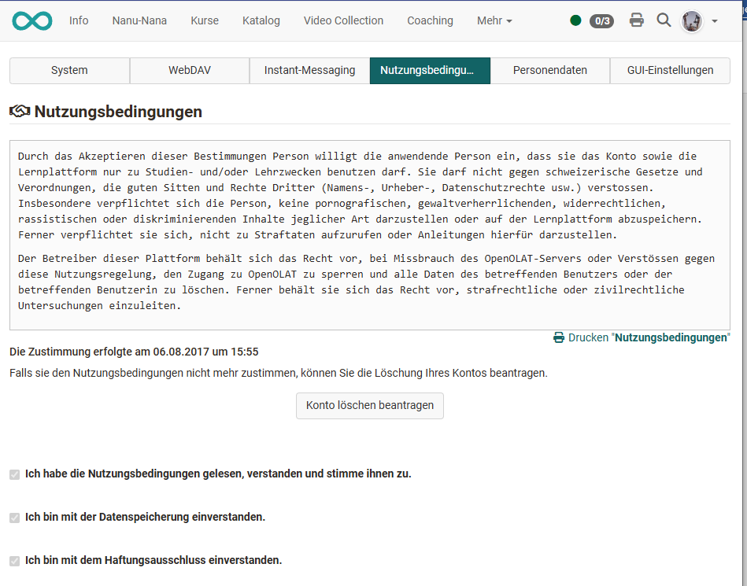
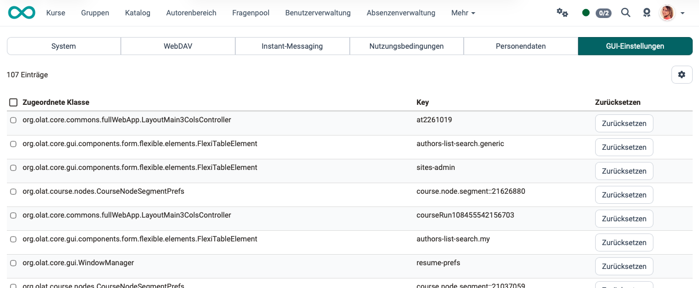

# :o_icon_o_icon_settings: Persönliche Konfiguration: Einstellungen {: #personal_configuration_settings}

{ class="aside-right lightbox"}

:octicons-device-camera-video-24: **Video-Einführung**: [Benutzereinstellungen](<https://www.youtube.com/embed/7osBJ99FIN8>){:target="_blank"}

Mit Hilfe der Einstellungen können Sie OpenOlat nach Ihren Bedürfnissen anpassen.

## Tab System {: #tab_system}

{ class="shadow lightbox" }

###  Allgemeine Systemeinstellungen {: #general}

In den allgemeinen Systemeinstellungen sehen Sie Ihre Kontodaten. Sie legen hier ausserdem die Sprache, die Benachrichtigungen und die Zustellung Ihrer E-Mails fest.

#### Anmeldename und Rollen {: #username_roles}

Hier sehen Sie Ihren Anmeldenamen und Ihre OpenOlat-Rollen. Beide Angaben sind nur zur Ansicht und lassen sich hier nicht ändern.

#### Sprache {: #language}

Unter "Sprache" wählen Sie Ihre individuelle Systemsprache. OpenOlat ist in zahlreiche Sprachen übersetzt worden. Die Änderung der Sprache wird erst nach dem nächsten Login aktiv.

!!! info "Wichtig"

    Die Sprache von Kursinhalten wird von der Sprachwahl hier nicht beeinflusst.

#### E-Mail-Benachrichtigung {: #notification_interval}

Unter "E-Mail-Benachrichtigung" legen Sie fest, wie oft Sie Benachrichtigungen per E-Mail erhalten wollen. Zur Auswahl stehen: "ausgeschaltet", "monatlich", "wöchentlich", "täglich", "halbtäglich", "alle vier Stunden" und "alle zwei Stunden".

#### E-Mail Versand {: #mail_delivery}

Unter "E-Mail Versand" legen Sie fest, wohin OpenOlat Ihre E-Mails zustellt. Das Feld erscheint nur, wenn die Administration das OpenOlat Postfach eingeschaltet hat.

  * "E-Mails an das interne OpenOlat Postfach zustellen": Die Nachrichten bleiben in OpenOlat. Sie lesen sie unter `Persönliche Werkzeuge > E-Mail`. In der Benachrichtigungsmail finden Sie zusätzlich einen Hinweis auf neue E-Mails im OpenOlat-Postfach.
  * "E-Mails an das interne OpenOlat Postfach und die Adresse ... zustellen": OpenOlat legt jede Nachricht ins Postfach und leitet sie zusätzlich an die angezeigte Adresse weiter. Angezeigt wird die Adresse aus Ihrem Profil. Das ist die dauerhafte Weiterleitung.

Ihre Wahl überschreibt die systemweite Standardeinstellung. Treffen Sie keine Wahl, gilt die Vorgabe der Administration: [E-Mail Einstellungen](../../manual_admin/administration/E-Mail_Settings.de.md#e-mail-inbox-and-outbox).

Eine einzelne Nachricht leiten Sie auch ohne diese Einstellung weiter: [Persönliche Werkzeuge: E-Mail](E-Mail.de.md#forward).

#### Zeichensatz für Download {: #charset}

Über den "Zeichensatz für Download" bestimmen Sie, in welchem Zeichensatz Dateien abgespeichert werden sollen, die Sie über die Datenarchivierung herunterladen. Dies betrifft den Download der Test- und Fragebogenresultate sowie der Kursresultate. Im Standard ist der Zeichensatz UTF-8 voreingestellt. Enthalten Ihre Tests oder Fragebogen z.B. arabische Zeichen, muss hier UTF-8 gewählt sein.

#### Dokumenteneditor {: #document_editor}

Unter "Dokumenteneditor" wählen Sie, mit welchem Editor OpenOlat Ihre Dokumente öffnet. Das Feld erscheint nur, wenn Ihnen mindestens zwei externe Editoren zur Verfügung stehen.

###  Spezielle Systemeinstellungen {: #special}

In den Speziellen Systemeinstellungen sehen und ändern Sie die Einstellungen, die Ihnen den tagtäglichen Einstieg und die Arbeit mit OpenOlat erleichtern können.

#### Sitzung wiederherstellen {: #resume_session}

In der Auswahl "Sitzung wiederherstellen" legen Sie fest, was direkt nach dem Login passiert:

  * "Nein": Die Startseite wird geladen.
  * "Ja, automatisch": OpenOlat lädt den zuletzt besuchten Ort.
  * "Ja, bei Bedarf": Sie legen nach jedem Login fest, wohin Sie gelangen wollen.

#### Startseite {: #landing_page}

Wenn Sie die Einstellung "Ja, automatisch" gewählt haben, wird das Feld "Startseite" ausgeblendet. Dieses Feld gestattet Ihnen, jede beliebige Seite innerhalb OpenOlat als Ihre persönliche Startseite festzulegen und damit die systemweit eingestellte Startseite zu überschreiben.

Seitenspezifische Links finden Sie in der Social-Sharing-Leiste links unten unter "Link kopieren". Noch einfacher ist es, auf der gewünschten Startseite das Startseiten-Icon anzuklicken. Jede OpenOlat-Seite, auf die Sie Zugriff haben, kann so als persönliche Startseite gewählt werden.

**Startseiten-Icon in der Fusszeile:**
{ class="shadow lightbox" }

###  Persönliche Werkzeuge {: #personal_tools}

Hier wählen Sie aus, welche persönlichen Werkzeuge direkt oben in der Menüleiste (links neben Ihrem Profilbild) erscheinen sollen, sodass Sie schnell auf diese Werkzeuge zugreifen können. 
Werkzeuge, die im Schnellzugriff angezeigt werden, sind nicht mehr im persönlichen Menü aufgeführt.

**Beispiel: "Einstellungen" und "Badges" sind aus dem persönlichen Menü in den Schnellzugriff verschoben**
{ class="shadow lightbox" }

!!! tip "Tipp"

    Versuchen Sie nicht, alle Werkzeuge zu aktivieren, sondern wählen Sie gezielt die Werkzeuge aus, die Sie häufig benutzen. So bleibt die Menüleiste übersichtlich.

###  Einstellungen zurücksetzen {: #reset}

Unter "Einstellungen Zurücksetzen" im Tab "System" haben Sie die Möglichkeit, Ihre vorgenommenen systembezogenen Änderungen wieder **auf die Standardeinstellungen zurückzusetzen**. Zurückgesetzt werden können

* die personalisierten Einstellungen der Bildschirmkomponenten (Menü, Toolboxen, Tabellen, Portal, Kalender, usw.),
* Systemeinstellungen (Benachrichtigungen, E-Mail-Versand, Zeichensatz, usw.)
* sowie die Einstellungen zur Wiederherstellung der letzten Sitzung.

Nach dem Zurücksetzen werden Sie automatisch aus OpenOlat abgemeldet.

[Zum Seitenanfang ^](#personal_configuration_settings)

---

## Tab WebDAV {: #tab_webdav}

Im Tab "WebDAV" finden Sie den [WebDAV-Link zu Ihrer OpenOlat-Instanz](../basic_concepts/Using_WebDAV.de.md), über den Sie Dateien bequem verwalten können. Über WebDAV greifen Sie als OpenOlat-Benutzer:in auf Ihren persönlichen Ordner zu. OpenOlat-Autor:innen können über WebDAV ihre gesamten Kursdateien organisieren.

Unter "Zugangsdaten" sehen Sie Ihren WebDAV-Anmeldenamen. Mit "Passwort einrichten" legen Sie ein eigenes WebDAV-Passwort fest.

{ class="shadow lightbox" }

[Zum Seitenanfang ^](#personal_configuration_settings)

---

## Tab Instant-Messaging {: #tab_instant-messaging}

Im Tab "Instant-Messaging" legen Sie die Einstellungen für die [Chat-Funktion](../../manual_admin/administration/Instant_Messaging.de.md) und Ihren Kommunikations-Status nach dem Login fest. Mit der Option "Kurznachrichten von allen Benutzer:innen empfangen" legen Sie fest, ob alle Benutzer:innen Ihnen Kurznachrichten senden dürfen. Unter "Nach dem Einloggen ist mein Status" wählen Sie zwischen "Verfügbar", "Bitte nicht stören" und "Nicht verfügbar".

{ class="shadow lightbox" }

[Zum Seitenanfang ^](#personal_configuration_settings)

---

## Tab Nutzungsbedingungen {: #tab_terms_of_use}

Hier können Sie die Nutzungsbedingungen nachlesen, welche Sie beim ersten Login bestätigt haben. Die genauen Nutzungsbedingungen werden von den OpenOlat-Administrator:innen festgelegt.

Ferner kann hier auch die Löschung des kompletten OpenOlat-Kontos beantragt werden. Der Antrag geht als E-Mail an eine von der System-Administration hinterlegte Adresse; die Löschung selbst führt die Benutzerverwaltung aus. Mehr dazu: [Datenschutz](../../manual_admin/usermanagement/Data_protection.de.md#request_account_deletion)

{ class="shadow lightbox" }

[Zum Seitenanfang ^](#personal_configuration_settings)

---

## Tab Personendaten {: #tab_user_data}

In diesem Bereich können Sie eine Übersicht über Ihre in OpenOlat gespeicherten Daten nach Artikel 15 DSGVO beim Betreiber anfordern. Es ist der entsprechende Support-Link hier hinterlegt.

Sobald der Export durchgeführt wurde, können Sie die über Sie gespeicherten Benutzerdaten hier über die Schaltfläche **Dateien herunterladen** beziehen. Die Datei bleibt einen Monat zum Herunterladen bereit, danach ist ein neuer Export nötig.

Wie der Export ausgelöst wird und wer das darf, beschreibt die Seite [Datenschutz](../../manual_admin/usermanagement/Data_protection.de.md#export_user_data) im Administrationshandbuch.

[Zum Seitenanfang ^](#personal_configuration_settings)

---

## Tab GUI-Einstellungen {: #tab_GUI}

Die Einstellungen des GUI (Graphical User Interface) werden in Variablen gespeichert. Expert:innen können hier gezielt einzelne Variablenwerte zurücksetzen.

{ class="shadow lightbox" }

[Zum Seitenanfang ^](#personal_configuration_settings)

---

## Weiterführende Informationen {: #further_information}

**Auf dieser Seite erwähnt** 
[E-Mail Einstellungen >](../../manual_admin/administration/E-Mail_Settings.de.md) 
[Persönliche Werkzeuge: E-Mail >](E-Mail.de.md) 
[Einsatz von WebDAV >](../basic_concepts/Using_WebDAV.de.md) 
[Modul Instant Messaging >](../../manual_admin/administration/Instant_Messaging.de.md) 
[Datenschutz >](../../manual_admin/usermanagement/Data_protection.de.md)

**Weiterführend** 
[Persönliche Konfiguration: Profil >](Profile.de.md) 
[Persönliche Konfiguration: Passwort >](Password.de.md) 
[Persönliche Werkzeuge >](Personal_Tools.de.md) 
[Startseite >](../../manual_admin/administration/Landing_pages.de.md) 
[Chat >](../basic_concepts/Chat.de.md)

**youtube** 
[Benutzereinstellungen](<https://www.youtube.com/embed/7osBJ99FIN8>){:target="_blank"}

[Zum Seitenanfang ^](#personal_configuration_settings)
