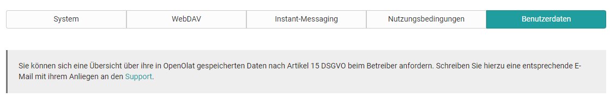

# Personal Configuration: Settings

{ class="aside-right lightbox"}

The settings allow you to adapt OpenOlat according to your needs.

### Tab System

#### General system settings: {: #general}

Here you can read out your username and your OpenOlat role. You can also
select your individual system language. OpenOlat has been translated into
numerous languages. Changing the language will only become active after the
next login.

!!! attention
	The language of course content is not affected by the language selection here.

You can also set how often you want to receive email notifications. You can
choose between: switched off, monthly, weekly, daily, half-day, every four and
every two hours. You can also specify whether OpenOlat e-mails should only be
displayed in the inbox within the OpenOlat system, or whether they should also
be sent to the external e-mail address configured in your profile. In the
notification mail, you will also find a note regarding new e-mails within the
OpenOlat mailbox, if you have selected the option "Deliver e-mails to the
internal OpenOlat mailbox".

Via the "Character set for download" you can determine in which character set
files that you download via data archiving should be stored. This concerns the
download of test and questionnaire results as well as course results. The
default character set is ISO-8859-1. If your tests or questionnaires contain
e.g. Arabic characters you have to select the character set UTF-8.

In the specific system settings you can view and change the settings that can
make your daily start and work with OpenOlat easier.

In the selection "Resume last session" you define what happens directly after
the login: Either

  * the start page is loaded,
  * the last place visited in OpenOlat is automatically loaded, or
  * you determine where you want to go after login, depending on the situation.

If you have selected the "Yes, automatically" setting, the field for entering
the start page is hidden. This field allows you to set any page within
OpenOlat as your personal start page and thus overwrite the system-wide start
page. Page-specific links can be found in the Social Sharing bar at the bottom
left under "Copy link". It is even easier to simply click on the start page
icon on the desired start page. Any OpenOlat page you have access to can be
selected for this purpose.

  

#### User tools:

Here you select which user tools should appear in the top
right-hand corner of the menu bar (next to your profile picture) so that you
can access these tools very quickly.

Tools that are not available as quick access in the navigation bar are
available as menu items in the personal menu. Use Help to get to the start
page of the user manual and Print to print the currently opened page.

!!! tip
	Do not try to activate all tools, but select the tools you use frequently.
	This keeps the menu bar clear.
  

Finally, under "Settings" in the "System" tab, you have the option of
**resetting** your system-related changes **to the  ** **default settings**,
including settings for personalization, notifications and session restore.

###  Tab WebDAV {: #webdav}

The tab "WebDAV" provides you with the [WebDAV link to your OpenOlat system](../basic_concepts/Using_WebDAV.md), which can be used to conveniently manage files. As
an OpenOlat user, you can access your personal folder via WebDAV. OpenOlat
authors can organize their entire course files via WebDAV.

### Tab Instant-Messaging

In the tab "Instant Messaging" you define the settings for the [chat function](../../manual_admin/administration/Instant_Messaging.md) and your communication status after login.

### Tab Terms of use

Here you can read the terms of use, which you confirmed the first time you
logged in. The exact terms of use will be determined by the OLAT
administrator.

Furthermore you can request the deletion of your complete OpenOlat account.  

### Tab User data

In this section you can request an overview of your data stored in OpenOlat
from the operator, in accordance with Article 15 GDPR. The corresponding
support link is available. As soon as the export has been carried out, you can
download the user data stored about you here.

## Further information

[Personal tools: E-Mail](../personal_menu/E-Mail.md) 