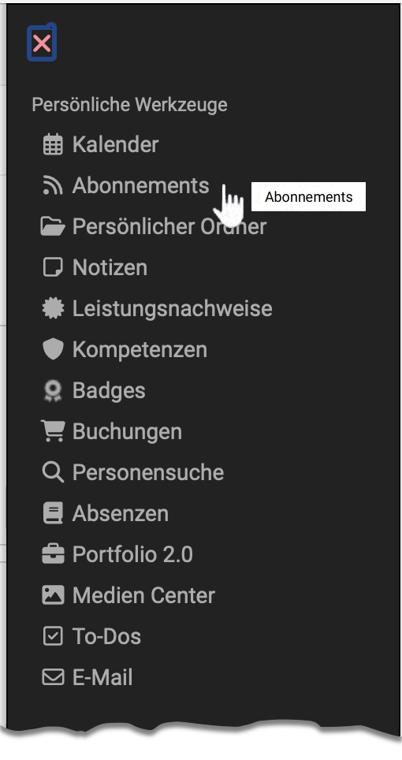
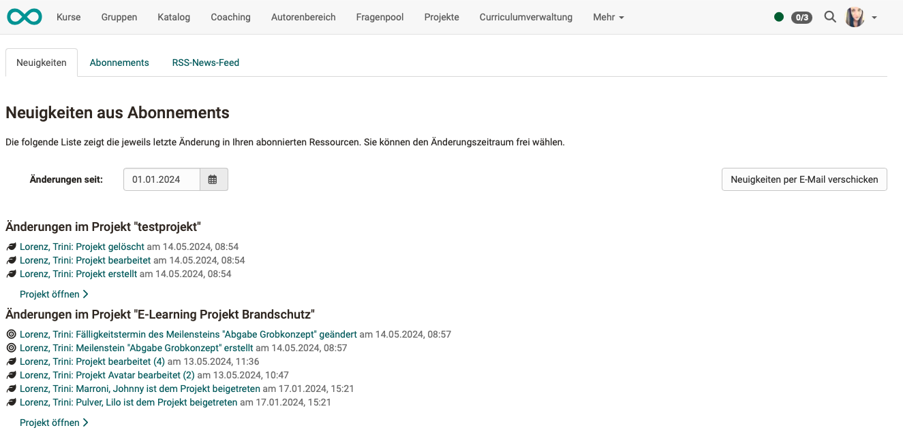
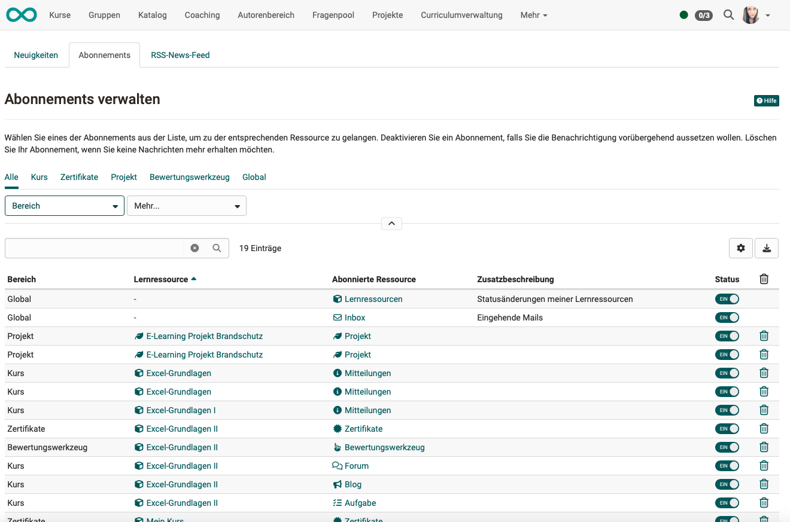
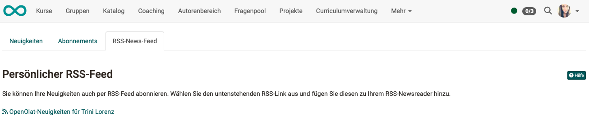

# Persönliche Werkzeuge: Abonnements {: #subscriptions}

{ class="aside-right lightbox"}

:octicons-device-camera-video-24: **Video-Einführung**: [Abonnements](<https://www.youtube.com/embed/h9gOqt7TR7Q>){:target="_blank”}

Abonnieren Sie bestimmte Elemente in Kursen und Gruppen um sich rasch über Änderungen informieren zu lassen.

Folgende Objekte sind abonnierbar: 

  * Forum 
  * Ordner 
  * Wiki 
  * Kalender
  * Aufgabe
  * Dateidiskussion
  * Portfoliomappen
  * Mitteilung
  * Teilnehmer-Ordner
  * Blog
  * Podcast
  * Video 

 

## Ansicht der Mitteilungen aus Abonnements

Unter "Abonnements" im persönlichen Menü können Sie alle ihre Neuigkeiten gesammelt einsehen.

Auf der Übersichtsseite, im **Tab "Neuigkeiten"**, können Sie sich Änderungen innerhalb
eines Zeitraumes anzeigen lassen und bei Bedarf die Änderungen noch einmal per E-Mail verschicken.

{ class=" shadow lightbox" }

Die Gesamtzahl der von Ihnen abonnierten Objekte ist im **Tab "Abonnements"** aufgelistet.

{ class=" shadow lightbox" }

Sie haben auch die Möglichkeit, sich mittels **RSS** über den Änderungsverlauf zu informieren.

Wenn Sie Änderungsmeldungen seltener oder häufiger per E-Mail erhalten wollen oder die E-Mail nicht erhalten wollen, können Sie dies unter "**Einstellungen - Allgemeine Systemeinstellungen**" im Tab "**System**" anpassen.

Falls das **Portal** im Menü der Kopfzeile aktiviert ist, können die Änderungsmeldungen auch dort unter "**Meine Benachrichtigungen**" angezeigt werden.

!!! hint "Beispiel: Neue Testresultate"

    Personen, die das Recht für das **Bewertungswerkzeug** besitzen (z.B. Betreuer:innen oder Kursbesitzer:innen), können sich benachrichtigen lassen, wenn **neue Testresultate eingegangen** sind oder sich **neue Benutzer:innen** registriert haben.

## Globale Abos

Ist das globale Abonnement für Lernressourcen aktiviert, werden die Statusänderungen übersichtlich unter den persönlichen Abonnenments im Tab Neuigkeiten aufgelistet und zusätzlich in der E-Mail Sammelbenachrichtigung für Abonnements aufgeführt.

Die Funktion ist per Default aktiviert und gilt jeweils für neue Kurs- und Lernressourcen-Besitzer:innen. Die Besitzer:innen können das Abo selbst deaktivieren.

Für alle Lernressourcen, die vor Release 17.2 erstellt wurden, kann das globale Abonnement nachträglich aktiviert werden.

!!! hint "Beispiel: Benachrichtigung über Statuswechsel von Lernressourcen"

    Besitzer:innen von Kursen und Lernressourcen müssen mitunter informiert werden, wenn sich der Status ihrer Ressourcen durch andere Autor:innen oder - bei Verwendung des automatischen Kurs-Lebenszyklus - systemgesteuert ändert. Dies kann beispielsweise wichtig sein, wenn mehrere verantwortliche Personen einen Kurs gemeinsam administrieren oder der Kurs explizit auf den Status "Beendet" oder "Gelöscht" gesetzt wird.

## Abonnements abbestellen

Wenn Sie das Abonnement nicht mehr wollen, können Sie es entweder abbestellen (an gleicher Stelle wie "Abonnieren") oder Sie können unter "Abonnements" hinter der Ressource die Option "löschen" wählen.

Das Abonnement erlischt ausserdem, wenn Sie nicht mehr Mitglied im entsprechenden Kurs oder Baustein sind (direktes Mitglied oder Mitglied via Gruppe).

## Neuigkeiten per RSS {: #rss}

**Warum sollte ich wissen, was RSS ist?:**

Dank RSS sind Sie schnell und komfortabel über Änderungen in von Ihnen
abonnierten Foren und Ordnern informiert. Auf einem Blick sehen Sie die
Überschriften neuer Beiträge und was seit Ihrem letzten Besuch geschehen ist.
Ausserdem erhalten Sie die entsprechenden Links, um direkt an den "Ort des
Geschehens" in OpenOlat zu springen. Alles was Sie für diesen Service
benötigen, ist die Internet-Adresse der für Sie bereitgestellten RSS-Datei und
einen sogenannten RSS-Reader.

 **Wo finde ich die Adresse der RSS-Datei?:**

Klicken Sie auf das Icon  . Ein neues Browser-Fenster öffnet sich. Ignorieren Sie den Inhalt der Seite und kopieren Sie die Webadresse (URL) in die Zwischenablage. Fügen Sie die Webadresse dann in Ihren RSS-Reader ein.

{ class=" shadow lightbox" }

 **Wie komme ich an einen RSS-Reader?:**

Wir empfehlen folgende Suchbegriffe: _RSS reader_ , _RSS newsreader_ ,
_feedreader_ um einen für Sie geeigneten RSS-Reader zu finden.

## Weitere Informationen

[Wikipedia-Artikel zu RSS](http://en.wikipedia.org/wiki/Rss_feed) 
[Kursbaustein Mitteilungen](../learningresources/Course_Element_Notifications.de.md) 
[Abonnements auf der Startseite (Einrichtung durch Administrator:innen)](../../manual_admin/administration/Landing_pages.de.md)

!!! info "Hinweis"

    In der **Benutzerverwaltung** werden sämtliche Abonnements eines Users angezeigt. Sie können dort durch Benutzerverwalter:innen auch gelöscht werden.

