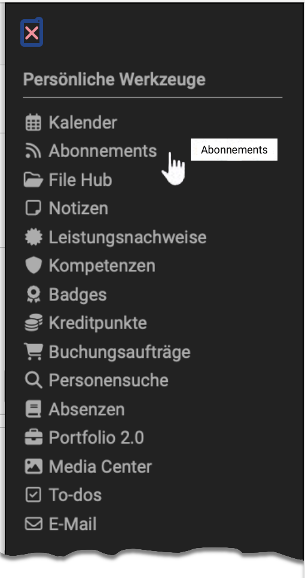
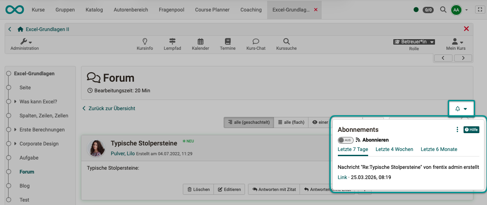
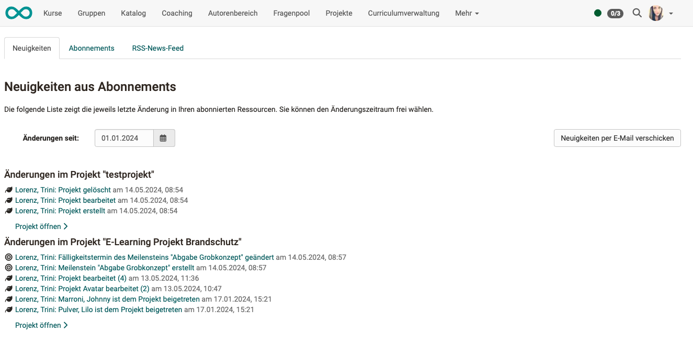
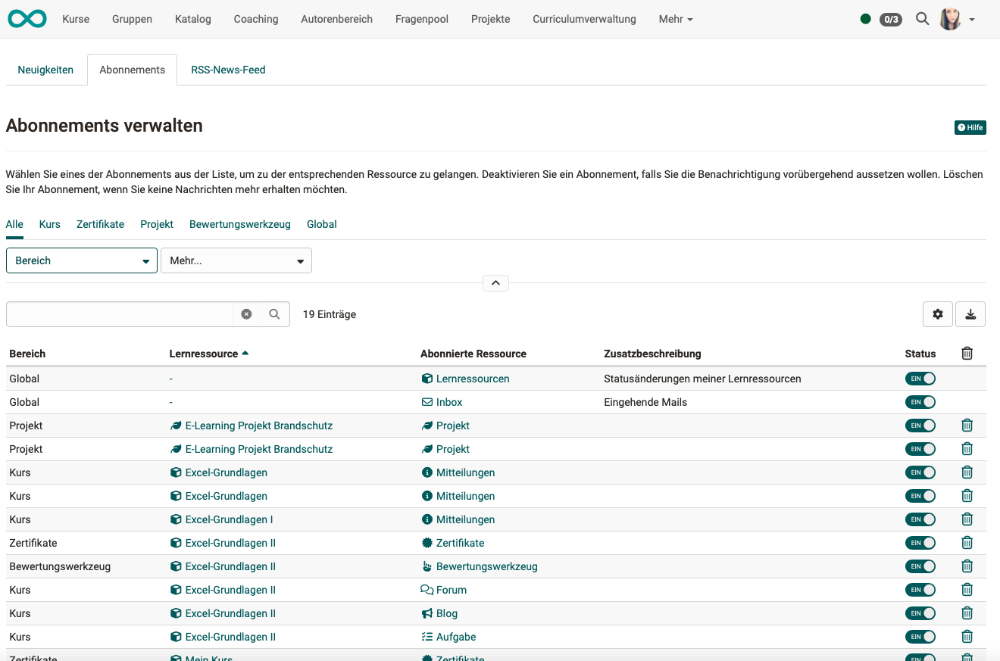
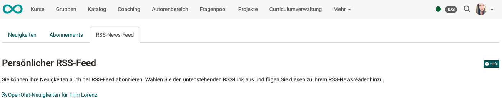

# Persönliche Werkzeuge: Abonnements {: #subscriptions}

{ class="aside-right lightbox"}

:octicons-device-camera-video-24: **Video-Einführung**: [Abonnements](<https://www.youtube.com/embed/h9gOqt7TR7Q>){:target="_blank"}

Abonnieren Sie bestimmte Elemente in Kursen und Gruppen, um sich rasch über Änderungen informieren zu lassen.

Folgende Objekte sind abonnierbar:

  * Forum
  * Ordner
  * Wiki
  * Kalender
  * Aufgabe
  * Dateidiskussion
  * Portfoliomappen
  * Mitteilungen
  * Teilnehmer:innen Ordner
  * Blog
  * Podcast
  * Video
  * Projekte [:octicons-tag-16:{ title="ab Release 18.0 (OO-6980)" }](https://track.frentix.com/issue/OO-6980)

 

## Abonnement einrichten {: #activate_abo}

Klicken Sie in einem abonnierbaren Kursbaustein auf das Glockensymbol rechts oben, sehen Sie die Übersicht der Neuerungen, die in diesem Kursbaustein angefallen sind.

Schalten Sie in diesem Popup-Fenster "Abonnieren" ein, erhalten Sie alle Mitteilungen über Neuerungen in diesem Kursbaustein automatisch. Sie müssen die Glockensymbole der einzelnen Kursbausteine dann nicht mehr selbst prüfen.

{ class="shadow lightbox" }

[Zum Seitenanfang ^](#subscriptions)

---

## Ansicht der Mitteilungen aus Abonnements {: #view_notifications}

Unter "Abonnements" im persönlichen Menü können Sie alle Ihre Neuigkeiten gesammelt einsehen.

Auf der Übersichtsseite, im **Tab "Neuigkeiten"**, wählen Sie unter "Änderungen seit" den Zeitraum und lassen sich die Änderungen anzeigen. Mit "Neuigkeiten per E-Mail verschicken" erhalten Sie die Liste zusätzlich per E-Mail.

{ class="shadow lightbox" }

Alle Ihre Abonnements sind im **Tab "Abonnements"** aufgelistet. Mit dem Schalter in der Spalte "Status" setzen Sie ein Abonnement vorübergehend aus, mit dem Papierkorb-Symbol löschen Sie es.

{ class="shadow lightbox" }

Sie können sich auch mittels **RSS** über den Änderungsverlauf informieren lassen (siehe unten).

Wie oft Sie Änderungsmeldungen per E-Mail erhalten, oder ob Sie keine E-Mail erhalten wollen, legen Sie fest unter: 
`Persönliches Menü > Einstellungen > Tab "System" > Allgemeine Systemeinstellungen > E-Mail-Benachrichtigung`

Ist das **Portal** aktiviert, werden die Änderungsmeldungen auch dort unter "Meine Benachrichtigungen" angezeigt.

!!! note "Beispiel: Neue Testresultate"

    Personen mit Zugriff auf das **Bewertungswerkzeug** (z.B. Betreuer:innen oder Kursbesitzer:innen) können sich benachrichtigen lassen, wenn **neue Testresultate** eingegangen sind. Benutzerverwalter:innen können sich benachrichtigen lassen, wenn sich **neue Benutzer:innen** registriert haben.

[Zum Seitenanfang ^](#subscriptions)

---

## Globale Abos [:octicons-tag-16:{ title="ab Release 17.2.4 (OO-6739)" }](https://track.frentix.com/issue/OO-6739) {: #global_subscriptions}

Ist das globale Abonnement für Lernressourcen aktiviert, werden die Statusänderungen Ihrer Lernressourcen unter den persönlichen Abonnements im Tab "Neuigkeiten" aufgelistet und zusätzlich in der E-Mail-Sammelbenachrichtigung für Abonnements aufgeführt.

Die Funktion ist standardmässig aktiviert und gilt für Besitzer:innen von Kursen und Lernressourcen. Im Tab "Abonnements" schalten Besitzer:innen das globale Abonnement aus oder wieder ein; löschen lässt es sich nicht.

!!! note "Beispiel: Benachrichtigung über Statuswechsel von Lernressourcen"

    Besitzer:innen von Kursen und Lernressourcen müssen mitunter informiert werden, wenn sich der Status ihrer Ressourcen durch andere Autor:innen oder, bei Verwendung des automatischen Kurs-Lebenszyklus, systemgesteuert ändert. Dies kann beispielsweise wichtig sein, wenn mehrere verantwortliche Personen einen Kurs gemeinsam administrieren oder der Kurs explizit auf den Status "Beendet" oder "Gelöscht" gesetzt wird.

[Zum Seitenanfang ^](#subscriptions)

---

## Abonnements abbestellen {: #unsubscribe}

Wenn Sie das Abonnement nicht mehr wollen, können Sie es an gleicher Stelle wie "Abonnieren" abbestellen oder im Tab "Abonnements" mit dem Papierkorb-Symbol löschen.

Das Abonnement erlischt ausserdem, wenn Sie nicht mehr Mitglied im entsprechenden Kurs oder in der entsprechenden Gruppe sind (direktes Mitglied oder Mitglied via Gruppe).

!!! note "Hinweis"

    In der **Benutzerverwaltung** werden sämtliche Abonnements einer Person angezeigt. Benutzerverwalter:innen können sie dort auch löschen.

[Zum Seitenanfang ^](#subscriptions)

---

## Neuigkeiten per RSS {: #rss}

**Warum sollte ich wissen, was RSS ist?**

Dank RSS sind Sie schnell und komfortabel über Änderungen in von Ihnen abonnierten Foren und Ordnern informiert. Auf einen Blick sehen Sie die Überschriften neuer Beiträge und was seit Ihrem letzten Besuch geschehen ist. Ausserdem erhalten Sie die entsprechenden Links, um direkt an den "Ort des Geschehens" in OpenOlat zu springen. Alles, was Sie für diesen Service benötigen, ist die Internet-Adresse der für Sie bereitgestellten RSS-Datei und ein sogenannter RSS-Reader.

**Wo finde ich die Adresse der RSS-Datei?**

Öffnen Sie den Tab "RSS-News-Feed" und klicken Sie auf den Link mit dem Symbol . Ein neues Browser-Fenster öffnet sich. Ignorieren Sie den Inhalt der Seite und kopieren Sie die Webadresse (URL) in die Zwischenablage. Fügen Sie die Webadresse dann in Ihren RSS-Reader ein.

{ class="shadow lightbox" }

**Wie komme ich an einen RSS-Reader?**

Wir empfehlen folgende Suchbegriffe: _RSS reader_, _RSS newsreader_, _feedreader_, um einen für Sie geeigneten RSS-Reader zu finden.

[Zum Seitenanfang ^](#subscriptions)

---

## Weiterführende Informationen {: #further_information}

[Wikipedia-Artikel zu RSS](http://en.wikipedia.org/wiki/Rss_feed) 
[Kursbaustein "Mitteilungen"](../learningresources/Course_Element_Notifications.de.md) 
[Startseite: Abonnements auf der Startseite einrichten (Administration)](../../manual_admin/administration/Landing_pages.de.md)

**youtube** 
[Abonnements](<https://www.youtube.com/embed/h9gOqt7TR7Q>){:target="_blank"}

[Zum Seitenanfang ^](#subscriptions)
