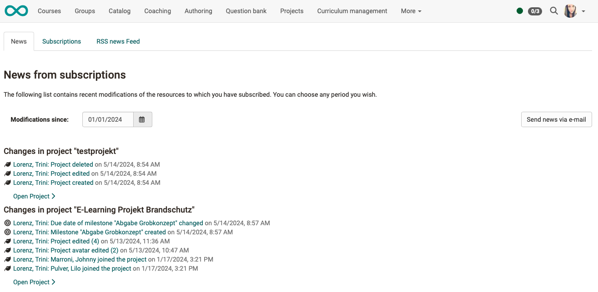
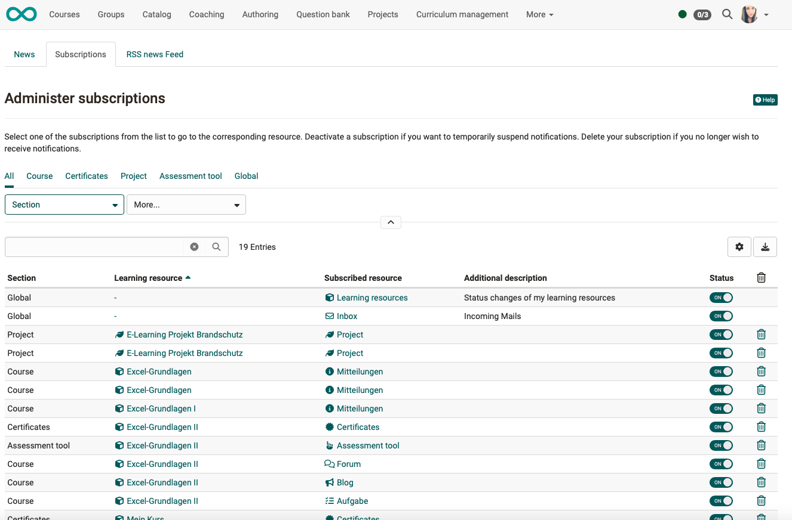
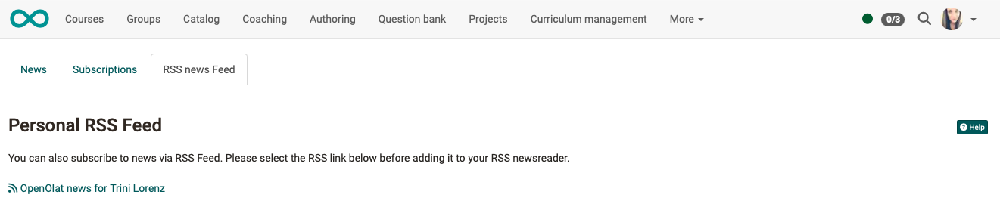

# Personal tools: Subscriptions

{ class="aside-right lightbox"}

Subscribe to certain elements in courses and groups to be informed quickly about changes.

The following objects can be subscribed to: 

  * Forum 
  * Folder 
  * Wiki 
  * Calender
  * Task
  * File discussion
  * Portfolio
  * Notifications
  * Participant folders
  * Blog
  * Podcast
  * Video 

 

## View notifications from subscriptions

Under "Subscriptions" in the personal menu, you can view all your news in one place.

On the overview page, in the **"News"** tab, you can display changes within a period of time and, if necessary, send the changes again by e-mail.

{ class=" shadow lightbox" }

The total number of objects you have subscribed to is listed in the **"Subscriptions"** tab.

{ class=" shadow lightbox" }

You also have the option of using **RSS** to find out about the change process.

If you want to receive change notifications less frequently or more frequently by e-mail or do not want to receive the e-mail, you can adjust this under "**Settings - General system settings**" in the "**System**" tab.

If the **Portal** is activated in the header menu, the change notifications can also be displayed there under "**My notifications**".

!!! hint "Example: New test results"

    Persons who have the right to use the **assessment tool** (e.g. coaches or course owners) can be notified when **new test results** have been received or **new users** have registered.

## Global subscriptions

If the global subscription for learning resources is activated, the status changes are clearly listed under the personal subscriptions in the News tab and are also listed in the collective e-mail notification for subscriptions.

The function is activated by default and applies to new course and learning resource owners. Owners can deactivate the subscription themselves.

The global subscription can be activated retrospectively for all learning resources that were created before release 17.2.

!!! hint "Example: Notification of status change of learning resources"

    Owners of courses and learning resources sometimes need to be informed when the status of their resources is changed by other authors or - when using the automatic course lifecycle - by the system. This can be important, for example, if several responsible persons administer a course together or if the course is explicitly set to the status "Finished" or "Deleted".

## Unsubscribe

If you no longer want the subscription, you can either cancel it (in the same place as "Subscribe") or you can select the "Delete" option under "Subscriptions" after the resource.

The subscription also expires if you are no longer a member of the corresponding course or module (direct member or member via group).

## News per RSS {: #rss}

**Why should I know what RSS is?:**

Thanks to RSS, you are quickly and conveniently informed about changes in the forums and folders you have subscribed to. At a glance, you can see the headings of new posts and what has happened since your last visit. You will also receive the corresponding links to jump directly to the "place of action" in OpenOlat. All you need for this service is the Internet address of the RSS file provided for you and a so-called RSS reader.

 **Where can I find the address of the RSS file??:**

Click on the icon  . A new browser window opens. Ignore the content of the page and copy the web address (URL) to the clipboard. Then paste the web address into your RSS reader.

{ class=" shadow lightbox" }

 **How to get an RSS reader?:**

We recommend the following search terms: _RSS reader_ , _RSS newsreader_ ,
_feedreader_ to find a suitable RSS reader for you.

## Further information

[Wikipedia-Artikel zu RSS](http://en.wikipedia.org/wiki/Rss_feed) 
[Kursbaustein Mitteilungen](../learningresources/Course_Element_Notifications.md) 
[Abonnements auf der Startseite (Einrichtung durch Administrator:innen)](../../manual_admin/administration/Landing_pages.md)

!!! info "Note"

    All of a user's subscriptions are displayed in **User management**. They can also be deleted there by user administrators.

