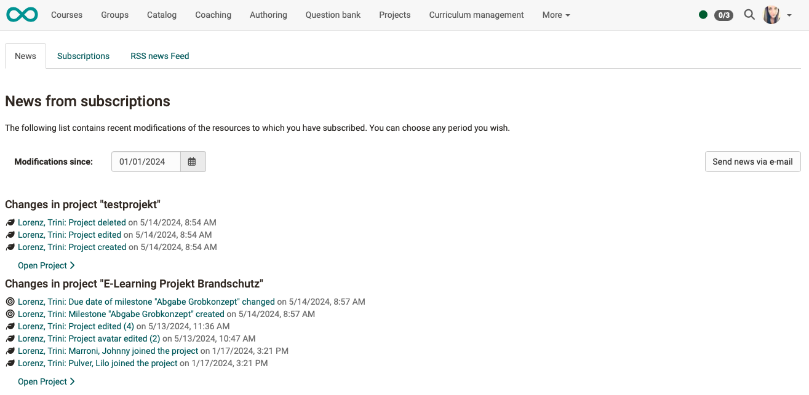
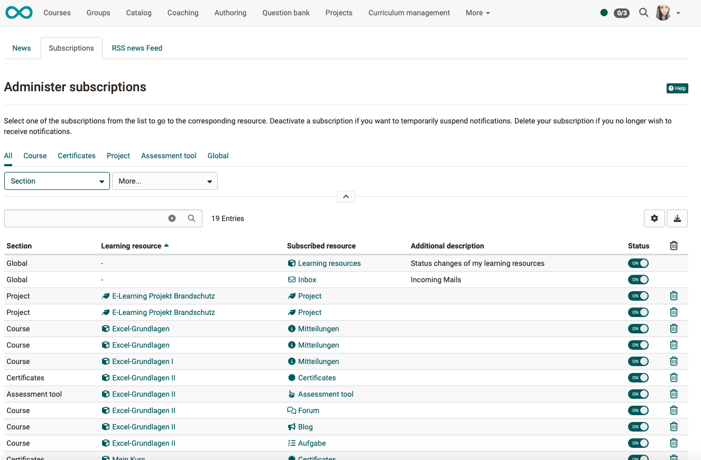
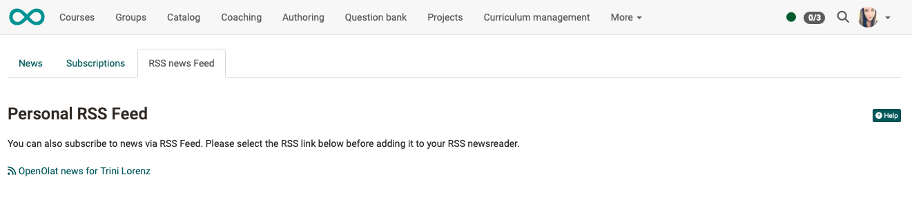

# Personal tools: Subscriptions {: #subscriptions}

{ class="aside-right lightbox"}

:octicons-device-camera-video-24: **Video introduction (German)**: [Subscriptions](<https://www.youtube.com/embed/h9gOqt7TR7Q>){:target="_blank"}

Subscribe to certain elements in courses and groups to be informed quickly about changes.

The following objects can be subscribed to:

  * Forum
  * Folder
  * Wiki
  * Calendar
  * Task
  * File dialog
  * Portfolio binders
  * Notifications
  * Participant folder
  * Blog
  * Podcast
  * Video
  * Projects [:octicons-tag-16:{ title="from Release 18.0 (OO-6980)" }](https://track.frentix.com/issue/OO-6980)

 

## Set up a subscription {: #activate_abo}

If you click the bell icon in the upper-right corner of a subscribable course element, you see an overview of the updates that have been made in that course element.

If you switch on "Subscribe" in this pop-up window, you automatically receive all notifications about updates in that course element. You then no longer have to check the bell icons of the individual course elements yourself.

{ class="shadow lightbox" }

[To the top of the page ^](#subscriptions)

---

## View notifications from subscriptions {: #view_notifications}

Under "Subscriptions" in the personal menu, you can view all your news in one place.

On the overview page, in the **"News"** tab, you select the period under "Modifications since" and display the changes. With "Send news via e-mail" you also receive the list by e-mail.

{ class="shadow lightbox" }

All your subscriptions are listed in the **"Subscriptions"** tab. With the toggle in the "Status" column you suspend a subscription temporarily, with the trash icon you delete it.

{ class="shadow lightbox" }

You can also use **RSS** to keep informed about the changes (see below).

How often you receive change notifications by e-mail, or whether you do not want to receive them at all, is set under: 
`Personal menu > Settings > Tab "System" > General system settings > E-mail notification`

If the **Portal** is activated, the change notifications are also displayed there under "My notifications".

!!! note "Example: New test results"

    Persons with access to the **assessment tool** (e.g. coaches or course owners) can be notified when **new test results** have been received. User managers can be notified when **new users** have registered.

[To the top of the page ^](#subscriptions)

---

## Global subscriptions [:octicons-tag-16:{ title="from Release 17.2.4 (OO-6739)" }](https://track.frentix.com/issue/OO-6739) {: #global_subscriptions}

If the global subscription for learning resources is activated, the status changes of your learning resources are listed under the personal subscriptions in the "News" tab and are also included in the collective e-mail notification for subscriptions.

The function is activated by default and applies to owners of courses and learning resources. In the "Subscriptions" tab, owners switch the global subscription off or on again; it cannot be deleted.

!!! note "Example: Notification of status change of learning resources"

    Owners of courses and learning resources sometimes need to be informed when the status of their resources is changed by other authors or, when using the automatic course lifecycle, by the system. This can be important, for example, if several responsible persons administer a course together or if the course is explicitly set to the status "Finished" or "Deleted".

[To the top of the page ^](#subscriptions)

---

## Unsubscribe {: #unsubscribe}

If you no longer want the subscription, you can unsubscribe in the same place as "Subscribe" or delete it in the "Subscriptions" tab with the trash icon.

The subscription also expires if you are no longer a member of the corresponding course or group (direct member or member via group).

!!! note "Note"

    All subscriptions of a person are displayed in **User management**. User managers can also delete them there.

[To the top of the page ^](#subscriptions)

---

## News per RSS {: #rss}

**Why should I know what RSS is?**

Thanks to RSS, you are quickly and conveniently informed about changes in the forums and folders you have subscribed to. At a glance, you can see the headings of new posts and what has happened since your last visit. You also receive the corresponding links to jump directly to the "place of action" in OpenOlat. All you need for this service is the Internet address of the RSS file provided for you and a so-called RSS reader.

**Where can I find the address of the RSS file?**

Open the "RSS news Feed" tab and click the link with the icon . A new browser window opens. Ignore the content of the page and copy the web address (URL) to the clipboard. Then paste the web address into your RSS reader.

{ class="shadow lightbox" }

**How do I get an RSS reader?**

We recommend the following search terms: _RSS reader_, _RSS newsreader_, _feedreader_ to find a suitable RSS reader for you.

[To the top of the page ^](#subscriptions)

---

## Further information {: #further_information}

[Wikipedia article on RSS](http://en.wikipedia.org/wiki/Rss_feed) 
[Course element "Notifications"](../learningresources/Course_Element_Notifications.md) 
[Landing pages: set up subscriptions on the landing page (administration)](../../manual_admin/administration/Landing_pages.md)

**youtube** 
[Subscriptions (German)](<https://www.youtube.com/embed/h9gOqt7TR7Q>){:target="_blank"}

[To the top of the page ^](#subscriptions)
